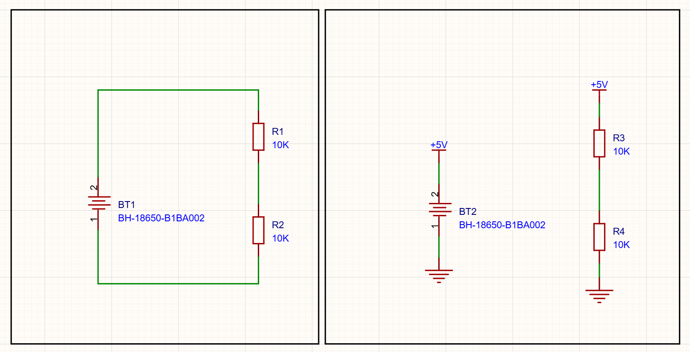
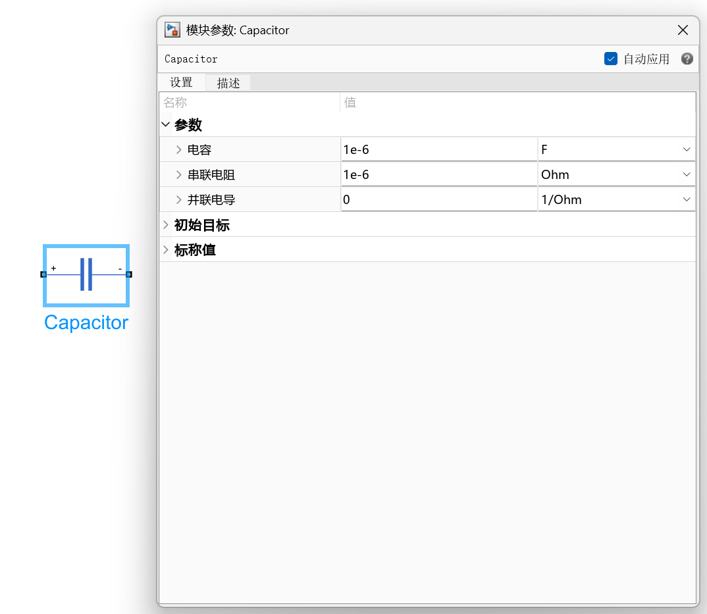

### 1.1 地面参考
- 在教科书中电路的每一个连线都会被画出来，原理图上的各种图标都与现实中的样子一一对应，这在书本上的简单电路中是没有问题的，但是在大型的电路工程图绘制中，会让图纸变得极端杂乱，线路满屏乱飞，各种模块和部件纠缠不清，可读性极差。在现代的各种电路绘制软件（比如我们使用的嘉立创EDA-pro）或者各种仿真软件（如MATLAB的simulink）中，我们应该去使用这些软件自带的[网络]功能和[地面参考]功能。

# [地面参考]指的是整个电路系统中认为规定为0V的位置。
- 当我们念某个东西的电压时，不再说“某两个点之间的电压是某某（比如某电阻两端的电压是某某）”，而是直接说“某一个点的电压是某某”。
- 这种说法在中学阶段的学习中无疑是大错特错的，因为电压是某两个点之间的差。
- 但在电路的工程中，这种叫法非常正确且标准，“某一个点的电压是某某”这句话隐含的意思是“某一个点相对于[地面参考]的电压是某某”，这两句话是完全等价的。
# [网络]指的是用一个符号来代替导线的连接。
- 只要是名字一样的符号，就一定是连在一起的
- 比如在图（1-1-1）中，我们使用“+5V”网络来连接电池的正极和电阻的上方，那这两个位置实际上就相当于是用一根导线连在一起的。
- [地面参考]本身也是个网络，只是一般用来连接0V，在图（1-1-1）中，电池负极和电阻下方都连在[地面参考]上，所以他们实际上也是连在一起的
# 总结
- 在图（1-1-1）中，左右两个电路完全等价，电池正极的电压是5V，电池负极的电压是0V，电阻上方的电压是5V，电阻下方的电压是0V，电阻上方＆电池正极是连在一起的，电阻下方＆电池负极是连在一起的。

### 1.2大数单位
- 1公里是1km，1km是1000m，我们经常用kx这种单位来表示x单位的一千倍，这里的k就是一种大数单位
- 常见的大数单位有：
- [T]   =1,000,000,000,000  特
- [G]   =1,000,000,000  吉 
- [M]   =1,000,000  兆
- [K]   =1,000  千
- 1     =1  （数字1）
- [m]   =0.001  毫
- [u]   =0.000,001  微
- [n]   =0.000,000,001  纳
- [p]   =0.000,000,000,001  皮
- 每个相邻的单位之间进率都是1000

### 1.3新科学计数法
- 在物理＆数学中，我们对科学计数法的写法是 $a\times10^{n}$（例如 $1\times10^{3}$），但在计算机中，这个符号很难用键盘打出来,所以在计算机中用形如“1e3”这种写法来表示科学计数法。
- “1e3”的“e”前面是尾数，“e”表示“exponent”，“e”后面的数字是指数。
- 如果用这种写法来表示刚才的大数单位，那就是：
- [T]   =1e12
- [G]   =1e9
- [M]   =1e6
- [K]   =1e3
- 1     =1  （数字1）
- [m]   =1e-3
- [u]   =1e-6
- [n]   =1e-9
- [p]   =1e-12
- 这种写法非常通用，在C/CPP,Python等各种编程语言中,在MATLAB,嘉立创EDA，Photoshop，Excel，甚至是各种网页，都是支持这么写的
- （许多平台为了安全考量（比如支付软件），会禁止输入字母，这就用不了这种写法了）

