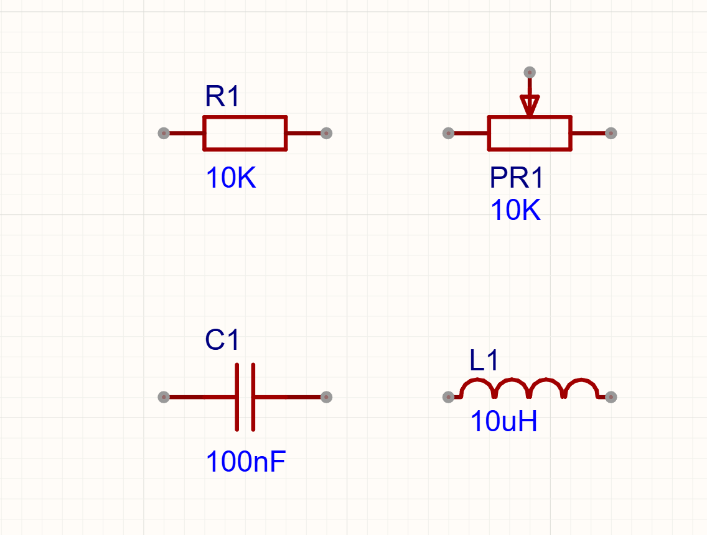
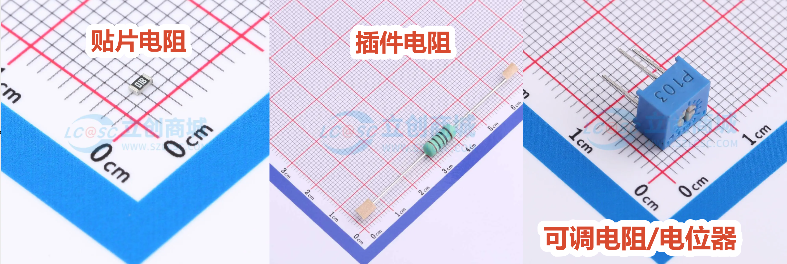
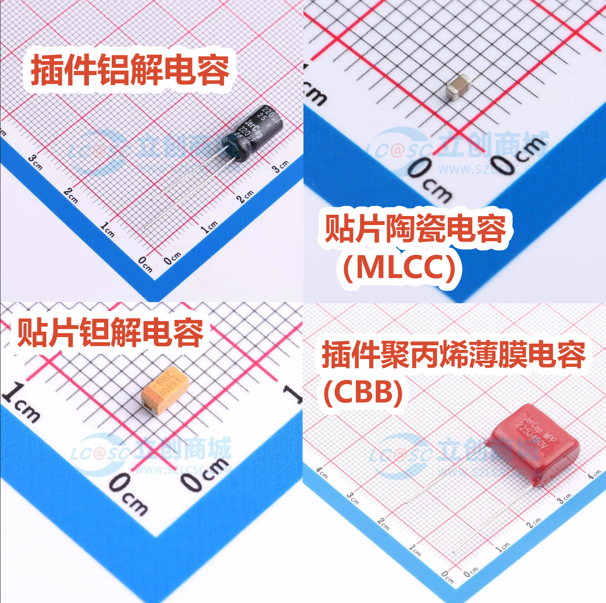
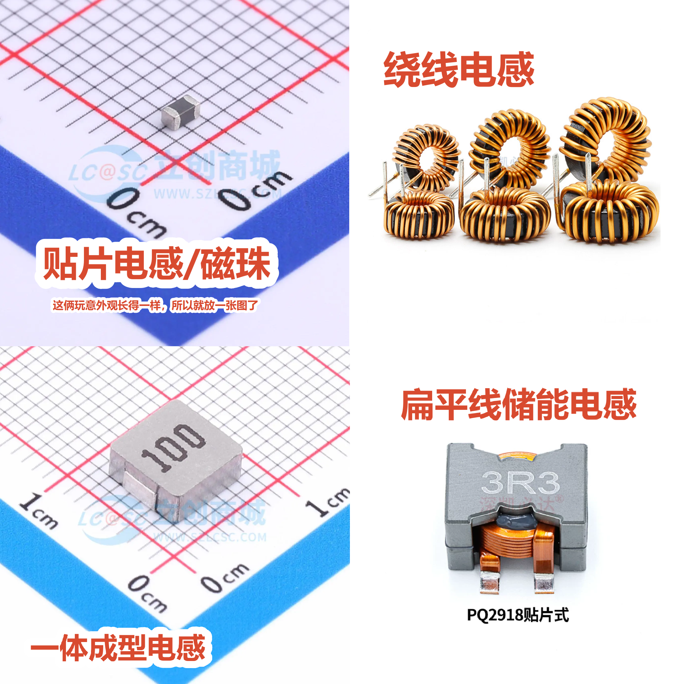
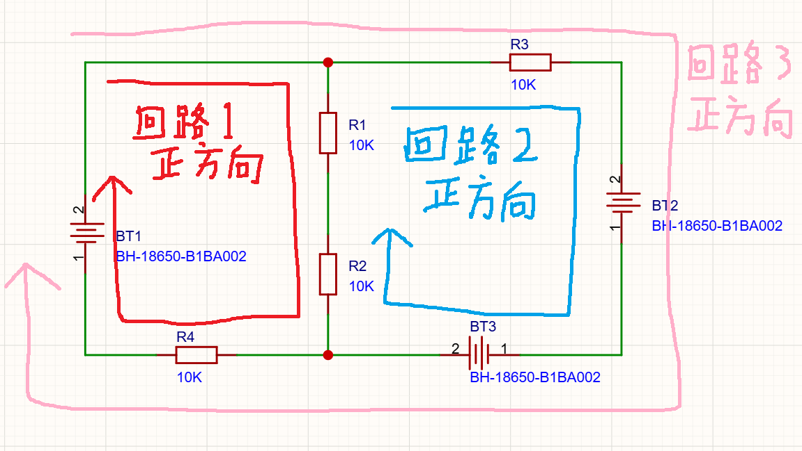
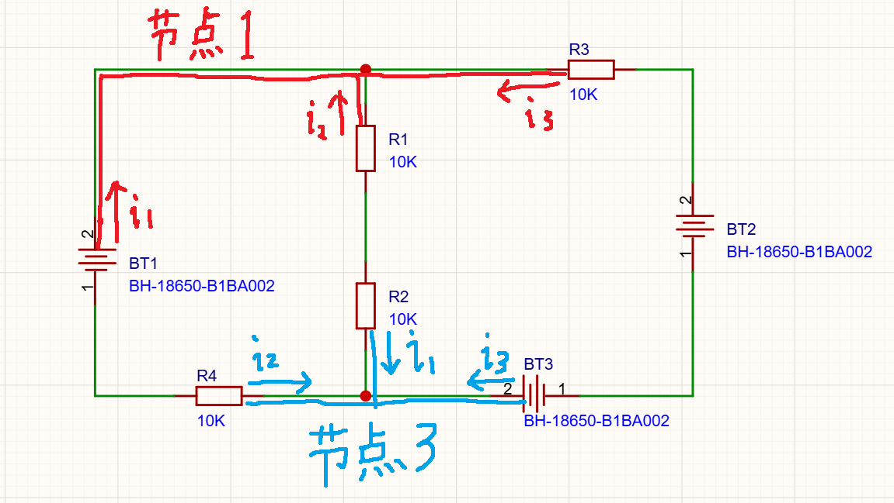
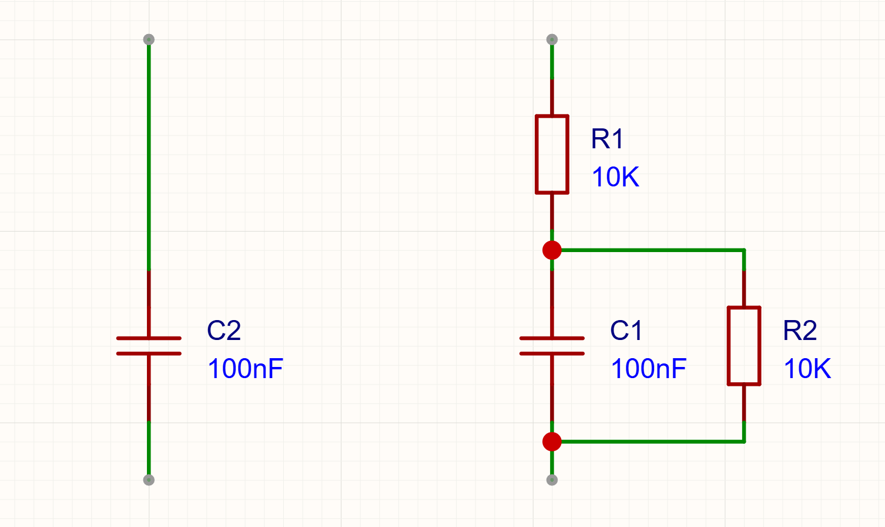
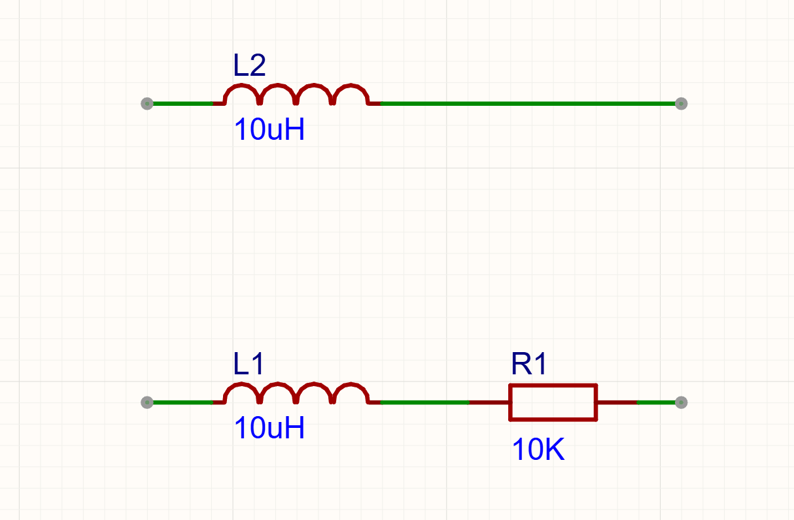
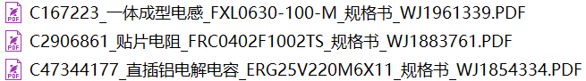


# 2.1 基本公式
## 电阻R & 电导G

- 公式[U=IR]
- R的单位是[欧姆(Ω)]
- 电导[G=1/R]
- G的单位是[西门子(S)],若从导电性而非电阻性的角度看待电路，我们就可以用电导来代替电阻进行分析，此时欧姆定理就会变成[I=GR]
- 电导在实际的电路计算中并不经常使用（电导这玩意几乎没什么用，忘掉他也无妨）
## 电容C

- 公式[Q=CU][I=Cdu/dt]
- C的单位是[法拉(F)]，也叫库伦每伏(C/V)，标志着电容两端每升高1V，储存的电荷会增加多少
- 对于目前还没学过高数的同学，可以把公式中的du/dt理解为电压的函数对时间求导，即对电压的函数u(t)求导得到的u'(t)
- 电流是电荷量的导数，所以如果对[Q=CU]两边求导，就能得到[I=Cdu/dt]
## 电感L

- 公式[Ut=LI][U=Ldi/dt]
- 电感的单位是[亨利(H)],也叫伏秒每安(Vs/A)，标志着电感中的电流每升高1A，电流的伏秒积会增加多少（伏秒积详见开关电源章节）
## 基尔霍夫电压定理（也叫[广义KVL]）
- 公式[∑u=0]，意思是在一个回路中，回路上所有元件的压降之和为0。

- [广义KVL]用来分析和计算电路中的某个[回路]（图中电路一共有3个[回路]，全都标出来了）
- 我们可以人为给某个[回路]规定一个方向（图中全使用的顺时针）。
- 沿着规定的方向如果某个电压是[降低]的，我们规定这个电压为[正压降]（u>0）。
- 沿着规定的方向如果某个电压是[升高]的，我们规定这个电压为[负压降]（u<0）。
- 如图在回路1中，就有[Ubt1+Ur1+Ur2+Ur4=0]（注意这些电压是有正负的，所以加和等于零），其中Ubt1<0，因为沿着规定的方向电压[升高]了，是[负压降]，所以Ubt1为负，如果BT1电池是5V电池，那Ubt1就是-5V，而不是+5V。
- 在回路2中，就有[Ur3+Ubt2+Ubt3+Ur2+Ur1=0]，其中Ubt2>0，Ubt3<0。
- 在回路3中，就有[Ur3+Ubt2+Ubt3+Ur4+Ubt1=0]，其中Ubt2>0，Ubt3<0，Ubt1>0。
## 基尔霍夫电流定理（也叫[广义KCL]）
- 公式[∑i=0]，意思是在一个[节点]上，流入[节点]的电流之和为0。

- [广义KCL]用来分析和计算电路中的某个[节点]（[节点]就是之前说的[网络]，图中一共有6个节点，这里标出来了2个）
- 我们可以人为给某个[节点]规定流入电流为正还是流出电流为正（图中全规定为流入为正）
- 如果[节点]上某个电流方向跟规定的正方向（这里是流入）是一致的（也就是流入），那这电流就是[正电流]（i>0）
- 如果[节点]上某个电流方向跟规定的正方向（这里是流入）是相反的（也就是流出），那这电流就是[负电流]（i<0）
- 如图在节点1中，就有红色的[i1+i2+i3=0]。
- 如图在节点3中，就有蓝色的[i1+i2+i3=0]。

# 2.2 现实模型与理想的区别
### 电容的等效模型（如图2-2-1）

- 电容的等效模型多出来了一个串联电阻[ESR]和一个并联电阻[IR]
- [ESR]的存在导致电容充电的电流大小受到了限制，会导致电容充放电更慢，充放电过慢会进一步导致电容的滤波能力下降（详见滤波器设计）。
- [IR]的存在导致电容两个电极之间存在微小的漏电流，如果充满电后把电容静静的放在那里，电容上的电压也会因为微小的漏电流而缓慢降低。
- 我们管这种现实中元件自带的难以避免的微小的（有的时候可能并非微小）阻值/容值/感值称作[寄生参数]，如寄生电阻，寄生电容，寄生电感等，这里的[ESR]&[IR]都称作寄生电阻。
### 电感的等效模型（如图2-2-2）

- 电感的等效模型多出来了一个串联电阻[ESR]。
- [ESR]的存在导致电感在经过大电流是会严重发热。

# 2.3 查看数据手册，了解电阻的额定功率，电容的耐压，电感的饱和电流温升电流等参数

#### [贴片电阻 规格书 （点击阅读）](datasheet/C2906861_贴片电阻_FRC0402F1002TS_规格书_WJ1883761.PDF)
- 电阻在超过[额定功率]的工况下会导致温度升高，造成[温漂],[温漂]是指元件因为温度变化产生的误差，单位是百万分之一每摄氏度[ppm/℃]。若[温漂]值为10ppm/℃，意思是温度每升高一度，阻值会偏移10e-6的比例（10e-6也就是1e-3％）。
- 根据电阻的[热阻(θ)]能计算出电阻持续工作在某功率下（前提是没加额外的散热器）的具体温度，[热阻]的单位是摄氏度每瓦[℃/W]，指电阻消耗的功率每升高1瓦，电阻的温度会比环境高出多少度。公式是[T=t0+P*θ]，其中T是电阻的温度，t0是环境温度，P是电阻消耗的功率，θ是热阻。
#### [电解电容 规格书 （点击阅读）](datasheet/C47344177_直插铝电解电容_ERG25V220M6X11_规格书_WJ1854334.PDF)
- 电容两端能承受的电压叫做[耐压]，电容的[耐压]一般是很小的数字，常见的典型值有3V,4.7V,10V,15V,50V,100V及更高。
#### [一体成型电感 规格书 （点击阅读）](datasheet/C167223_一体成型电感_FXL0630-100-M_规格书_WJ1961339.PDF)
- 电感能经过的最大电流是[额定电流]，[额定电流]一般是指[饱和电流(Isat)]和[温升电流(Irms)]两者中的最小值。
- 电感依靠磁芯内部的磁场B来储存能量，以实现通过磁芯让一个电感的感值变得更大，但磁芯能存储的能量终究是有限的，一但磁芯饱和（装不下更多磁场能量了），就再无法让电感保持很大的感值，导致电感的感值急剧下降，甚至跌落到接近为0。能保证不让磁芯发生饱和的能经过的最大电流即为[饱和电流(Isat)]，只要让电感电流工作在Isat以下，就几乎不可能发生磁芯饱和。（这里写“几乎”而不是“绝对”，是因为在开关电源中有一些特殊情况可以使电感没达到Isat也能发生饱和，详见开关电源章节）
- 电感内部的寄生电阻也会因为电流而发热，让电感不会发生过热的最大电流即为[温升电流(Irms)]（若有安装外部的散热器，可以让电流工作在Irms以上而不会过热）。