### 总览
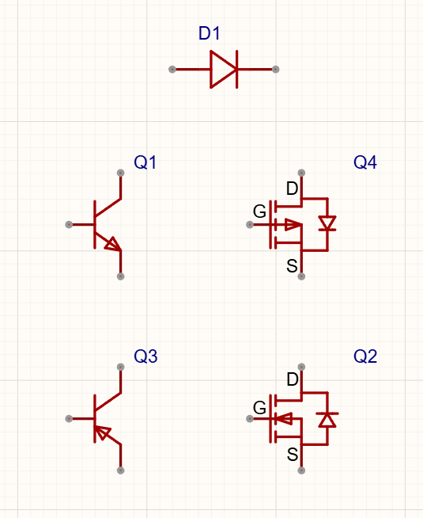
- 二极管
- 三极管（BJT）
- mos管
# 3.1 二极管
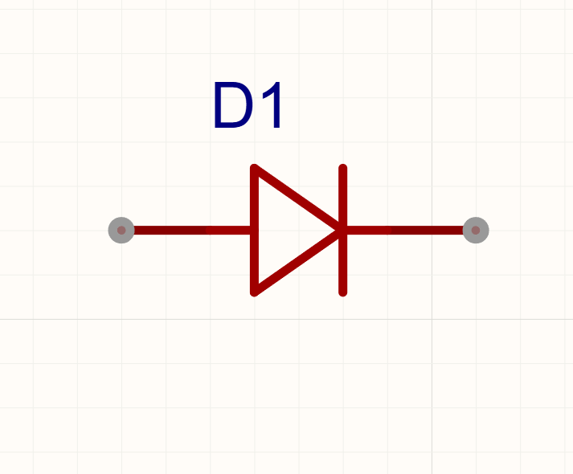
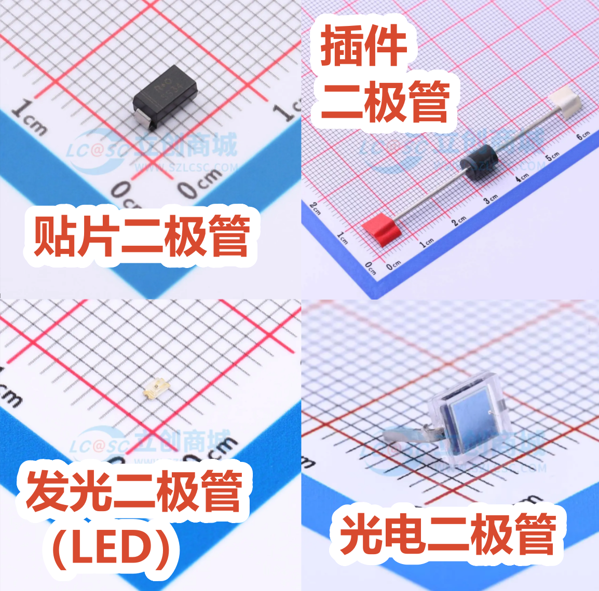
### 单向导电性
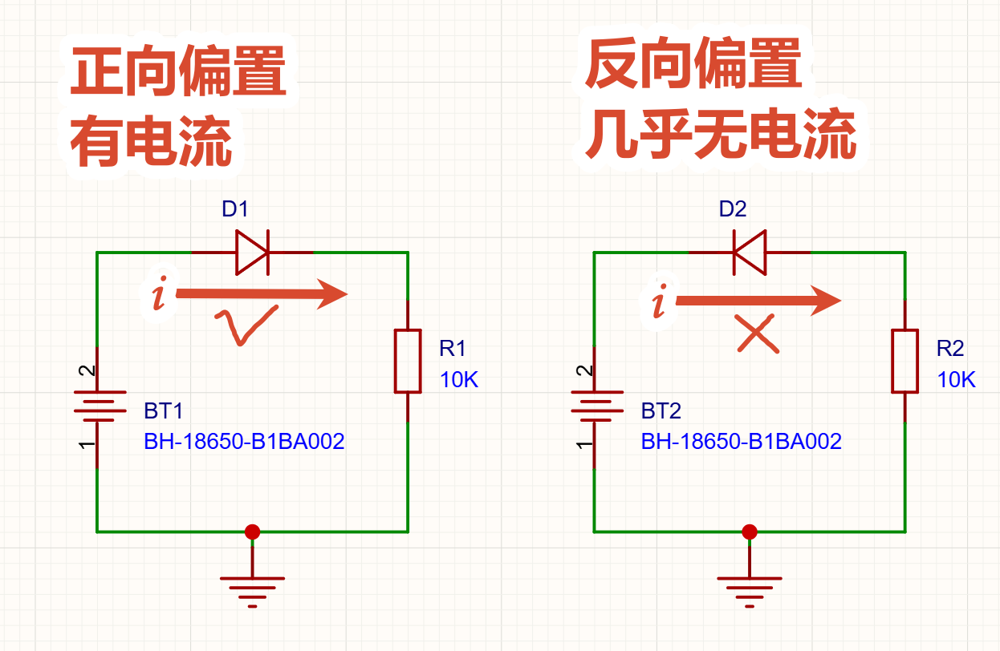
- 二极管只能单向导电，电流只能由阳极流向阴极，反向则会截止，几乎无电流。
- 给阳极高压，阴极低压，在二极管上形成正的电压，称为[正向偏置]，反之给二极管施加让他截止的反向电压，称为[反向偏置]。

### 正向压降
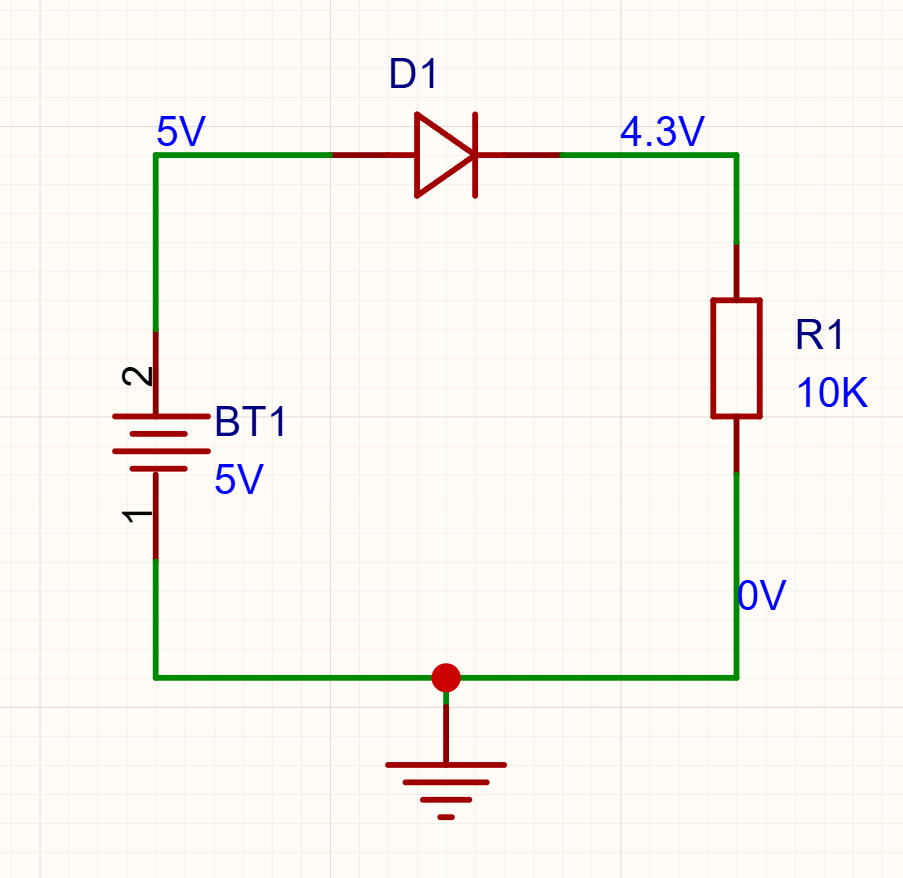
- 因为二极管是靠内部的一种叫做内建电场的东西实现单向导通的功能的，所以在正向导通的时候难以避免的会产生一定的压降（常见的二极管是0.7V），称为[正向压降]。
- 如图3-1-3中，若供电的电压为5V，电流经过产生0.7V的压降，最终电阻上实际只有4.3V的电压。

### 反向击穿
- 虽然二极管在[反向偏置]的时候几乎没有电流，但是当反向电压增大到超过二极管的承受范围时，二极管会发生反向击穿，二极管会失去反向截止的特性，产生极大的反向电流，约等于短路了，称为[雪崩击穿]和[齐纳击穿]。
- 大多数二极管（如开关二极管，肖特基二极管等）是绝对不可以反向击穿的，一但击穿直接报废。但有的经过特殊设计的二极管是可以反向击穿的，甚至为了实现某些功能会刻意去击穿他们（比如稳压管，静电防护tvs等）。

### 特性曲线
[开关二极管 规格书 （点击阅读）](datasheet\C2128_开关二极管_1N4148WS_规格书_WJ317201.PDF)
##### 开关二极管数据手册中的特性曲线
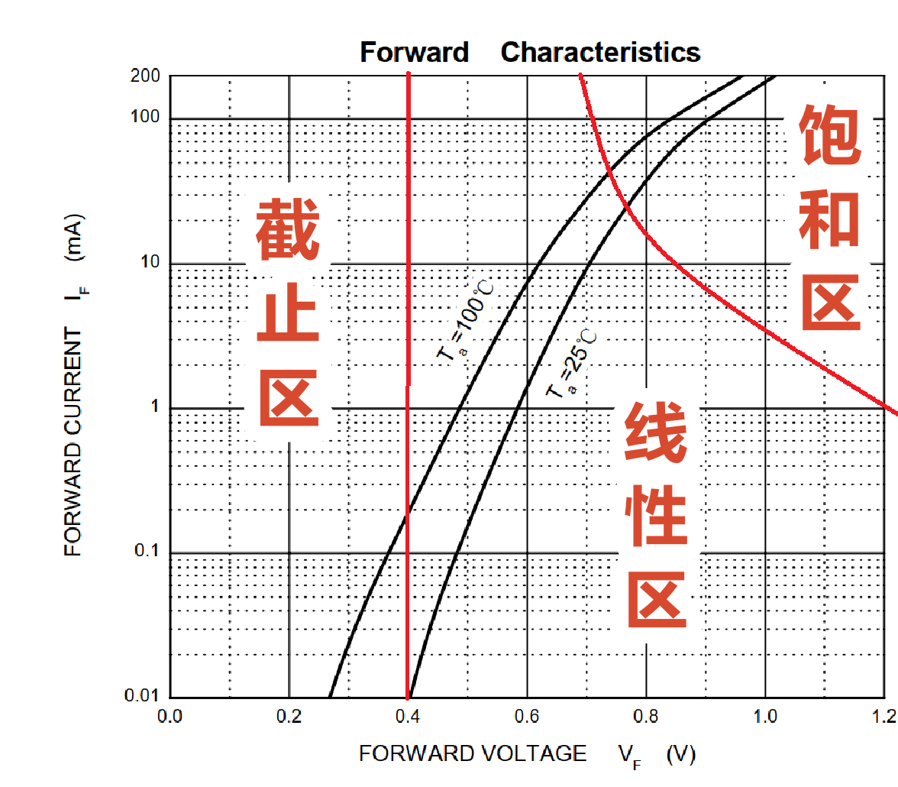
- [截止区]：偏置电压未达到开启电压（该二极管开启电压是0.4V），二极管未开启，几乎无电流
- [线性区]：偏置电压超过开启电压，二极管正向导通，di/du的值几乎不变，电流随电压上升的曲线接近一条直线，所以线性区内二极管的性质与电阻相似，可看作一个理想的二极管串联一个电阻。
- [饱和区]：电流大到一定程度时，超过了二极管的载流能力，电流难以继续升高，电压电流的关系不再线性。
##### 稳压二极管数据手册中的特性曲线
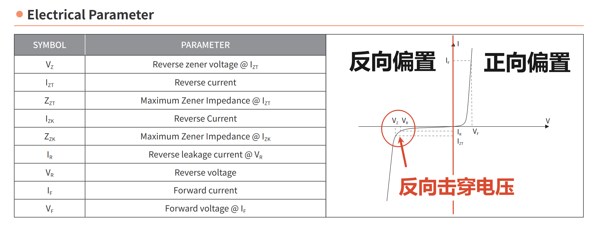
- 与上面的开关二极管特性曲线类似，正向偏置时同样存在[截止区]&[线性区]&[饱和区]，但是此特性曲线图中额外画出了反向偏置时的曲线，专门标出了[反向击穿电压]。
- 当偏置电压低于反向击穿电压时，二极管发生击穿，失去了单向导通的性质，电流反向导通，而且阻值极小，电流迅速增大，近乎短路。
### 常见用法-防插口反接
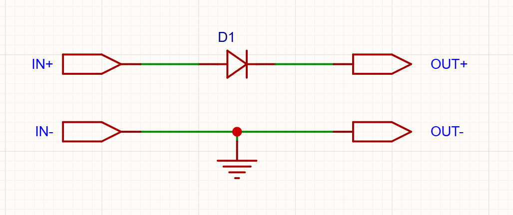
- 有的时候人们会不小心把电路的供电的正负极插反，导致很严重的后果，用二极管可以制作防反接电路，接反后无电流，电路不会爆炸。
- 对于大功率的应用，这种防反接做法并不合适，因为二极管上会产生固定的压降，大电流下会产生巨量的功耗。
- 假设二极管压降是0.7V，热阻是100℃/W，经过的电流是10A，那二极管消耗的功率是
0.7V*10A=7W
此时二极管的温度
7W*100℃/W=700℃
10A的电流就能让二极管温度高达700℃！！！实际上二极管在达到这个温度前早都爆炸了。可见这种做法在大功率的电路中完全不适用。
### 常见用法-电压钳位
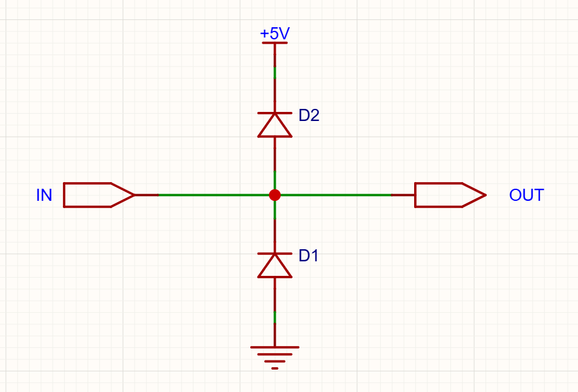
- 若二极管的正向压降为0.7V，则图中的钳位电路可以把输入到OUT端口的电压限制在-0.7V到5.7V之间（GND-0.7V<= VOUT <= VCC+0.7V）。
- 当电压在-0.7V到5.7V之间时，上下两管电压都未达到正向开启电压，二极管都截止，VOUT=VIN。
- 当电压小于-0.7V时，上管未达到正向开启电压，下管正向电压大于0.7V开始导通，输入的小于-0.7V的电压被强行连接到0V的网络，VIN被拉高直到电压高于-0.7V。
- 当电压大于-0.7V时，下管未达到正向开启电压，上管正向电压大于0.7V开始导通，输入的大于5.7V的电压被强行连接到5V的网络，VIN被拉低直到电压低于5.7V。
- 钳位电路可以很好的保护OUT端口，防止IN端口输入超过范围的电压导致OUT端口被过高的电压打坏。
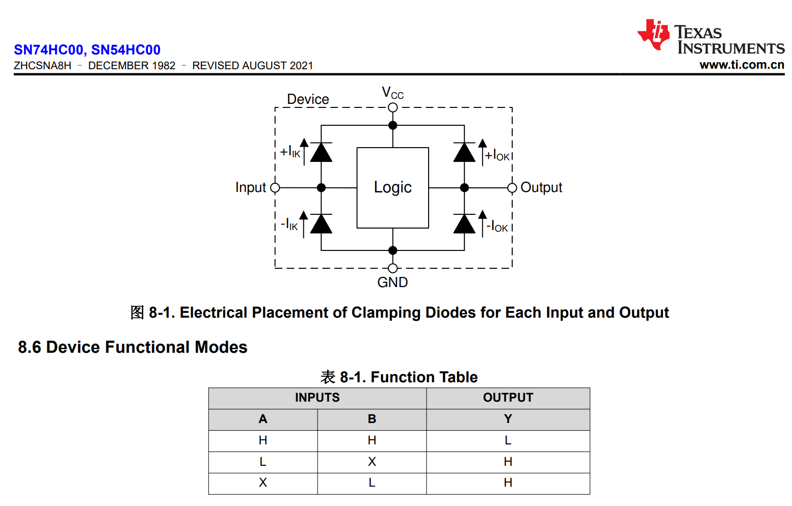某款使用了钳位电路作为保护的芯片的数据手册的截图
### 常见用法-稳压管
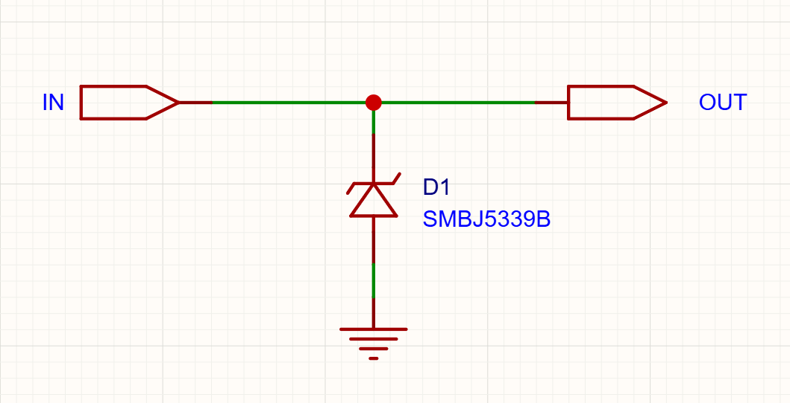
- 与钳位电路类似，如图的稳压管电路也是一种通过限制输入电压范围来保护元件的电路
- 稳压管的反向击穿电压很低，稳压管允许被反复击穿。
- 当输入电压过低（低于0V）时，稳压管正向导通，与钳位电路中的下管类似，将过低的电压拉高。
- 当输入电压过高，高于稳压管的反向击穿电压时，稳压管发生反向击穿，输入端与地之间导通，将过高的电压拉低。
- 对比钳位电路，稳压管的电路结构更简单，只需要一个元件就能实现，但是稳压管的稳压值是固定的，而钳位电路的稳压范围可以根据不同的供电范围而变化。
### 常见用法-防静电tvs
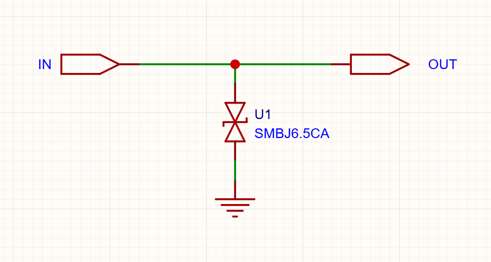
- tvs管，也算是二极管的一种变种，单向的tvs现在已经很少见到，基本上使用的是双向tvs，双向tvs相当于两个单向tvs共阳极串联在一起。
- tvs的唯一作用是防[ESD]对元器件造成伤害。
- [ESD]：指静电与浪涌，静电对人体虽然没什么伤害，但是对电路非常致命，瞬间的静电电压高达上千伏，各种半导体器件会被上千伏的电压直接打坏。浪涌指电路中产生的各种瞬间的电压尖峰，与静电十分类似，只不过产生的原因不同，静电伤害来自两个物体的直接接触，而浪涌来自电路的其它部分，比如电机制动产生的感生电动势，大功率H桥/H半桥的寄生电感产生的电压尖峰等等。
- tvs承受电流的能力很差，但是响应速度极快，对于ESD这种速度极快而电流很小的危害来说，tvs再合适不过了，tvs是ESD防护的专用电路。
- tvs的工作原理与稳压管完全一样，要了解工作原理请参考上面的稳压管。
### 发光二极管[LED]&光电二极管
- [LED]：即发光二极管，LED在有电流经过时会发光，LED发光效率极高，功耗极低，体积极小，非常适合作为各种指示灯。
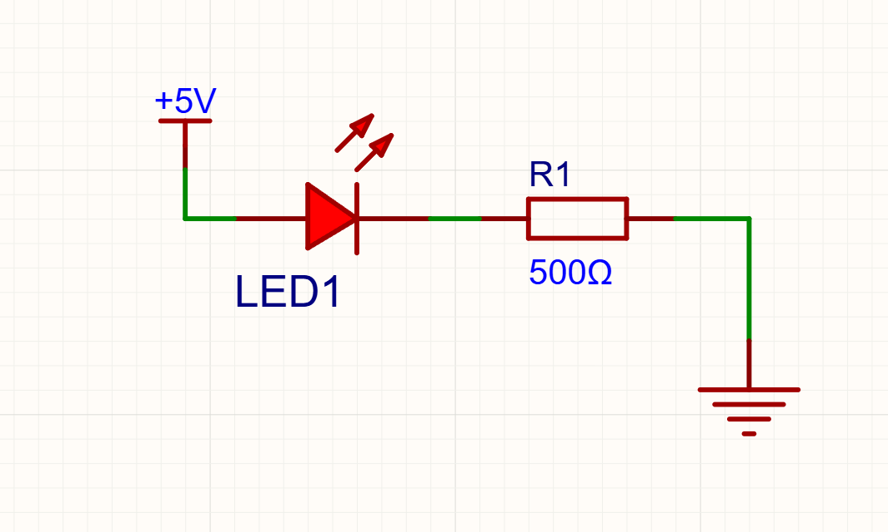
- LED的过流能力非常弱，使用时必须要串联一个至少500Ω左右的电阻来限制电流。
- [光电二极管]：光电二极管与LED相反，在受到特定波长的光源照射时，会产生及其微弱的电流，通过三极管放大这个微弱的电流，可以实现一个光照传感器电路，详见三极管章节[常见用法-传感器信号初级放大]
# 3.2 三极管（BJT）
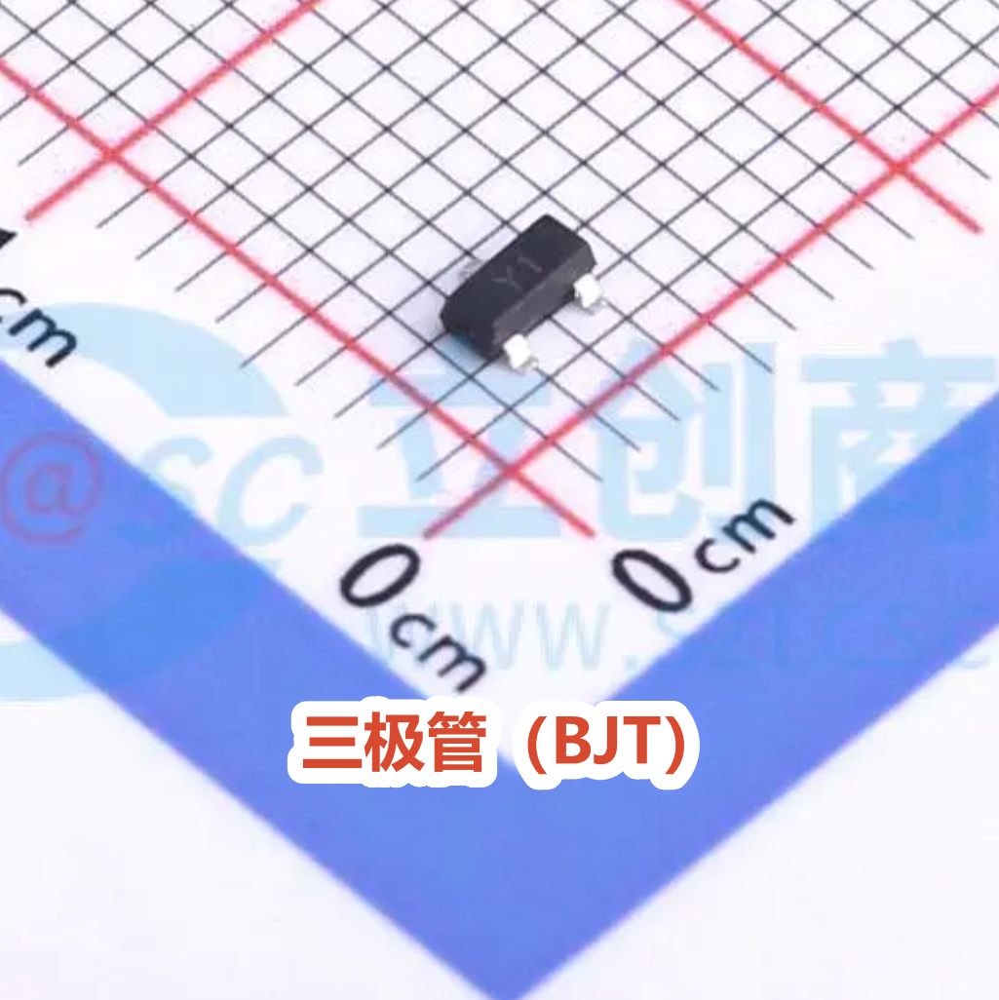
### 三极管的功能与结构
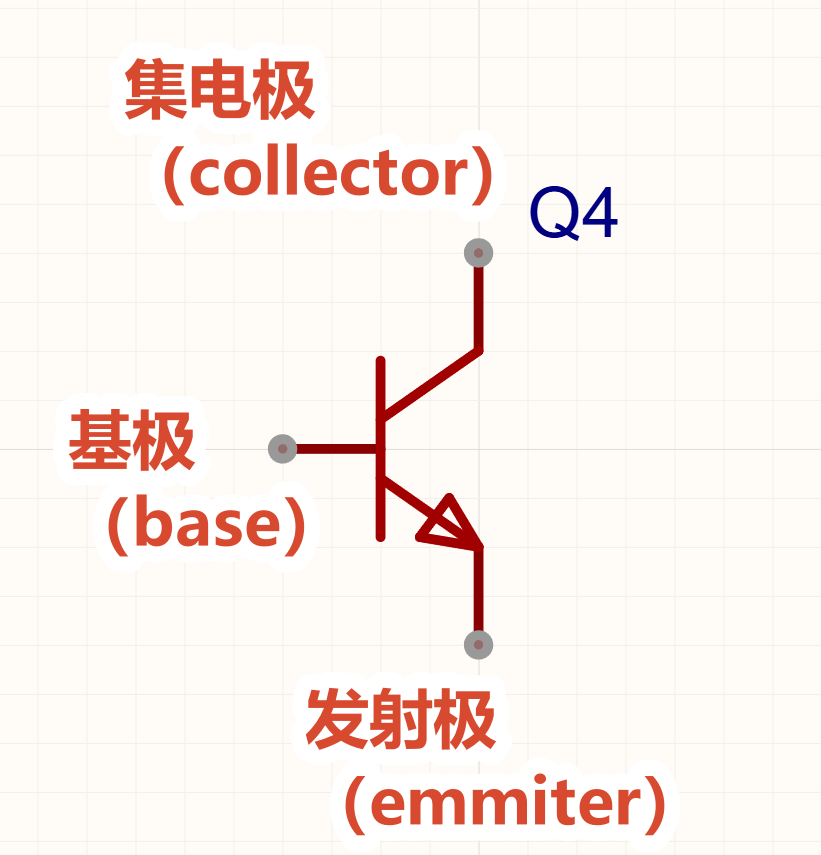
- 三极管有三个引脚，分别是[基极b]，[集电极c]，[发射极e]。
- 三极管可以看作一个由电流控制的开关，也可以看作一个可以放大电流的元件。
- 基极流向发射极的电流大小Ibe控制着集电极和发射极之间的通断
- 图中是最常见的npn型三极管，ce之间能通过的最大电流Ice由be之间的电流Ibe控制，关系是[Ice=βIbe]，其中三极管的[放大倍数β]是个固定的属性，只由三极管的型号和温度决定。
- 由[Ice=βIbe]可见三极管并非一个理想的由电流控制的开关，三极管实际上是一个可以放大电流的元件，只要给三极管的ce极之间施加一个恒定的电压，三极管就能满足将输入给基极的电流Ibe放大β倍变成Ice。
- [放大倍数β]是一个相当大的数字，一般在几百到几千的量级。
### 等效电路
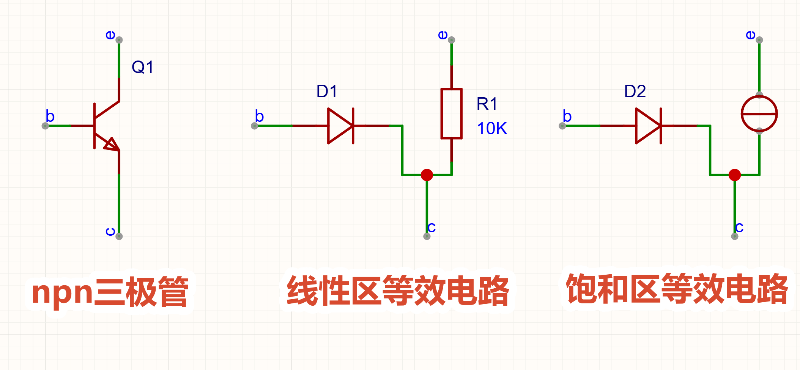
- 三极管的be极之间相当于一个二极管，npn型三极管中这个二极管是由b指向e的，也就是说控制电流只能由b流向e。
- be之间的等效二极管也说明了三极管的be之间需要一定的[开启电压]，因为二极管有一定的正向压降，be之间的电压Vbe低于开启电压时，无电流Ibe，三极管未能开启。
- 在[线性区]（线性区详见三极管的特性曲线）内工作时，三极管的ce极之间相当于一个电阻，电阻随基极电流Ibe增大而减小。
- 在[饱和区]（饱和区详见三极管的特性曲线）内工作时，三极管的ce极之间相当于一个恒流源，恒流源的电流随基极电流Ibe增大而增大。
### 特性曲线
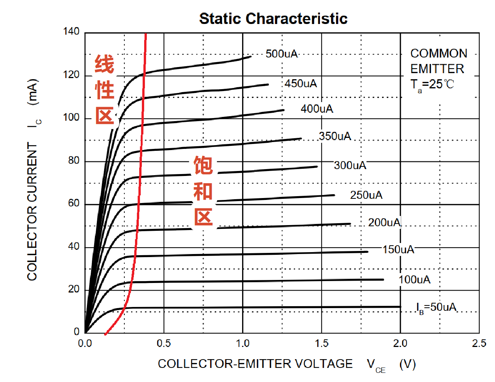
- [线性区]：be间的等效二极管导通产生电流，ce间导通，ce间的电流未接近饱和电流，此时di/du的值几乎不变，电流随电压上升的曲线接近一条直线，所以线性区内ce间的性质与电阻相似，可看作一个电阻，只不过阻值大小由Ibe决定，Ibe越大，阻值越小。
- [饱和区]：ce间电流大到一定程度时，超过了三极管ce间的载流能力，电流难以继续升高，电压电流的关系不再线性，直到接近恒流（电压继续升高但是电流几乎不变了）。
### npn型三极管与pnp型三极管
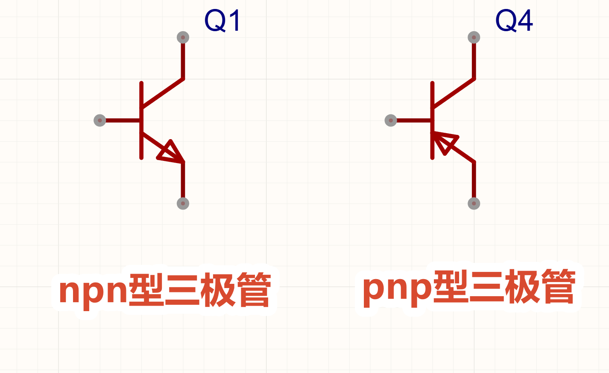
- 图左便是刚才介绍的npn型三极管，但三极管中还有一种不太常见的pnp型三极管，如图右。
- pnp型三极管与npn型不同的地方在于，他的be间二极管方向是反过来的，也就是说他需要Ibe<0才能开启，其余属性与npn型三极管均类似。
- 换言之，npn三极管的be之间电压Ube>0才能开启，pnp三极管的be之间Ube<0才能开启，两者的开启条件正好相反。
### 常见用法-驱动供电电压较高的元件
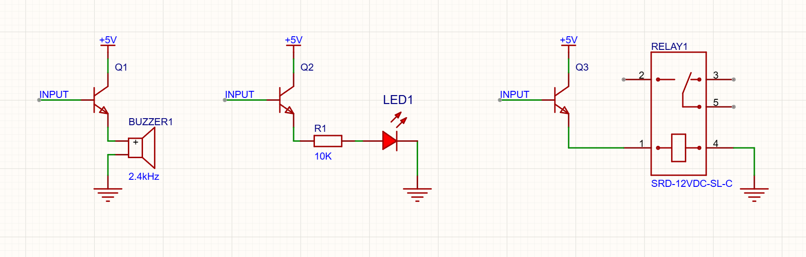
- 当使用单片机，数字芯片等来控制其它元件时，常因为单片机输出电流不够导致无法正常驱动其它元件，这时我们就需要使用三极管来放大电流。
- 如上图分别是使用三极管驱动蜂鸣器/LED/继电器的电路，单片机输入给基极一个微小的电流Ibe，三极管将电流Ibe放大β倍变成Ice，放大了上百倍的Ice便能轻松驱动蜂鸣器/LED/继电器等元件。
### 常见用法-信号放大电路
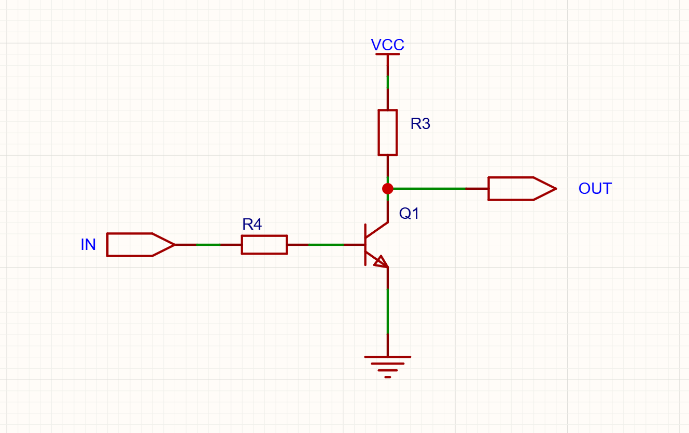
- 当三极管工作在线性区时，ce之间相当于一个由Ibe控制的可变电阻（记为Rce），Rce与图中R3串联，输出的电压Vout是Vcc经过R3//Rce串联分压后的结果，Vout=(Vcc*Rce)/(Rce+R3)。
- 假设三极管的be间二极管的正向压降为0.7V，当输入一个电压Vin，Vin产生的Ibe大小为（Vin-0.7V）/R4。
- Ibe的大小与Vin成正比，Vin增大>>Ibe增大>>Rce减小>>Vout减小，Vin减小>>Ibe减小>>Rce增大>>Vout增大。
- Vin增大Vout减小，Vin减小Vout增大，同时Vout的大小与Vcc成正比，也就是说该电路起到了反向放大的作用，控制Vcc的大小就能控制放大的倍率。将Vin放大变成了Vout，只不过方向反了过来，大概的关系是Vout=V0-kVin（Vin>0），其中V0是静态工作点，Vin=0时Vout的电压，k是放大倍率，由电路的各种参数决定。
- 图中示例其实是一个不完整的共射放大电路，作为放大电路他还有很多缺点，比如Vin低于be二极管正向压降时三极管截止，无法放大，输出信号有很大的直流偏置V0，输入信号Vin为负的时候根本无法工作，输出阻抗极高很难驱动大电流应用等等，想要了解更多关于放大电路的可以参阅模拟电路，实际应用中我们更多的是直接使用现成的放大器芯片，而不是自己手搓一个简陋的放大电路，所以分立元件组成的放大电路仅供了解即可。
### 常见用法-开漏输出与推挽输出
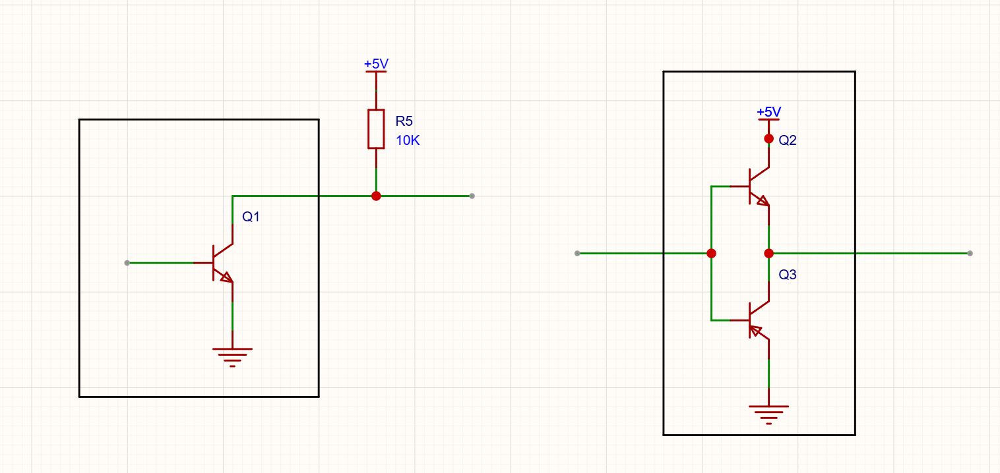
- 图左为三极管组成的开漏输出电路，图右为三极管组成的推挽输出电路。
- [开漏输出]：当输入低电平时（接近0V），三极管未开启，输出相当于通过R5直接与供电VCC相连，输出高电平，电阻R5被称为[上拉电阻]，把电压拉高了。当输入低电平时（能让三极管开启的电压），三极管开启，三极管的电阻远小于上拉电阻R5，输出被拉低，输出低电平。
- 若是R5不接VCC，而是接地，则R5会变成下拉电阻，此时输入低电平输出低电平，输入高电平输出高电平。
- [推挽输出]：当输入低电平时（小于0V），上管为npn型三极管关闭，下管为pnp型三极管导通，输出相当于经过下管连接到了地，输出为0V的低电平。当输入高电平时（大于0V），上管为npn型三极管导通，下管为pnp型三极管关闭，输出相当于经过上管连接到了VCC，输出为VCC，高电平。
- 推挽输出和开漏输出虽然都能实现用输入信号控制输出，但开漏输出在三极管关闭时，输出的电压全靠那个上/下拉电阻提供，输出跟供电（VCC或者地）之间有一个阻值很大的上/下拉电阻，导致其输出电流的能力极差。推挽输出并没有使用上/下拉电阻，在输出高低电平时都是通过上下管直接与供电连接，输出和供电之间只隔了一个完全开启的三极管，阻值极低，其输出电流的能力很强，适合驱动各种大功率的应用。
- 推挽输出虽然输出能力强，但是使用了两个三极管，而开漏输出只使用了一个三极管，开漏输出其成本远低于推挽输出。
- 在数电中，通过开漏输出可以用极简的电路实现[线与]或者[线或]的逻辑，成本远低于推挽，缺点是速率很慢，例如学习单片机时提到的I2C总线使用的就是[线或]的逻辑实现的，[线与]和[线或]详见数字电路章节。
### 常见用法-传感器信号初级放大
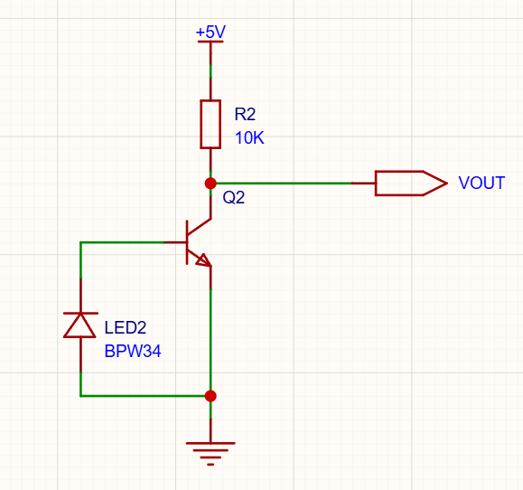
- 光电二极管会产生的电流及其微弱，难以观测，根据三极管可以放大电流的特性，我们可以使用三极管来放大这个微弱的电流，实现光照传感器电路。
- 如图将一个光电二极管接到了三极管的基极，让光电二极管的电流经过三极管，被放大β倍变成Ice，此时三极管可以等效为一个电阻，与图中的R2分压，产生输出电压Vout，光照越强，光电二极管输出的电流越大，三极管等效的电阻越小，Vout越小，同理光照越弱，Vout越大。
- 这种一个光电二极管和一个光电三极管组合而成的电路，我们称之为[光电三极管]，使用时为了方便，我们更多时候会直接去购买光电三极管，而不是用光电二极管和三极管组合一个出来。
# 3.3 mos管
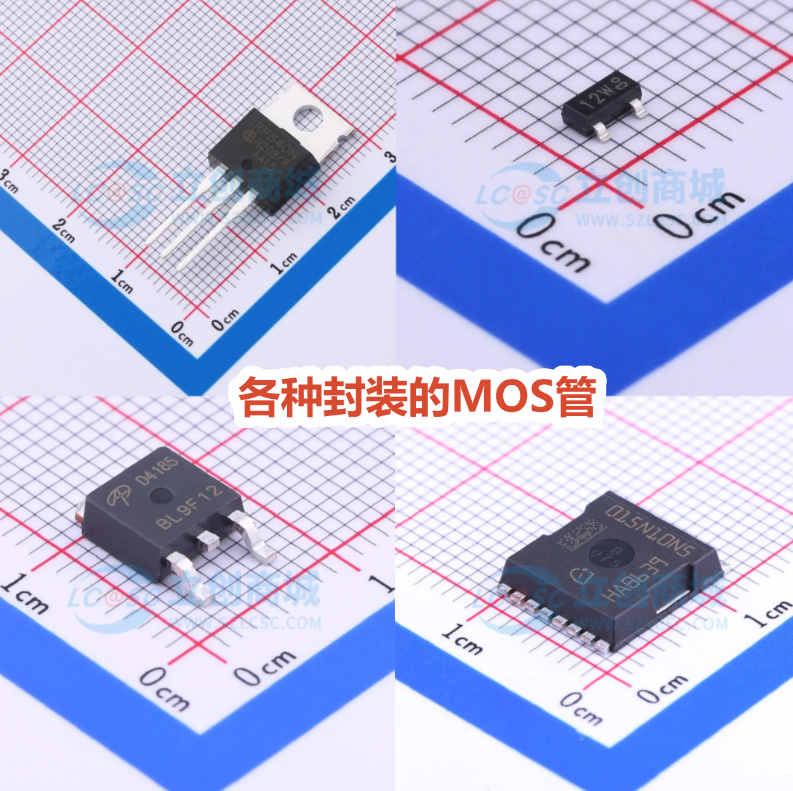
### mos管的功能与结构
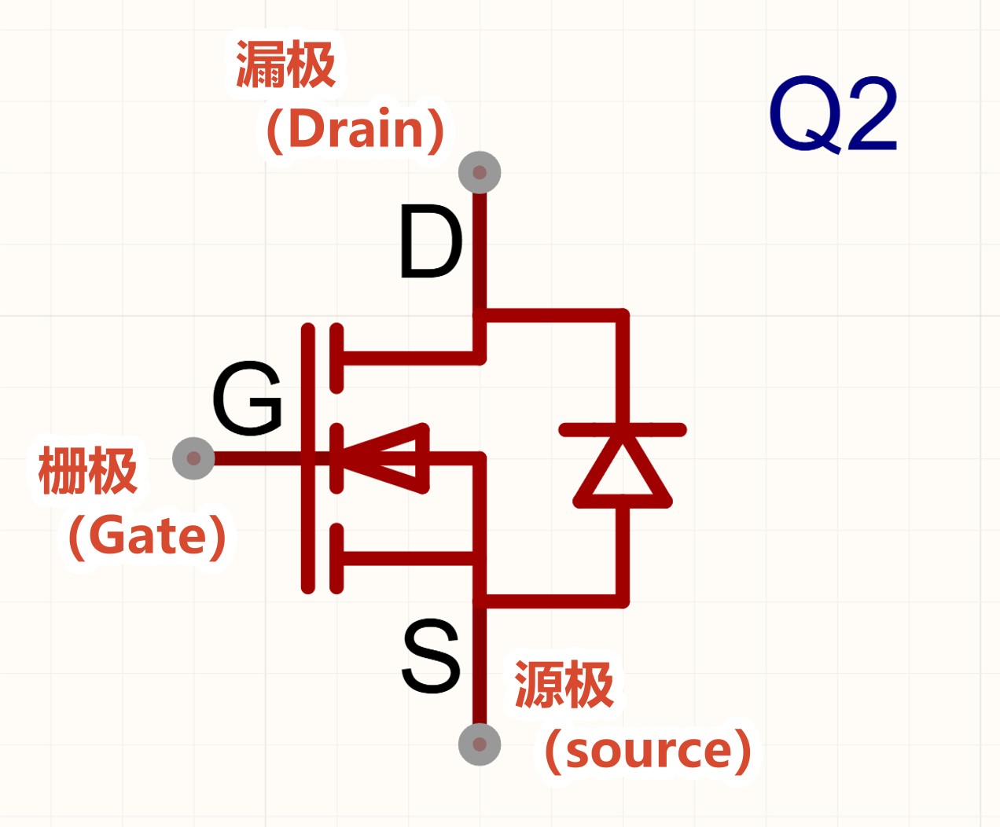
- mos管有三个引脚，分别是[栅极g]，[漏极d]，[源极s]。
- mos管可以看作一个由电压控制的开关。
- 栅极相对于源极的电压大小Vgs控制着漏极和源极之间的通断
- 图中是最常见的nmos，ds之间能通过的最大电流Ids由gs之间的电压Vgs控制，Vgs和Ids的关系是非线性的，不能像三极管那样可以用一个简单的倍数β表示，这个关系同样会受到温度和型号的影响而不同。
- mos管并非一个理想的由电压控制的开关，准确来说是一个由电压控制的电阻。
- mos管的载流能力极强，远比三极管强，以至于mos管很少会工作在饱和状态，所以讨论mos管时基本上不用考虑饱和的情况。
### 等效电路
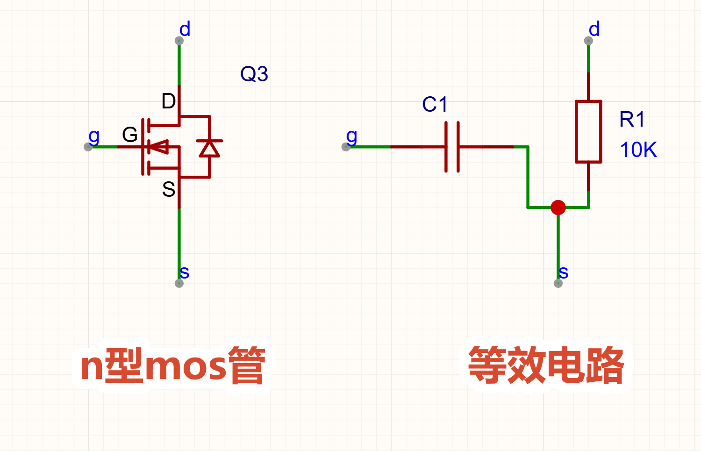
- mos管因为很少考虑饱和的情况，所以其等效电路不用等效恒流模型，只需要将其简单的等效成gs间一个电容，电容的电压控制ds间的电阻的大小。
### 特性曲线
[NMOS 规格书 （点击阅读）](datasheet\C8545_场效应管(MOSFET)_2N7002_规格书_WJ134536.PDF)
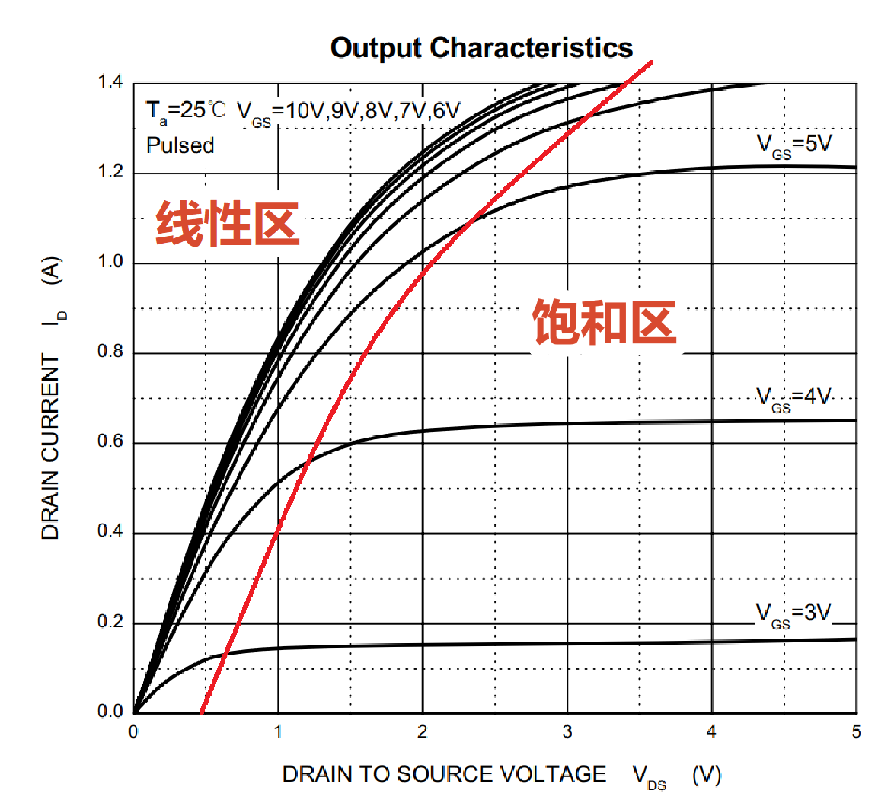
- 线性区与饱和区跟三极管同理，线性区du/di接近一个定值，性质类似一个电阻，等效为电阻，饱和区电流不再增加，等效为电流源。
- 图中能看到mos管的饱和电流随着栅极电压Vgs而增加的很快，栅极电压大于6V时的曲线的饱和区甚至都超出了表格显示的范围，所以可见mos管的饱和电流极高，根本不用担心饱和问题。
### nmos与pmos
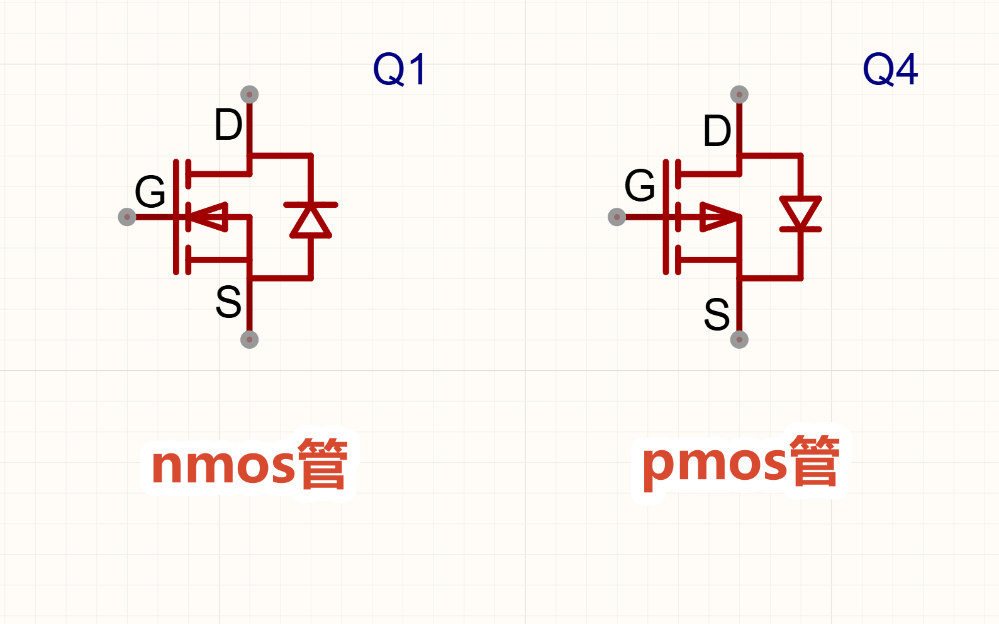
- 图左便是刚才介绍的nmos，但mos管中还有一种不太常见的pmos，如图右。
- pmos与nmos不同的地方在于，他的电容上画的箭头方向是反过来的，也就是说他需要Ibe<0才能开启，其余属性与npn型三极管均类似。
- 换言之，npn三极管的be之间电压Ube>0才能开启，pnp三极管的be之间Ube<0才能开启，两者的开启条件正好相反。
### 常见用法-驱动供电电压较高的元件
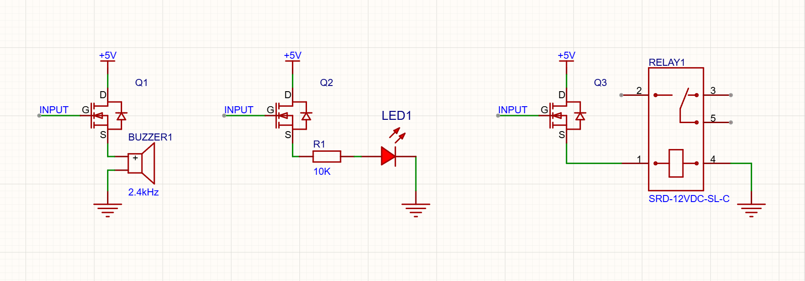
- 与上面的三极管类似，同样的电路结构，输入高电平，mos管导通，元件工作（图中是LED，蜂鸣器，继电器），输入低电平，mos管关断，元件停止工作。
- 但是实际情况中对于这种小功率的应用，我们更倾向于使用三极管而不是mos管，因为三极管只需要一个二极管的正向压降就能导通，一般只要零点几伏，而刚才看到的mos管的开启电压甚至需要好几伏，远高于三极管，如果一个单片机最高只能输出3V，而mos管需要的开启电压是5V，那单片机就无法开启mos管，但是三极管就没这么高的要求了，单片机可以轻松开启三极管。
### 常见用法-信号放大电路
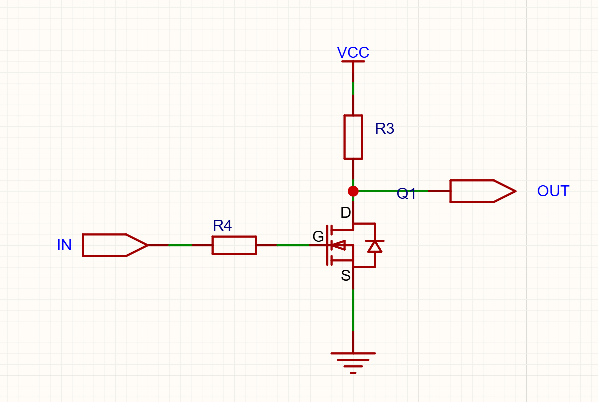
- 与三极管类似，mos管也能组成信号放大电路，跟三极管放大电路性质几乎一样。
### 常见用法-开漏输出与推挽输出
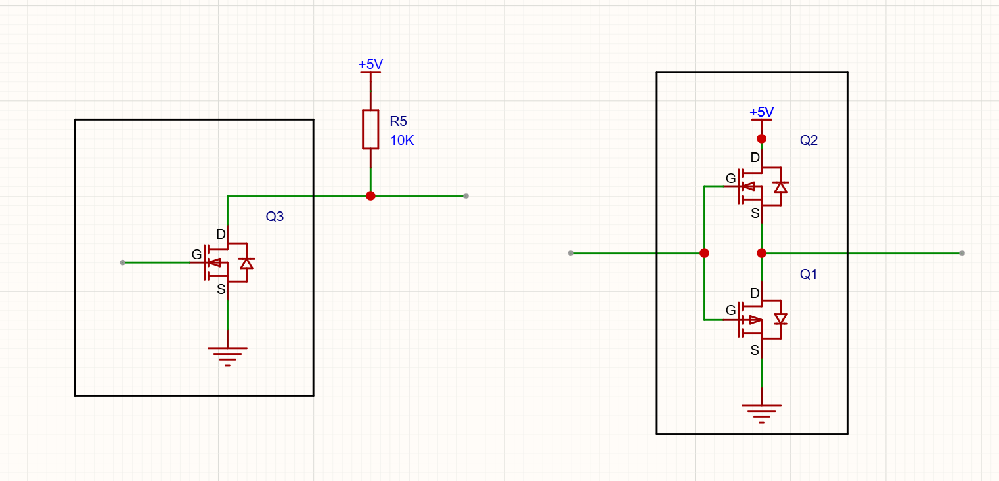
- 与三极管类似，mos管也能组成开漏与推挽输出，而且mos管组成的开漏与推挽才是更主流的选择，三极管组成的开漏与推挽早已被淘汰，只有在一些特殊功能的芯片中使用。
- 图中两个推挽都是用一个nmos和一个pmos组成的，左边的推挽在输入低电平时输出高电平，输入高电平时输出低电平，输入与输出相反，右边的推挽在输入高电平时输出高电平，在输入低电平时输出低电平，输入与输出一致，我们管左边的推挽叫做反相器，管右边的推挽叫做中继器，其用法详见数字电路。
### 常见用法-大功率开关
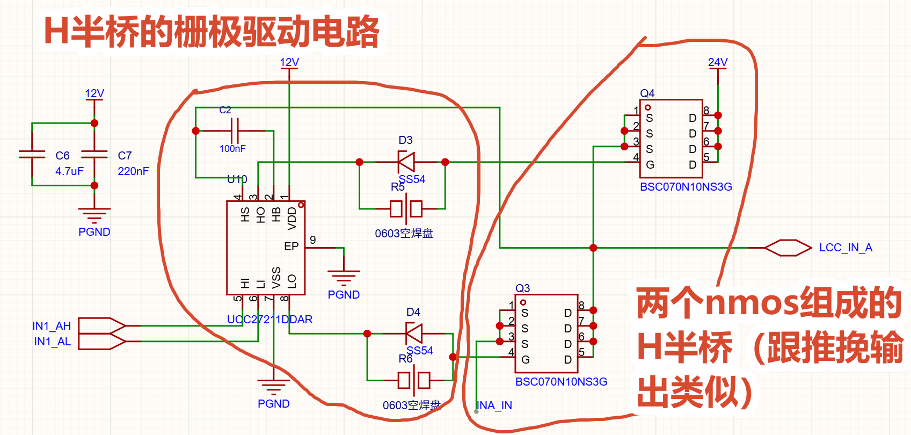
- 由于mos管出色的载流性能，各种大功率的应用我们会使用mos管进行功率控制，其中nmos的载流能力比pmos又强出不少，所以我们在大功率应用中会使用两个nmos作为推挽的上下管而不是一个pmos和一个nmos，在大功率应用中我们宁愿使用复杂的栅极驱动电路也不愿使用性能较弱的pmos。
- 我们管这种两个nmos组成的推挽叫做H半桥，因为他长得特别像半个H。
- 驱动两个nmos的电路称作栅极驱动电路，图中我们只需要输入AH,AL信号，就能通过栅极驱动控制两个大功率nmos的通断。
# 3.4 浅谈mos管和三极管的优缺点，何时用三极管，何时用mos管
- mos管的载流能力远远强于三极管，在大功率的应用中一定要使用mos管而不是三极管。
- 三极管的驱动电压远低于mos管，如果是小功率的需要用单片机用低压直接驱动的电路，一定要选择三极管而不是mos管。
- mos管的开关速率远远高于三极管，在需要高频的进行开关的场合，一定有选择mos管而不是三极管。（这就是为什么现代的计算机芯片内部都是使用mos管而不是三极管，就是为了达到更高的速率）
# 3.5 浅谈PN结，载流子，半导体器件内部的工作原理，为什么半导体器件高温下无法工作，为什么半导体器件在经过大电流的时候过流能力会下降
- （请自行去了解）单晶硅中掺杂磷原子或者硼原子，产生大量电子与空穴作为载流子，称为P型和N型半导体，PN半导体组成了二极管，三极管，mos管，载流子数量有限，电流过大超过有限的载流子的载流能力时电流便无法再增长，高温会让大量共价键的电子逃逸形成更多的电子和空穴作为载流子，导致PN半导体的导电性能增强，因此高温下许多半导体无法正常关断。