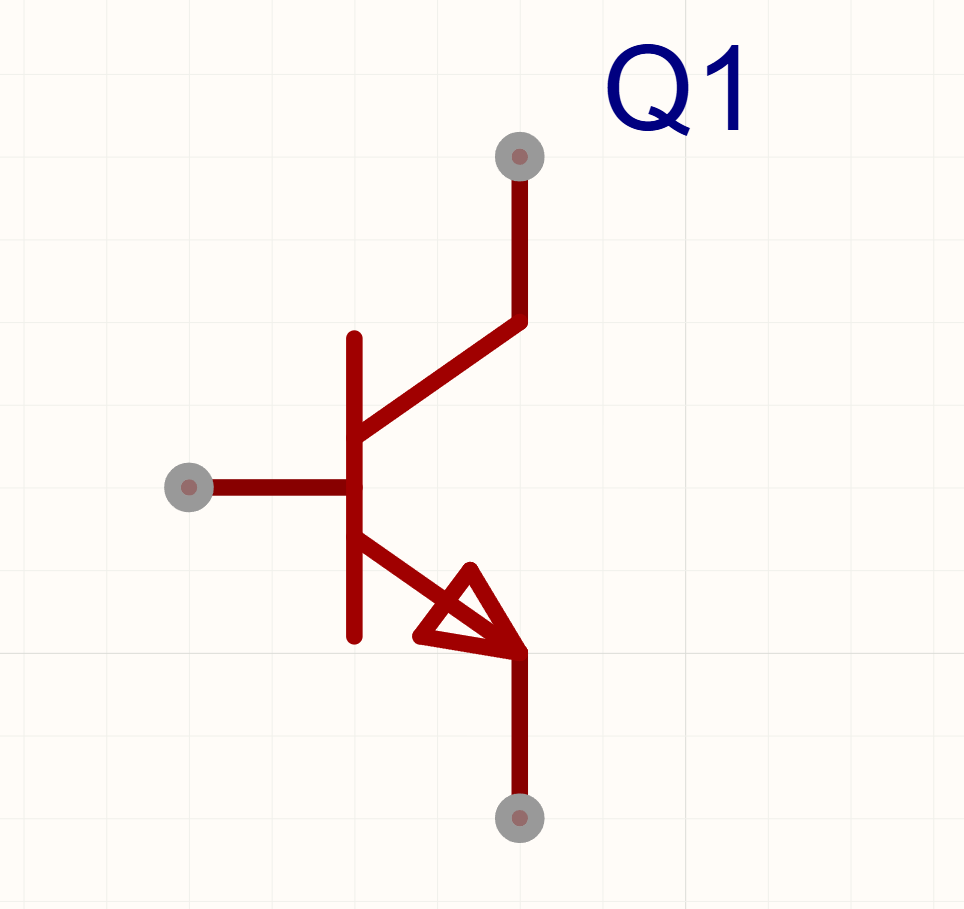

### 总览

- 二极管
- 三极管
- mos管
# 3.1 二极管

### 单向导电性

- 二极管只能单向导电，电流只能由阳极流向阴极，反向则会截止，几乎无电流。
- 给阳极高压，阴极低压，在二极管上形成正的电压，称为[正向偏置]，反之给二极管施加让他截止的反向电压，称为[反向偏置]。

### 正向压降

- 因为二极管是靠内部的一种叫做内建电场的东西实现单向导通的功能的，所以在正向导通的时候难以避免的会产生一定的压降（常见的二极管是0.7V），称为[正向压降]。
- 如图3-1-3中，若供电的电压为5V，电流经过产生0.7V的压降，最终电阻上实际只有4.3V的电压。

### 反向击穿
- 虽然二极管在[反向偏置]的时候几乎没有电流，但是当反向电压增大到超过二极管的承受范围时，二极管会发生反向击穿，二极管会失去反向截止的特性，产生极大的反向电流，约等于短路了，称为[雪崩击穿]和[齐纳击穿]。
- 大多数二极管（如开关二极管，肖特基二极管等）是绝对不可以反向击穿的，一但击穿直接报废。但有的经过特殊设计的二极管是可以反向击穿的，甚至为了实现某些功能会刻意去击穿他们（比如稳压管，静电防护tvs等）。

### 特性曲线
[开关二极管 规格书 （点击阅读）](datasheet\C2128_开关二极管_1N4148WS_规格书_WJ317201.PDF)
##### 开关二极管数据手册中的特性曲线

- [截止区]：偏置电压未达到开启电压（该二极管开启电压是0.4V），二极管未开启，几乎无电流
- [线性区]：偏置电压超过开启电压，二极管正向导通，di/du的值几乎不变电流随电压上升的曲线接近一条直线，所以线性区内二极管的性质与电阻相似，可看作一个理想的二极管串联一个电阻。
- [饱和区]：电流大到一定程度时，超过了二极管的载流能力，电流难以继续升高，电压电流的关系不再线性。
##### 稳压二极管数据手册中的特性曲线

- 与上面的开关二极管特性曲线类似，正向偏置时同样存在[截止区]&[线性区]&[饱和区]，但是此特性曲线图中额外画出了反向偏置时的曲线，专门标出了[反向击穿电压]。
- 当偏置电压低于反向击穿电压时，二极管发生击穿，失去了单向导通的性质，电流反向导通，而且阻值极小，电流迅速增大，近乎短路。
### 常见用法-防插口反接

- 有的时候人们会不小心把电路的供电的正负极插反，导致很严重的后果，用二极管可以制作防反接电路，接反后无电流，电路不会爆炸。
- 对于大功率的应用，这种防反接做法并不合适，因为二极管上会产生固定的压降，大电流下会产生巨量的功耗。
- 假设二极管压降是0.7V，热阻是100℃/W，经过的电流是10A，那二极管消耗的功率是
0.7V*10A=7W
此时二极管的温度
7W*100℃/W=700℃
10A的电流就能让二极管温度高达700℃！！！实际上二极管在达到这个温度前早都爆炸了。可见这种做法在大功率的电路中完全不适用。
### 常见用法-电压钳位

- 若二极管的正向压降为0.7V，则图中的钳位电路可以把输入到OUT端口的电压限制在-0.7V到5.7V之间（GND-0.7V<= VOUT <= VCC+0.7V）。
- 当电压在-0.7V到5.7V之间时，上下两管电压都未达到正向开启电压，二极管都截止，VOUT=VIN。
- 当电压小于-0.7V时，上管未达到正向开启电压，下管正向电压大于0.7V开始导通，输入的小于-0.7V的电压被强行连接到0V的网络，VIN被拉高直到电压高于-0.7V。
- 当电压大于-0.7V时，下管未达到正向开启电压，上管正向电压大于0.7V开始导通，输入的大于5.7V的电压被强行连接到5V的网络，VIN被拉低直到电压低于5.7V。
- 钳位电路可以很好的保护OUT端口，防止IN端口输入超过范围的电压导致OUT端口被过高的电压打坏。
某款使用了钳位电路作为保护的芯片的数据手册的截图
### 常见用法-稳压管

- 与钳位电路类似，如图的稳压管电路也是一种通过限制输入电压范围来保护元件的电路
- 稳压管的反向击穿电压很低，稳压管允许被反复击穿。
- 当输入电压过低（低于0V）时，稳压管正向导通，与钳位电路中的下管类似，将过低的电压拉高。
- 当输入电压过高，高于稳压管的反向击穿电压时，稳压管发生反向击穿，输入端与地之间导通，将过高的电压拉低。
- 对比钳位电路，稳压管的电路结构更简单，只需要一个元件就能实现，但是稳压管的稳压值是固定的，而钳位电路的稳压范围可以根据不同的供电范围而变化。
### 常见用法-防静电tvs

- tvs管，也算是二极管的一种变种，单向的tvs现在已经很少见到，基本上使用的是双向tvs，双向tvs相当于两个单向tvs共阳极串联在一起。
- tvs的唯一作用是防[ESD]对元器件造成伤害。
- [ESD]：指静电与浪涌，静电对人体虽然没什么伤害，但是对电路非常致命，瞬间的静电电压高达上千伏，各种半导体器件会被上千伏的电压直接打坏。浪涌指电路中产生的各种瞬间的电压尖峰，与静电十分类似，只不过产生的原因不同，静电伤害来自两个物体的直接接触，而浪涌来自电路的其它部分，比如电机制动产生的感生电动势，大功率H桥/H半桥的寄生电感产生的电压尖峰等等。
- tvs承受电流的能力很差，但是响应速度极快，对于ESD这种速度极快而电流很小的危害来说，tvs再合适不过了，tvs是ESD防护的专用电路。
- tvs的工作原理与稳压管完全一样，要了解工作原理请参考上面的稳压管。
### 发光二极管[LED]&光电二极管
- [LED]：即发光二极管，LED在有电流经过时会发光，LED发光效率极高，功耗极低，体积极小，非常适合作为各种指示灯。

- LED的过流能力非常弱，使用时必须要串联一个至少500Ω左右的电阻来限制电流。
# 3.2 三极管
### 三极管的功能与结构

- 
### 等效电路

- 
### 特性曲线

- 
### npn型三极管与pnp型三极管

- 
### 常见用法-驱动供电电压较高的元件

- 
### 常见用法-信号放大电路

- 
### 常见用法-开漏输出与推挽输出

### 常见用法-传感器信号初级放大

- 

# 3.3 mos管
### mos管的功能与结构

- 
### 等效电路

- 
### 特性曲线

- 
### nmos与pmos

- 
### 常见用法-驱动供电电压较高的元件

- 
### 常见用法-大功率开关

- 
### 常见用法-信号放大电路

- 
### 常见用法-开漏输出与推挽输出

- 

# 3.4 浅谈mos管和三极管的优缺点，何时用三极管，何时用mos管

# 3.5 浅谈PN结，载流子，半导体器件内部的工作原理，为什么半导体器件高温下无法工作，为什么半导体器件在经过大电流的时候过流能力会下降