### 4.1 RC的响应和计算公式
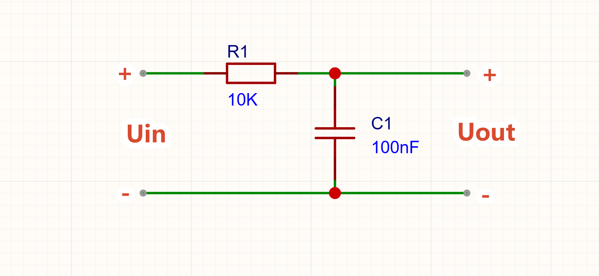
- 如图是一个RC组成的RC滤波电路，如果用电压表观察输入电压由0V跳变到5V时，输出电压的波形，我们可以得到如下图像
##### RC的冲激响应
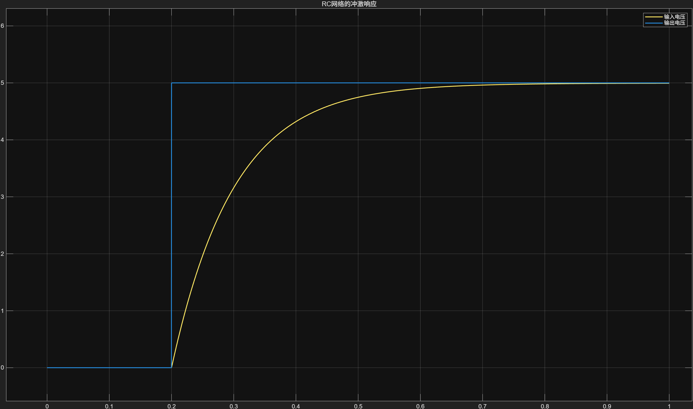
- 这个图像称作RC的冲激响应。
- 上电瞬间，电容还没被充电，电阻右侧的电压是0V，电阻左侧电压是5V，流过电阻的电流是 $5\,\mathrm{V}/R$。
- 随着电容被流过电阻的电流不断充电，电容上的电压不断上升。
- 随着电容被充电到的电压越来越高，电阻两端电压，也就是5V减去电容电压的差值会越来越小，流过电阻的电流 $U/R$ 也会越来越小。
- 电流越小，电容充电速度也会越慢，也就是说电容充电的过程是最开始很快，之后越来越慢的。
- 如果用公式详细的计算上面的过程，之前提到过电容的基本公式是 $i=C\,dU/dt$。记电容电压 $U_c$，电阻电压 $U_r$，输入电压 $U_i$，电流 $I$，那么，电流 $I=(U_i-U_c)/R$，$I=C\,dU_c/dt$，两式合起来有 $(U_i-U_c)/R=C\,dU_c/dt$，化简后变成 $U_i=RC\,dU_c/dt+U_c$，最开始 $t=0$ 时 $U_c$ 电压是0V，所以初始条件是 $U_c(0)=0\,\mathrm{V}$，这是一个一阶微分方程，不需要知道微分方程是什么，只需要知道最终解出来的结果是 $U_c=U_i(1-e^{-t/RC})$，也就是说上面图像中的曲线形状是一个e的指数的形状，这个曲线称为RC的冲激响应，表示当给一个RC输入一个阶跃信号（从0V突然跳变到某个电压的信号）时RC输出的电压。
- 根据上面的公式，我们可以发现电容的充电速度跟RC有关，RC越大，充电越慢，对应的波形上升的就越慢。RC越小，充电越快，对应的波形上升的就越快。
- 不需要记住上面的公式，因为实际应用中并没有那么细致的计算，我们只需要知道RC充电是个上升速度逐渐变缓的曲线，而且RC值越大上升越慢即可。
##### RC的零输入响应
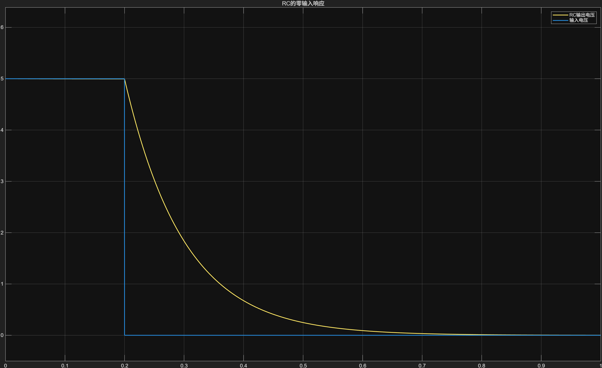
- RC零输入响应与上面的冲激响应相反，零输入响应指在电容已经充满的情况下猛地输入一个0V给电容放电，RC放电的曲线。
- 用跟刚才冲激响应同样的方法分析，最开始电容已经充满为5V，阶跃瞬间电阻左侧电压变成0V，右侧5V，电流为-5V/R。
- 电流的值越大，电容放电速度越快，电容上的电压下降的速度越快。
- 电容上的电压越低，电阻两端电压越小，电流越小，电容电压下降越慢。也就是说电容放电的速度越来越慢。
- 如果用公式计算，最终可以得到 $U_c=U_i e^{-t/RC}$，上面的图像也是一个e的指数的曲线，这个曲线称为RC的零输入响应。
- 同样不太需要记住上面的公式，仅作了解，重要的是得知道RC的充放电都是一个刚开始很快，然后越来越慢的过程，RC越大越慢，RC越小越快。
##### RC网络的滤波
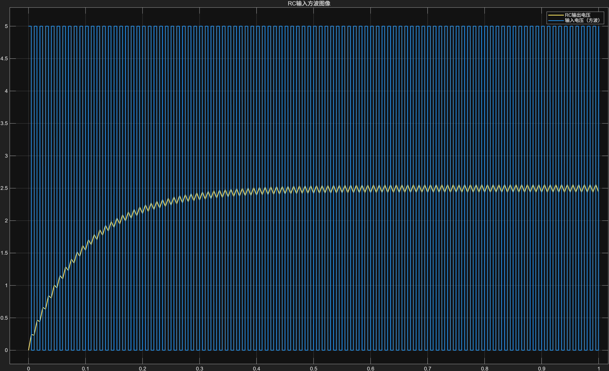
- 如图是给RC输入一个高频的矩形波时的图像，上图图例太大难以看清，把其中一小段放大如下图
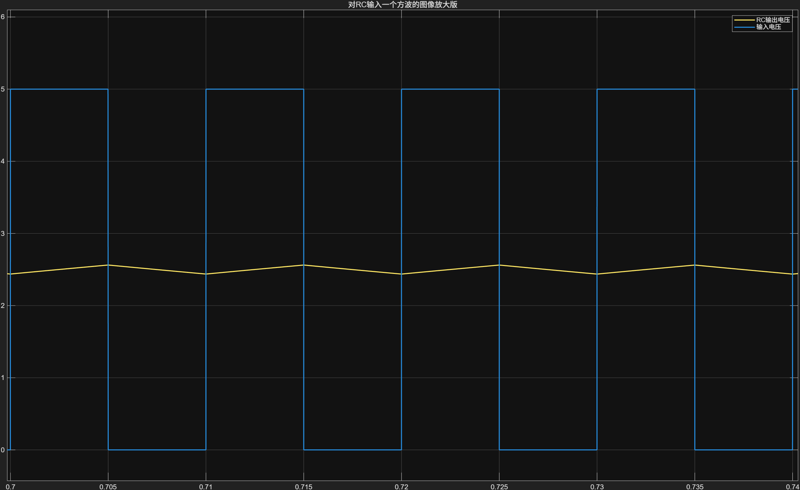
- 方波每次上升时都相当于一个冲激响应，而每次下降时都相当于一个零输入响应。
- 因为方波的频率很高，RC才刚开始变化方波就立马切换反向了，所以每一次RC的电压上升和下降的曲线接近一个直线，且直线的斜率为 $U_c$ 在那个最终稳定的电压值对应的导数（图中RC的电压最终稳定在2.5V左右浮动，所以这里是 $U_c=2.5\,\mathrm{V}$ 时的导数值）。
- 如果对之前那个复杂的e的指数的公式求导会很麻烦，所以这里更好的做法是直接算稳定的电压（图里是2.5V）对应的电流得到充电速度，输入是5V和0V跳变，5V时电阻电流是 $(5\,\mathrm{V}-2.5\,\mathrm{V})/R$，0V时电阻电流是 $(0\,\mathrm{V}-2.5\,\mathrm{V})/R$，电容的公式 $du/dt=i/C$，拿刚才那两个电流值就能算出来每次电压跳变后的瞬间的 $du/dt$ 的值了，也就是每次上升下降的斜率。
- 因为输入每次跳变间隔时间极短，电容的充电速度在每个周期内几乎没有太大的减缓，可以看作每次切换的循环内电容的充电速度都是不变的，一直是 $du/dt$。
- 我们输入了一个幅值为5V的方波，最终输出的是一个频率一样的，但是幅值极低的（图中那个输出波形的幅值大概只有0.1V左右），我们成功把一个幅值为5V的输入变成了一个幅值为0.1V的输出，这个过程称为滤波，即把不需要的波给它过滤掉（让他变得极小）。
- 输入的0V-5V的方波，实际上就是一个在±2.5V来回跳变的方波加上了一个恒为2.5V的电压，变成了在0V-5V来回跳变的方波，我们管这个恒为2.5V的电压称为直流偏置，直流值，而把这个在±2.5V切换的方波称为交流值，这个0V-5V的方波本质上就是这一个交流值和直流值加起来的结果。
- 图中经过滤波后输出的波形是一个在2.5V上下以0.1V的幅度跳变的三角波，也就是一个2.5V的直流值加一个0.1V三角波交流值，滤波前直流值2.5V，交流值2.5V方波，滤波后直流值还是2.5V，但是交流值变成了只有0.1V的三角波。这就是滤波的目标，让直流值尽量保持不变，让交流值尽可能的变小。
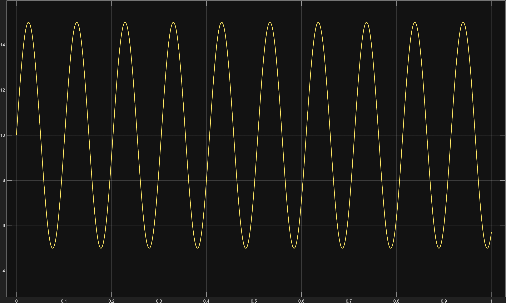
- 此图就是一个既有直流值又有交流值的波形，其中正弦波在5V到15V之间波动，所以正弦波的幅值是5V，正弦波是 $5\sin(\omega t+\varphi)$，正弦波一直在围绕10V这个值波动，所以直流值就是10V，图中的波的波形是 $5\sin(\omega t+\varphi)+10$，$5\sin(\omega t+\varphi)$ 就是交流值，10就是直流值。
### 4.2 滤波原理
##### 噪声与滤波器
- 理想中的各种波形是丝滑而干净的，但现实并非如此，现实中各种电磁干扰，高频开关节点，晶振，等等各类干扰会给电路的各个地方引入大量的交流分量，导致本应该纯粹的波形变得毛毛躁躁，我们管这种干扰叫做噪声。
- 许多元件对噪声十分敏感，为电路滤除噪声十分重要，为此我们会为电路设计各种各样的滤波器来滤除噪声。
- 不光是滤除噪声，在各种射频信号，模拟信号的处理中，也需要使用各种滤波器。
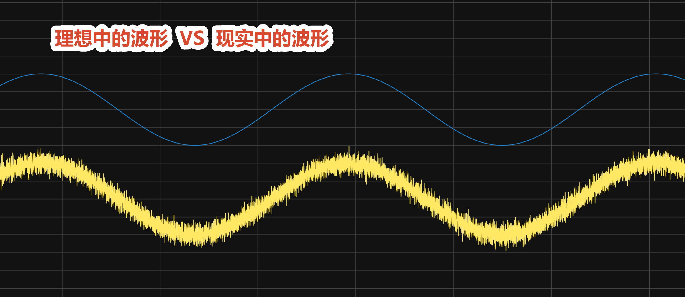
- 衡量一个滤波器的好坏，我们有两个指标，分别是增益和相位，最核心的是增益，增益直接决定了滤波器的滤波性能。
- 增益（Gain），符号是G，单位是dB或者绝对值，就是指滤波器会把输入的交流值放大多少倍后输出，比如输入波形的交流值的幅值是10V，输出波形的交流值幅值是1V，滤波器将输入信号变成了0.1倍后输出，此时的增益就是0.1，$G=1\,\mathrm{V}/10\,\mathrm{V}=0.1$，增益越小，说明输出的交流值越小，我们的滤波器滤波能力就越强。
- 相位（Phase），符号是φ，指滤波器会导致的相位差，比如输入信号是 $A\sin(\omega t+1)$，输出信号却是 $GA\sin(\omega t+2)$，初相位从1变成了2，这个滤波器为信号带来了1rad的相位超前。一般相位为正表示相位超前了，相位为负表示相位滞后了。
- 相位这个属性的用途详见自动控制原理和DC-DC电源设计章节，其中DC-DC电源设计章节是电路组学习的，电控不用专门去学习。
- 增益和相位的计算方法详见下方4.4阻抗。
##### RC滤波
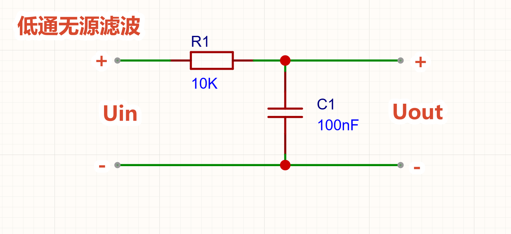
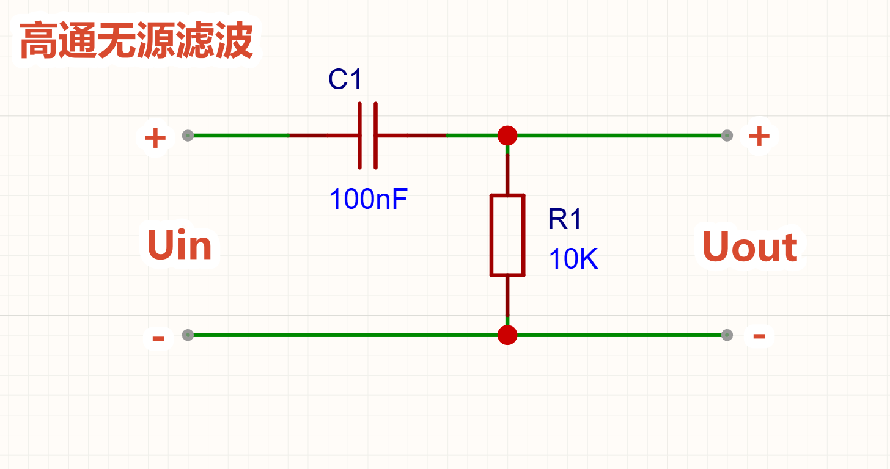
- 上面两张图是两个不同摆法的RC滤波，分别叫做高通无源滤波和低通无源滤波，是两种非常常见的滤波器。
- 下面是分别是两张关于这两个滤波器的波特图，滤波器的波特图展示的是滤波器对于不同频率的输入信号表现出的增益和相位的图像。
- 图中的增益的单位并不是绝对值，而是分贝dB，dB跟绝对值的换算关系是 $G_{\mathrm{dB}}=20\lg(G)$，dB是绝对值对10取对数再乘以20后的结果，比如说0.1的增益意思就是-20dB增益，1的增益就是0dB，dB单位的值大于0说明绝对值大于1，dB单位的值小于0说明绝对值小于1，dB的正负能直接反映该系统对信号是放大了还是衰减了，在RC组成的滤波器中增益的绝对值是绝对小于1的，也就是说dB为单位的增益是小于0的，dB这个单位呈对数的关系，而现实中滤波器的增益随频率的变化也是呈指数关系的（参考前面对e的指数求导，得到的结果也是一个e的指数的函数），所以dB这个单位能更直观的展示滤波器的增益。
- 接下来所有提到增益的地方都以dB为单位，而不是绝对值。
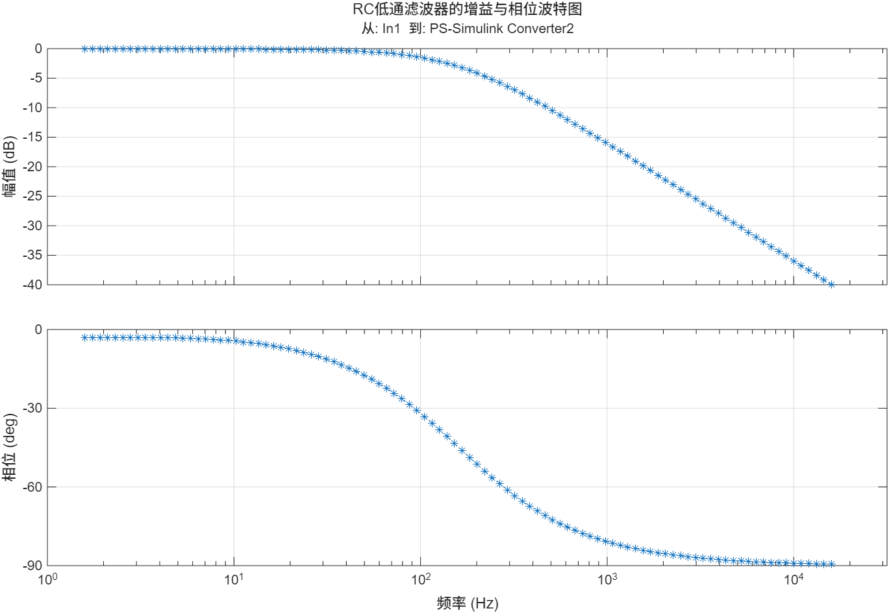
- 低通滤波指只能让低频通过，而高频无法通过的滤波器，这种滤波器对低频的增益很高，而对高频的增益很低，所以对高频的滤波效果很好。
- 图中在频率 $10^2\,\mathrm{Hz}$ 之前时，增益都接近0dB，信号几乎无衰减，而到 $10^2\,\mathrm{Hz}$ 之后，增益随着频率增加而一路下降，由于之前说dB是取对数的关系，所以图中虽然增益看起来是线性下降的，但是实际上增益下降的十分剧烈，增益每下降20dB，增益的绝对值就会下降到1/10，增益刚开始下降时信号就已经衰减的十分微弱了。
- [截止频率]：是指滤波器输出衰减约为-3dB的频率（也就是绝对值刚好为0.5的时候），一般用截止频率作为滤波器滤波能力快速变化的分界线，低通滤波器的截止频率为 $f_c=1/(2\pi RC)$，此示例中R=10kΩ，C=100nF，得出截止频率大约是159Hz，波特图中-3dB对应的频率也确实大概在159Hz的位置。
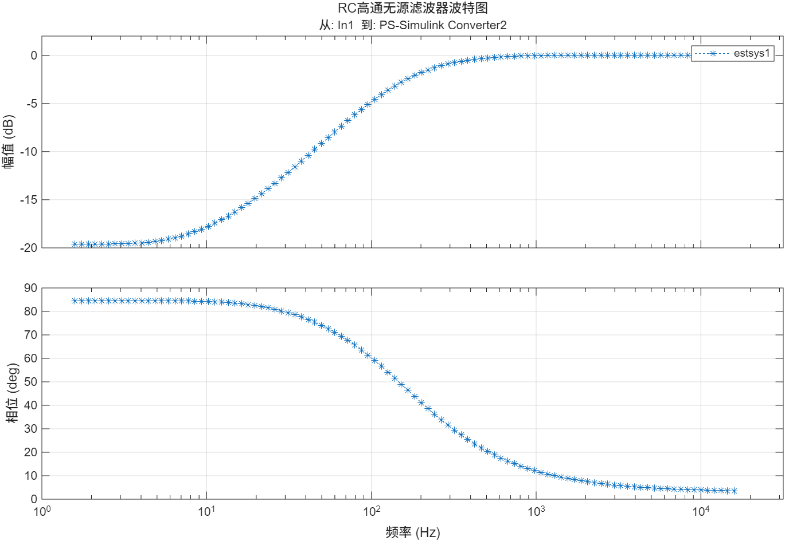
- 高通滤波指只能让高频通过，而低频无法通过的滤波器，这种滤波器对高频的增益很高，而对低频的增益很低，所以对低频的滤波效果很好。
- RC无源高通滤波器的截止频率同样为 $f_c=1/(2\pi RC)$，因为RC的值跟刚才的低通滤波器一样，所以截止频率还是159Hz。
- 信号在 $10^2\,\mathrm{Hz}$ 之前时，增益都非常小，低频信号都被过滤掉了，在 $10^2\,\mathrm{Hz}$ 之后，增益才变得比较大，高频信号得以通过。
##### LC滤波
- 对于无源滤波器，我们管滤波器中含有的储能元件的数量称为滤波器的阶数，之前的RC滤波器属于一阶滤波器，而接下来要介绍的LC滤波器就属于二阶滤波器。滤波器的阶数越高，滤波性能就越好，但是设计起来会更复杂。
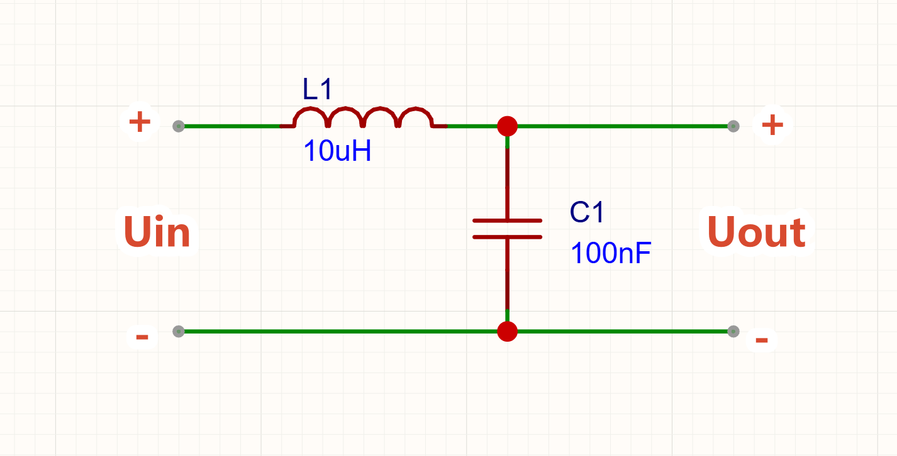
- 如图是LC低通滤波器，同样只能让低频通过，高频被滤除。
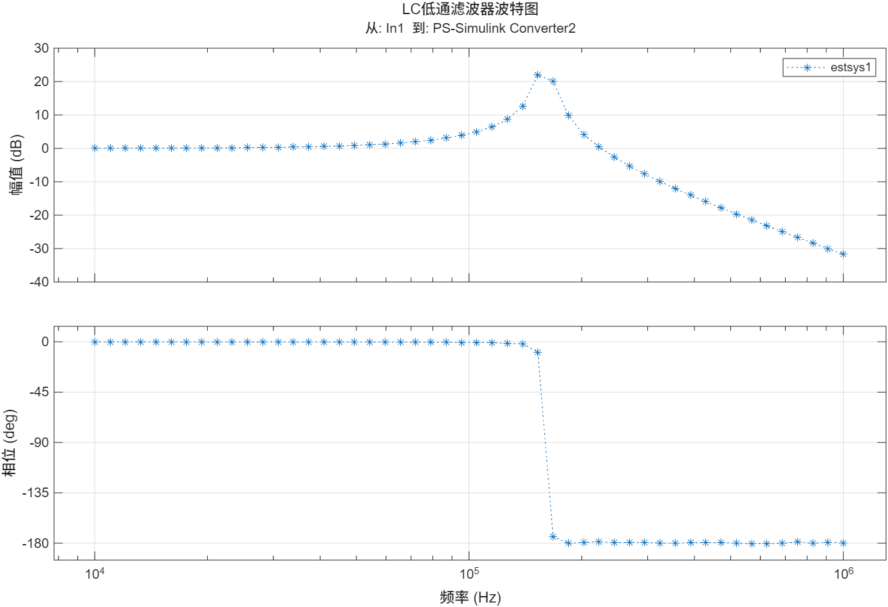
- LC滤波器的截止频率是 $f_c=1/(2\pi\sqrt{LC})$,高通和低通LC滤波器的截止频率都是这个公式。
- 该示例中L=10uH，C=100nF，计算出截止频率是159.15kHz
- 与RC不同的是，LC滤波器在截止频率附近增益会有一个凸起，这个凸起的增益甚至超过了1，会把这个频率的信号放大，这个频率也叫谐振频率，输入信号跟LC网络发生了谐振，导致增益变得很高。
- 在理想状态下，这个谐振增益可以接近无穷大，但是现实中电感和电容上微小的寄生电阻带来的阻尼让这个谐振增益不至于过大，此仿真的波特图中为了能够正常仿真，不发生无法收敛的报错，故意引入了100mΩ的寄生电阻，所以这里的谐振增益不至于大得离谱。
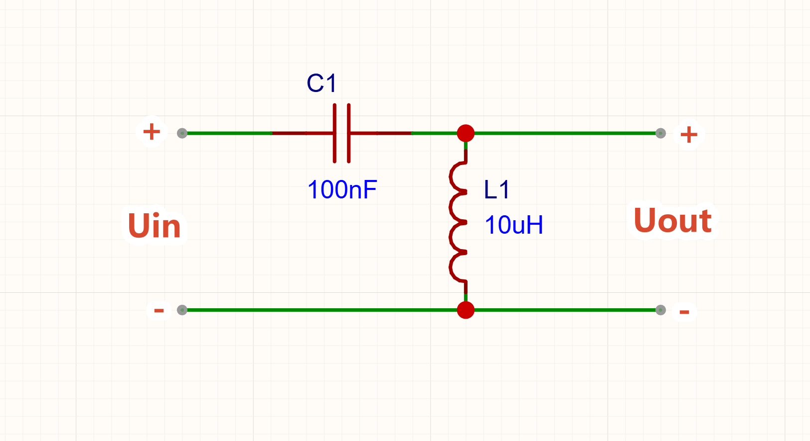
- 如图是LC高通滤波器，高频通过，低频截止。
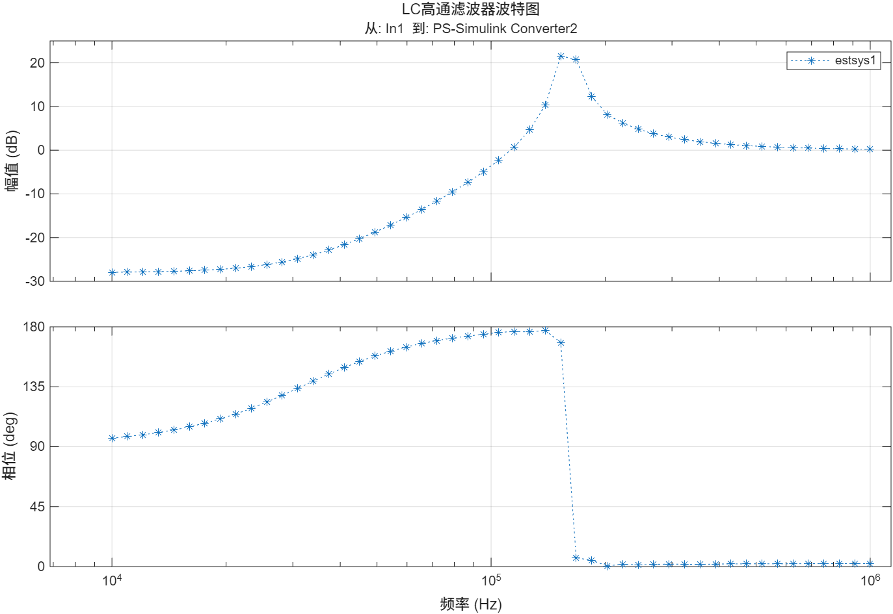
- 截止频率同上，也是 $f_c=1/(2\pi\sqrt{LC})$。
- 同样在谐振频率下会有一个增益的尖峰。
- 与之前不同的是，这个LC高通滤波器的相位居然不是从180°或者0°开始的，而是从90°开始，缓慢增加到180°，然后跌落到0°，非常诡异。理想状态下LC高通滤波器的相位-频率曲线应该跟LC低通是反过来的，从180°开始，然后猛地跌落到0°，实际上，理想状态下的LC滤波确实如此，但是现实中是有寄生电阻的，寄生电阻导致了相位波特图如此诡异的变化，具体原因见阻抗章节。
### 4.3去耦电容
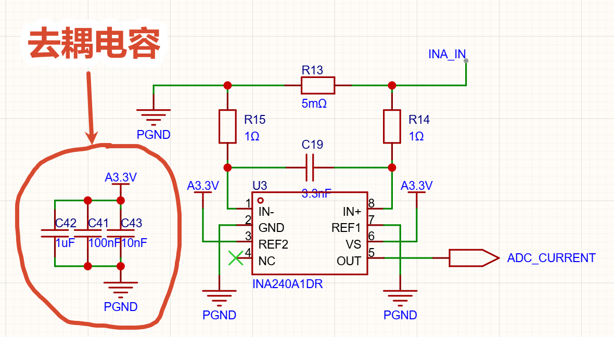
- 工程中我们经常会用到各种电流，电压采集电路，这些电路对供电的噪声十分敏感，滤除掉供电的噪声十分重要。
- LC滤波器设计过于复杂，电感体积过于庞大，设计不当还会放大噪声（谐振点），而且电感自身还会产生磁场产生电磁干扰，所以更常使用的是RC滤波器。
- RC高通滤波器不会被我们使用，是因为我们要给直流供电滤波，RC高通滤波器在线路上串联了一个电容，无法经过直流电流，根本不可能实现供电，不能使用。
- RC高通滤波器不被使用的第二个原因是，高频噪声带来的伤害远比低频噪声更可怕，我们优先要滤除的是高频噪声。电路中各个部分都会有寄生电容和寄生电感，高频噪声比低频噪声的 $du/dt$ 和 $di/dt$ 的值大很多很多，因为电感和电容的公式 $i=C\,du/dt$ 和 $u=L\,di/dt$，导致这两个导数值在寄生电容和寄生电感上会产生很大的噪声。
- 我们使用RC低通滤波作为供电的滤波，因为供电需要较大的电流，所以滤波器串接的电阻绝对不可以很大，我们一般不会接这个电阻（除非是对噪声抑制要求极高的场景），而是使用导线上的寄生电阻作为RC滤波的R，这样供电线路就能保持最低的阻值，供电顺畅，我们只需要接上C即可。
- 既然去掉了R，那么就剩下了C，我们管这种滤波电容叫做去耦电容。
- 如图中的去耦电容，并联了多个不同容值的电容在一起，因为电容总有寄生电阻ESR，所以并联在一起的滤波电容并不是简单的容值相加，而是各自负责了不同频率的滤波，三个不同的电容相当于有了三个不同工作频率的RC滤波，滤波效果极佳。
- 推荐的做法是一个1uF的滤波电容加一个100nF的滤波电容，如果有更高的要求可以加更多的容值。
- 去耦电容一定要尽可能的接近负载，距离太远会失去滤波的用处。
### 4.4 阻抗

### 4.5无源滤波器的设计
