### 5.1 开漏输出&推挽输出&三态输出
- 数字信号指的是只有0与1的信号，高低电平代表逻辑上的0与1，是离散的信号，比如规定高于2.4V就是1，低于0.7V就是0，那么信号处于0.7V和2.4V之间不高不低的状态是不被允许的，因为这种状态不能确定到底是数字1还是0，我们管这种无法确定的状态叫做真空态。
- 数字电路（也称数电）为了能很好的输出数字信号，就要做到以下几点：\
第一，输出速率要尽可能的快速，要能够快速地开关。\
第二，输出电流的要尽可能的大，就可以更好的驱动下一级电路。\
第三，尽可能避免真空态，输出在01之间跳变的过程中不可避免的要经过短暂的真空态（电压高低切换的过程中会短暂经过不高不低的范围）。
- 为了做到上面三点，我们会使用推挽或者开漏输出作为数字电路的输出，如上图所示，为了更快的速率，现代的所有数字芯片（各种高速的逻辑芯片，单片机，FPGA，电脑，或者其它）内部都是使用mos管制作的，称为CMOS工艺。 \
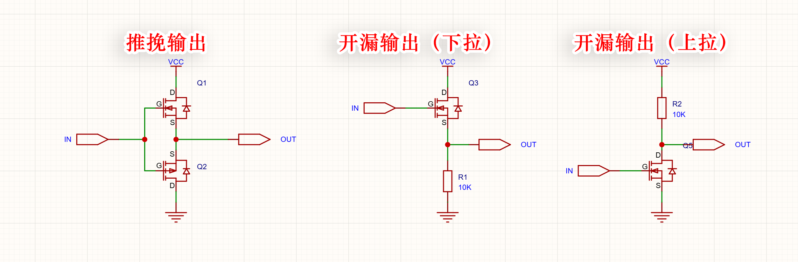
- 绝大多数都使用推挽输出，因为推挽输出不论输出高电平还是低电平，他的输出电阻都会很低，信号在01之间翻转的速率会更快。
- 数字芯片的开漏输出需要手动去添加上拉/下拉电阻，而推挽输出不需要，所以在挑选芯片设计电路的过程中一定要查阅手册看芯片的输出方式到底是推挽还是开漏。
- 下面是两个数字芯片（与逻辑门）的数据手册，在里面能查询到他们的输出方式：\
[推挽输出与门数据手册（点击阅读）](datasheet/CMOS推挽输出与门芯片.pdf)\
[开漏输出与门数据手册（点击阅读）](datasheet/CMOS开漏输出与门芯片.pdf)\
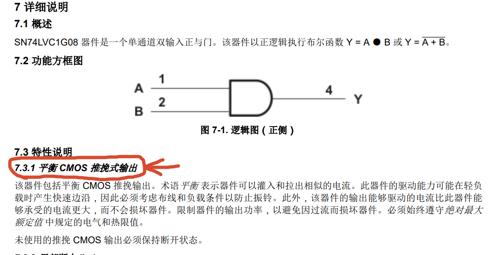
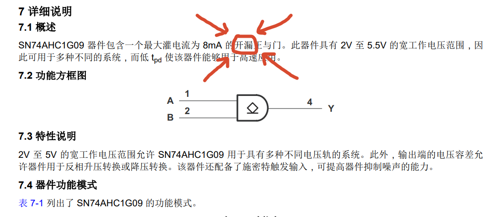

- 比起在推挽输出中，还可以分出来一种叫做三态输出的输出方式，其电路如下图 \
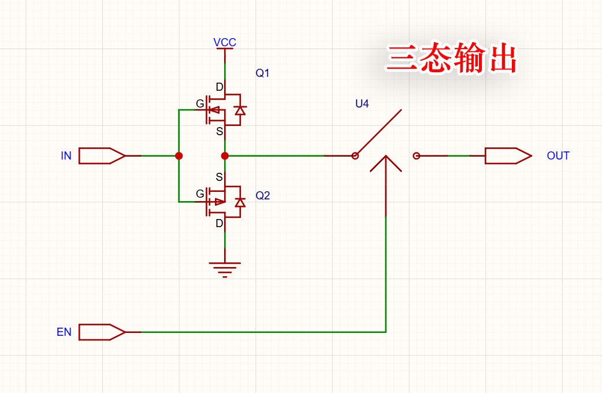
- 三态输出本质上还是推挽输出，不过比起推挽输出只能输出高电平与低电平这两种状态，三态输出多出来一种输出状态，叫做高阻态，三态输出可以输出高电平，低电平，高阻，三种状态。
- 其等效的电路相当于在推挽输出前方增加了一个开关，开关由EN（enable）引脚控制。当EN输入高电平，开关开启时，电路相当于推挽电路。当EN输入低电平，开关关闭时，电路处于高阻态，电路的输出引脚相当于什么都没接，电压值完全由外部的其它电路控制。
- 高阻态时相当于这个电路失去了对导线的电压的控制权，让其它电路去控制。
### 5.2 数字信号的上下边沿
- 我们管数字信号由低电平跳变到高电平的瞬间称为上升边沿，称信号由高电平跳变到低电平的瞬间称为下降边沿，上升边沿与下降边沿统称为边沿，如下图。 \
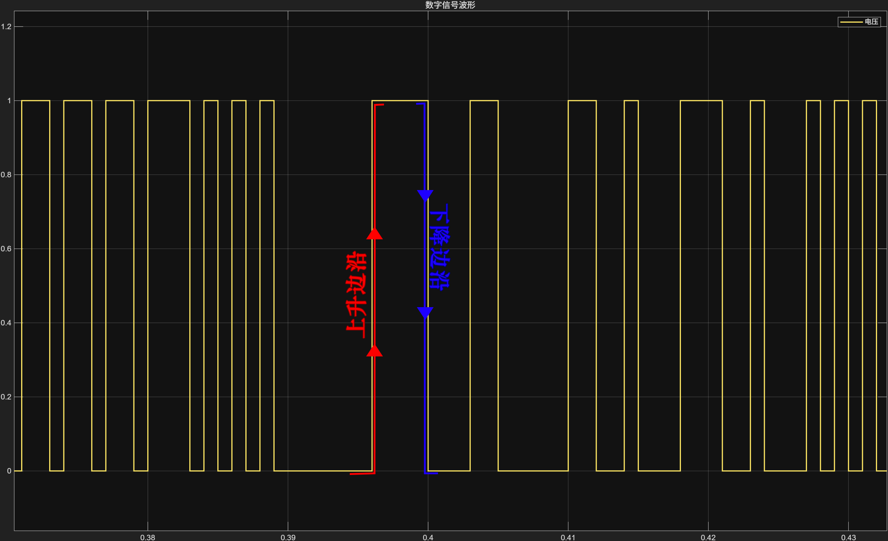
- 如果把上升和下降边沿放大，会变成如下图的样子 \
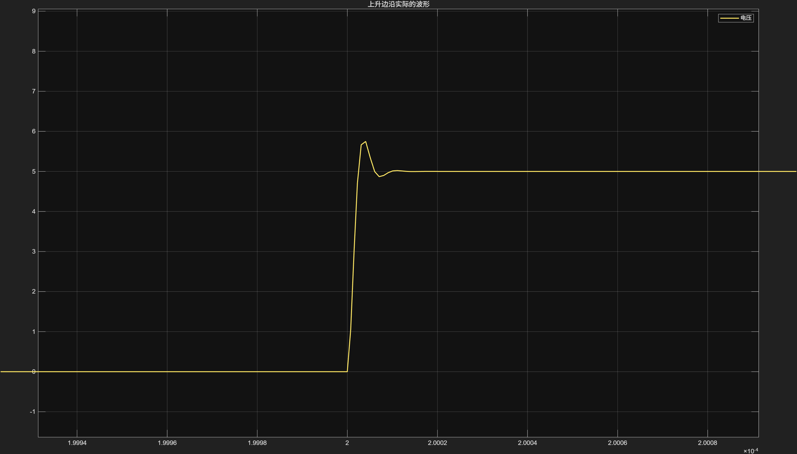
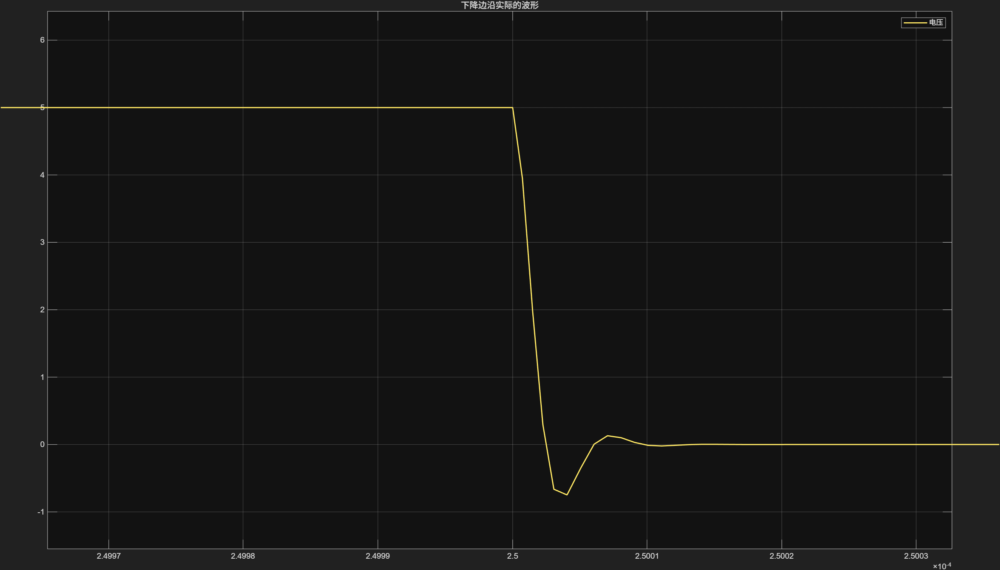
- 我们发现实际上的波形并不是很干净的方波，而是方波上升时会有一定的斜率，沿着斜率缓慢上升，而且会有微小的过冲和振荡。
- 波形变得如此难看的原因有以下三点：\
寄生电容，寄生电感，寄生电阻 \
第一：寄生电容，已知导线是由铜制成的，铜拥有一定的容纳电荷的能力（即使很小很小），所以铜导线相当于有一个很小很小的寄生电容，一般在pF的量级。\
第二：寄生电感，已知当导线有电流经过时，会围绕导线产生微小的磁场（也是很小很小），所以铜导线相当于一个很小很小的寄生电感，一般在nH级别。\
第三：寄生电阻，已知铜导线是有一定的电阻率的，铜制成的导线的阻值并非为0，铜导线有一个很小很小的寄生电阻，一般在mΩ级别。
- 如果画出拥有寄生电容，寄生电感，寄生电阻的导线的等效电路，就如下图所示 \
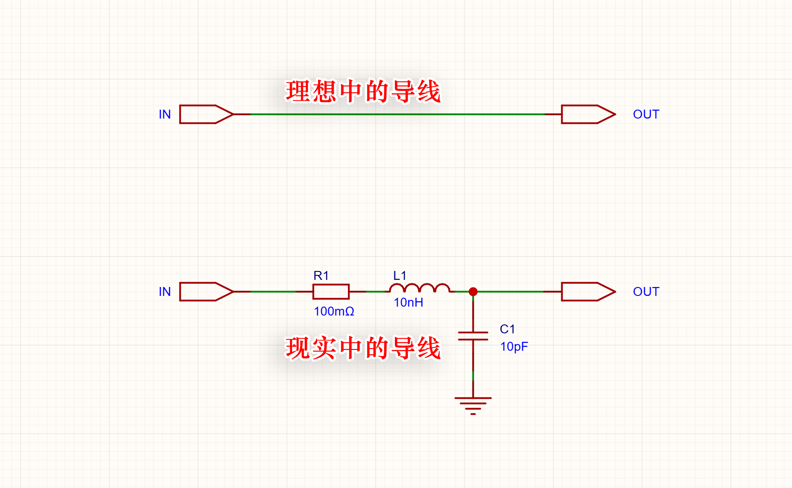
- 现实中的方波有两个问题，上升速率和过冲。\
过冲，是由寄生电容和寄生电感决定的，我们平时不用太在意，在非超高频的场景，这个并不会产生太大的影响。\
上升速率，是由寄生电容和寄生电阻决定的，参考电路原理章节提到的RC响应，我们可知RC的值越小，方波上升的速率越快，方波就越接近理想的方波。
- 在推挽输出中，输出高/低电平时输出相当于经过mos管跟供电相连，阻值很低，RC很小，上升很快。
- 在开漏输出中，高低电平的输出只有一种是经过mos管连到供电的，而另一种则是通过上下拉电阻连接到输出的，上下拉的阻值很大（一般是10k级别），RC的值很大，导致方波上升的速率很慢很慢。
- 下图是推挽和开漏在输出高/低电平时电流走过的路径等效的RC，因为当前不用太在意过冲，所以等效模型中只有RC而没有L。 \
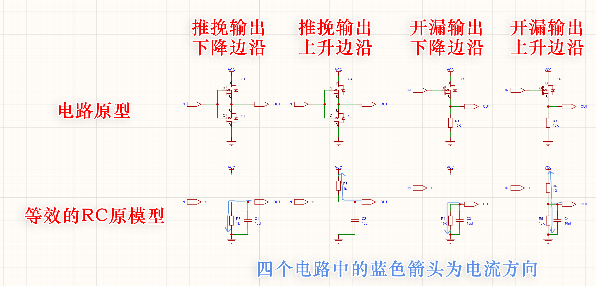
- 上图假设mos管开启时的电阻是1Ω，关闭时相当于断开，上下拉电阻都是10kΩ
- 图中推挽输出的上升和下降边沿，电流经过的路径的阻值R都是1Ω。
- 图中开漏输出的下降边沿，电流经过的路径的阻值R是10kΩ。
- 图中开漏输出的上升边沿，电流经过的路径有两个，一个是1Ω，一个是10kΩ，10kΩ相对于1Ω其电流几乎可以忽略不计（相当于1Ω和10kΩ并联，结果大约还是等于1Ω），相当于电流流过的路径R是1Ω。
- 在上面四个输出中，开漏输出的下降边沿阻值是10kΩ，远大于其它三种输出的1Ω，所以他的电平的变化速率会非常慢，对比如下图： \
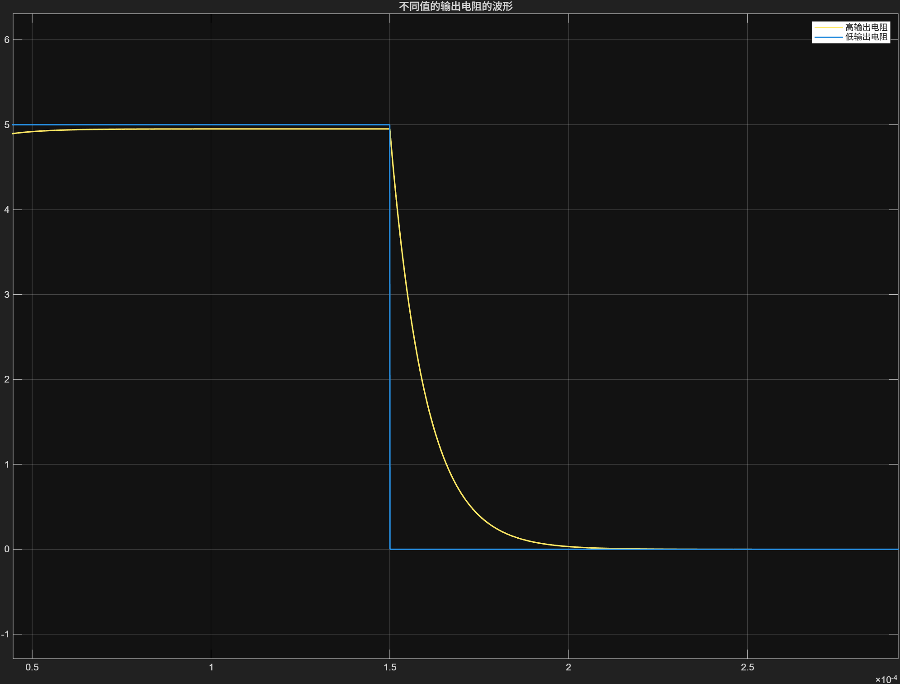
- 可见开漏的波形变化非常缓慢，完全不适合高速的信号传输，而推挽的信号波形很完美，非常适合高速信号传输。
### 5.3 施密特触发器
- 要规定0和1的电压范围，我们可以设置一个电压标准，比标准高就是高电平，比标准低就是低电平，比如设置标准为1.5V，那么高于1.5V的输入我们就能看作1，低于1.5V的输入就能看作0，写作数学公式就是 

```math
V_{out} = 
\begin{cases}
1~,&(u_{in}\geq 1.5V) \\
0~,&(u_{in}< 1.5V)
\end{cases}
```
这种规定看似不错，但在现实中极易受到噪声的影响，导致下面这种问题。
- 我们之前说到现实中任何的波形都是充满大量噪声干扰的（详见电路原理章节），如果使用上面的只有一个电压标准的判断方法，在遇到噪声时就会发生下图的现象 \
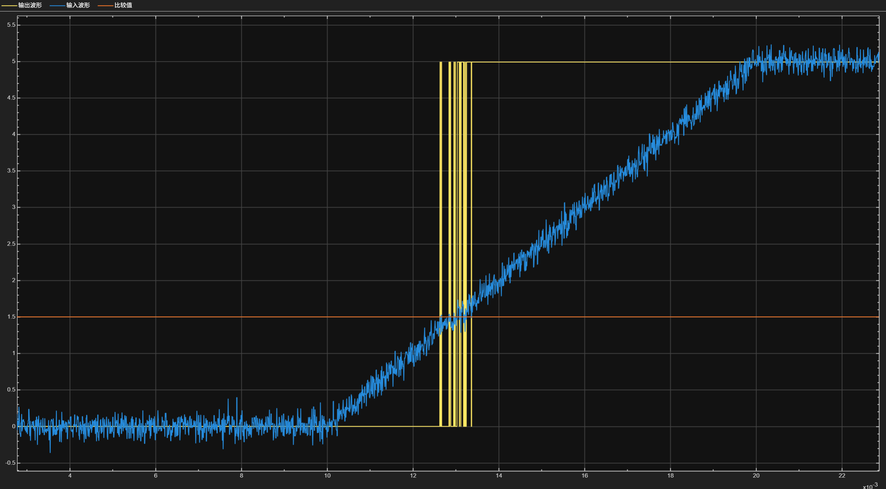
- 上图蓝色曲线为输入波形（从0V跳变到5V的上升边沿，但是有很多噪声），橙色曲线为比较电压（这里是1.5V），黄色曲线为根据比较电压判断输出电平0还是1。
- 按理来说黄色曲线应该是从0跳变到1，但是图中黄色曲线先是在输入电压接近比较电压的时候来回跳变了若干次才变成高电平，这种来回跳变的现象是一个错误的信号，会产生很危险的后果。如果放大上图，得到下方的图片，我们可以看到产生跳变的原因。 \
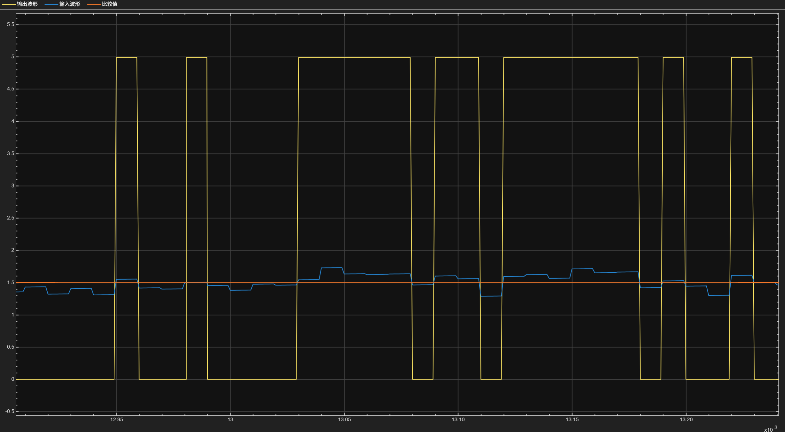
- 前面提到输入信号的上升和下降边沿不是瞬间的，而是沿着一个斜率缓慢上升的，当输入信号缓慢上升到接近比较电压时，噪声会让输入信号在比较电压周围上下振荡，多次穿过比较电压的阈值，产生许多次误判，导致了错误信号的产生。
- 为了避免上面这种现象，我们会使用两个比较电压，叫做电压的上升阈值 $V_{T+}$ 和下降阈值 $V_{T-}$ ，当输入电压超过上升阈值时，输出变成1，当输入电压低于下降阈值时，输出变成0，当输入电压处于上升阈值和下降阈值之间时，输出保持之前的状态不变，如果写成数学公式就是

```math
V_{out} = 
\begin{cases}
1~,&(u_{in}\geq V_{T+}) \\
保持不变~,&(V_{T+}> u_{in}\geq V_{T-})\\
0~,&(u_{in}< V_{T-})
\end{cases}
```
这种触发方式叫做施密特触发，实现这种功能的电路叫做施密特触发器。
- 若是讲之前的充满噪声的波形输入给施密特触发器，得到的图像如下 \
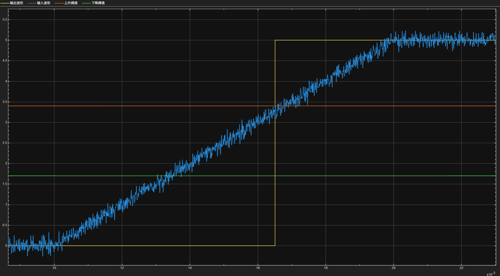
- 新得到的输出波形十分干净，没有任何异常的跳变，施密特触发器可以实现对数字信号的抗干扰的作用。
- 施密特触发器的电路符号和现实中的封装如下 \
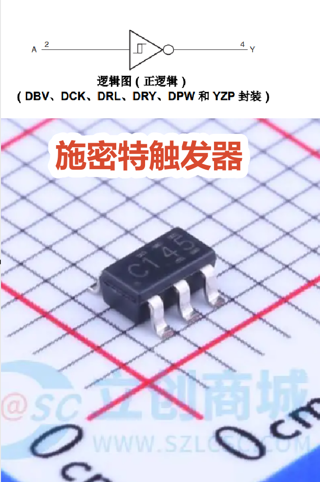
- 大多数施密特触发器芯片并不是输入高电平输出1，输入低电平输出0，而是反过来的输入高电平输出0，输入低电平输出1，所以有时也叫做施密特反相器。
- 施密特触发器常作为各种数字电路的输入整形电路，绝大多数的数字芯片内部都集成了施密特触发器，来让芯片的逻辑更稳定。
### 5.4 TTL电平与CMOS电平
- TTL和CMOS最初指的是两种不同的芯片工艺，如今TTL和CMOS演变出了新的含义，不再是指芯片的工艺，而是指芯片判断和输出0和1电压的两种不同的标准。
- 输入的上升阈值电压 $V_{IH}$ 表示输入的高电平 \
输入的下降阈值电压 $V_{IL}$ 表示输入的低电平 \
输出高电平 $V_{OH}$ ,输出低电平 $V_{OL}$ \
如上便是数字芯片输入输出电平的四个标准，输入输出满足下列关系 
```math
Logic = 
\begin{cases}
1~,&(u_{in}\geq V_{IH}) \\
保持不变~,&(V_{IH}> u_{in}\geq V_{IL})\\
0~,&(u_{in}< V_{IL})
\end{cases}
```
```math
V_{out} = 
\begin{cases}
V_{OH}~,&(逻辑1) \\
V_{OL}~,&(逻辑0)
\end{cases}
```
 
- TTL电平，常指的是5V的TTL电平，其输入输出的电平为 
```math 
\begin{aligned}
V_{OH} & \geq 2.4V ,\\
V_{OL} & \leq 0.4V ,\\
V_{IH} & \geq 2V ,\\
V_{IL} & \leq 0.8V
\end{aligned}
``` 
- CMOS电平，其电平标准会随着供电 $V_{CC}$ 而改变，其输入输出的电平为 
```math 
\begin{aligned}
V_{OH} & \approx V_{CC} ,\\
V_{OL} & \approx 0V     ,\\
V_{IH} & \geq 0.7V_{CC} ,\\
V_{IL} & \leq 0.3V_{CC}
\end{aligned}
``` 

- TTL电平是固定的，而CMOS的电平是随 $V_{CC}$ 而改变的，对于不同电平的信号，CMOS电平可以通过改变芯片的供电电压来实现对不同的电平的信号的兼容。
- 数字芯片的数据手册一般都会标注芯片的电平标准。
### 5.5 八种逻辑门，逻辑门的内部结构
- 在写代码时，经常会使用各种逻辑运算，比如C语言中
```c
    bool a = 1;
    bool b = 0;
    if( a && b ){/*codes*/} //满足条件a与b，就执行{/*codes*/}
```
- 诸如上面的“a && b“，就是一种逻辑运算，a和b是布尔值，只有0和1两种状态，表示真与假。a为1，b为0，那么a与b并没有同时满足，a与b的结果就是0，所以程序不会进入上面的if分支。
- 在原生的C语言中我们可以使用的逻辑运算有下面这些
```c
    bool a = 1, b = 1;
    bool and    = a && b;    // 与门：a 与 b
    bool or     = a || b;    // 或门：a 或 b
    bool not    = !a;       // 非门：非 a
```
- 在数字电路中，我们管能进行这些最基本的逻辑运算的电路叫做逻辑门，常见的逻辑门共有八种，他们的名称以及对应的逻辑式分别是: \
中继器 $S=A$ \
非门： $S=\overline{A}$ \
与门： $S=A \times B$ 或者 $AB$ \
或门： $S=A+B$ \
与非门： $S=\overline{A \times B}$ \
或非门： $S=\overline{A + B}$ \
异或门： $S=A \oplus B$ \
同或门： $S=A \odot B$ 
- 这八种逻辑门可以在电路层面进行与上面相同的逻辑运算。
- 逻辑运算的写法是每个逻辑门后面的逻辑式，通过逻辑式可以组合出各种各样的逻辑。
##### 5.5.1 缓冲器（中继器）＆非门（反相器）
- 缓冲器，又称中继器，一个输入，一个输出，输入与输出完全相同，输入0输出0，输入1输出1
- 非门，又称反相器，一个输入，一个输出，输入与输出完全相反，输入0输出1，输入1输出0
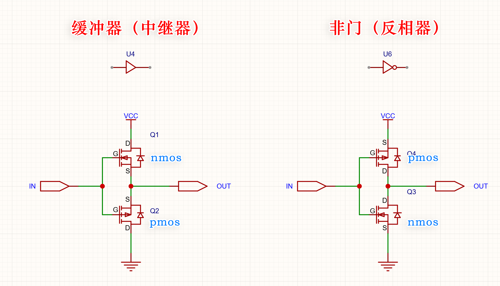
- 图上为缓冲器和非门的符号，图下是他们内部的电路结构（内部电路结构感兴趣可了解，不用在意）。
- 我们会使用真值表来罗列出一个逻辑电路的各种输入对应的输出，缓冲器和非门的真值表如下
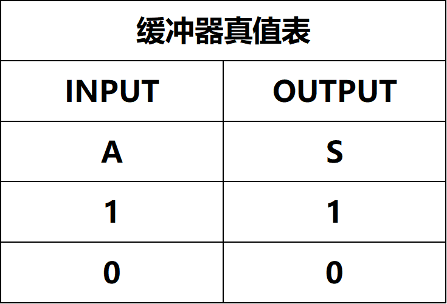
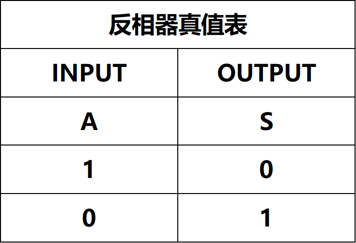
- 输入为A，输出为S，那么A和S就满足上面的关系。
- 缓冲器严格来说并不是一个逻辑门，只是用来作为施密特触发器整形信号用的，所以在之后的内容中将很少见。
##### 5.5.2 与门&或门
- 与门，多个输入，一个输入，所有的输入都为1时，输出为1，否则为0
- 或门，多个输入，一个输入，任意一个输入为1时，输出为1，否则为0
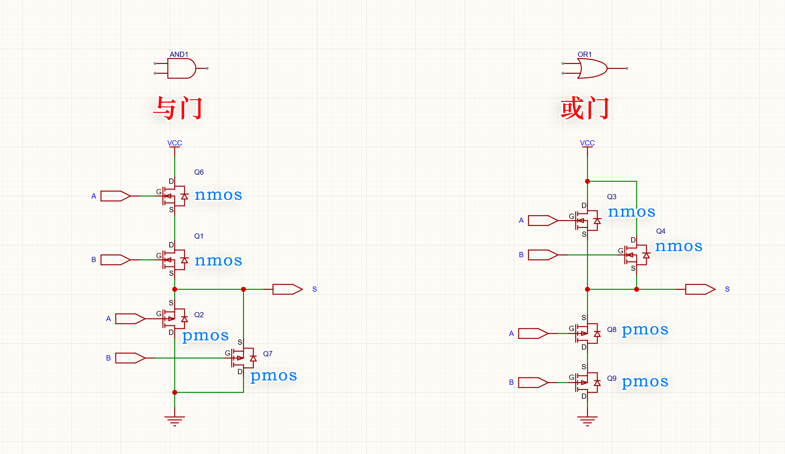
- 图上为与门和或门的符号，图下是他们内部的电路结构（内部电路结构感兴趣可了解，不用在意）。
- 与门和或门的真值表如下

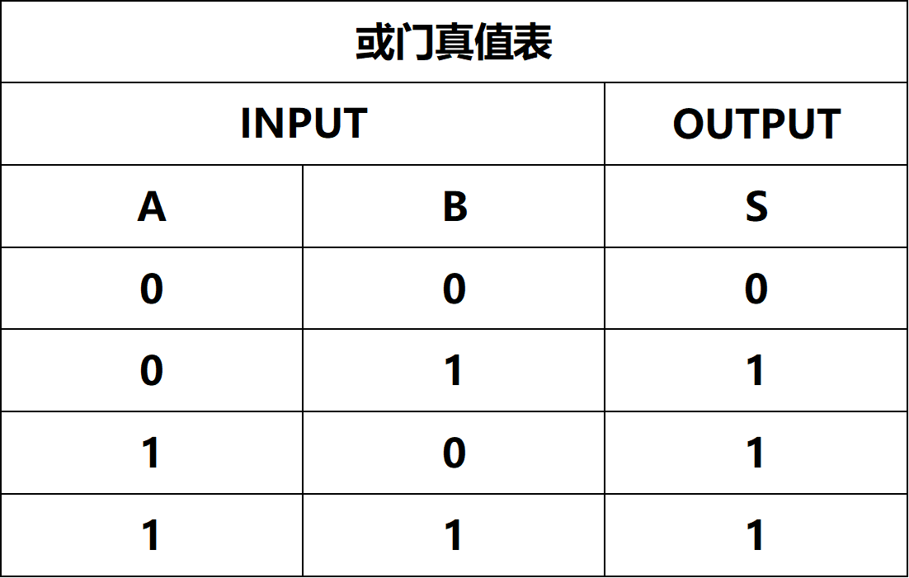
- 理解逻辑门可以按照逻辑门的名称来了解： \
与门，意思就是A与B为1时为1，否则为0 \
或门，意思就是A或B为1时为1，否则为0 \
其他的非门，以及下面的异或门，同或门都可以从名称的角度去理解。
##### 5.5.3 与非门＆或非门
- 与非门，就是一个与门前面再连接了一个非门，所有的输入都为1时，输出为0，否则为1
- 或非门，就是一个或门前面再连接了一个非门，任意一个输入为1时，输出为0，否则为0
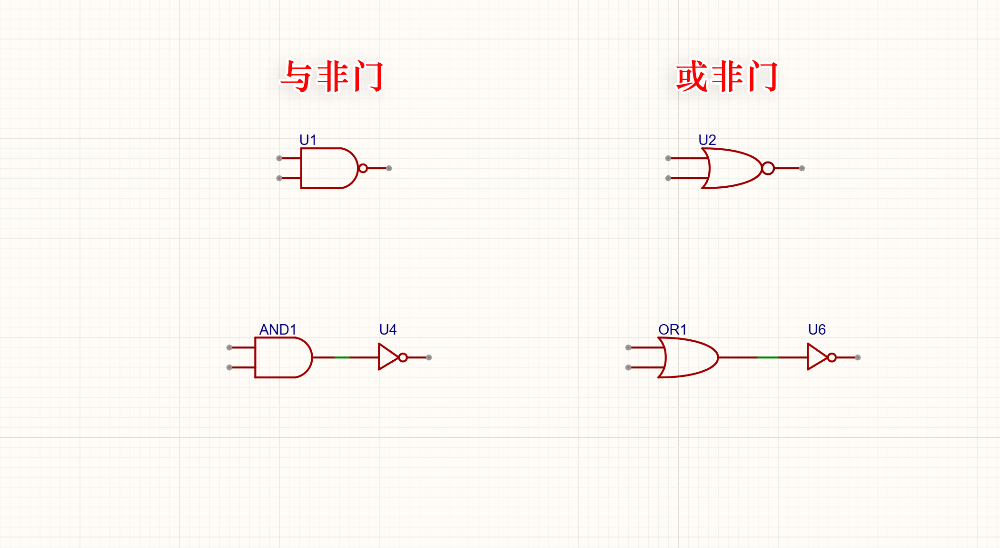
- 图上为与门和或门的符号，图下是他们相等的逻辑。
- 与非门和或非门的真值表如下

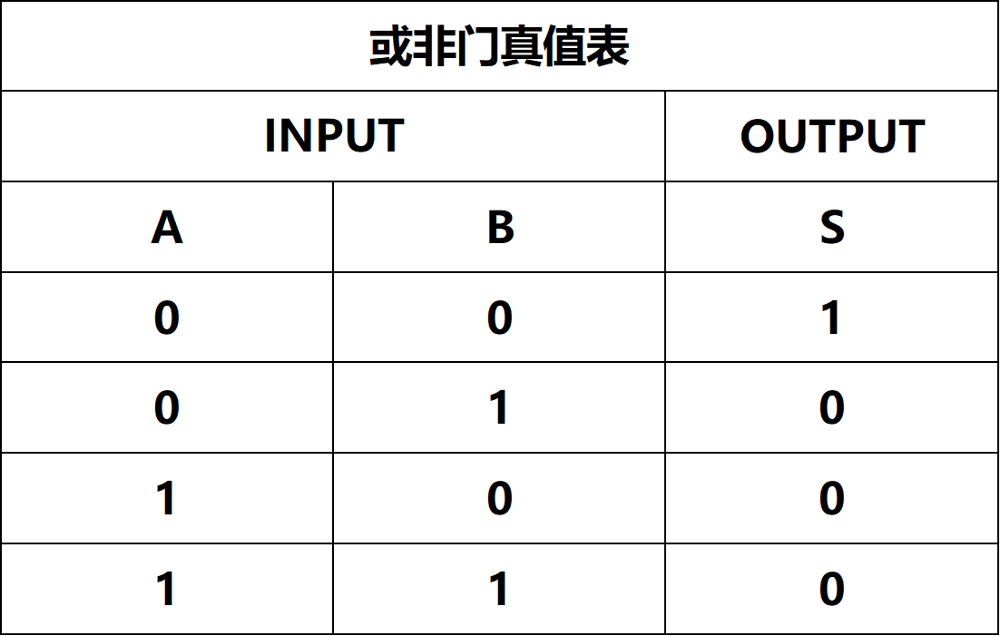
- 与非门和或非门没有独立的逻辑符号，而是由或和非，与和非组合出来的逻辑式 \
与非门： $S=\overline{A \times B}$ \
或非门： $S=\overline{A + B}$ 
##### 5.5.4 异或门＆同或门
- 异或门，当输入不相同时，输出1，否则输出0
- 同或门，当输入都相同时，输出1，否则输出0
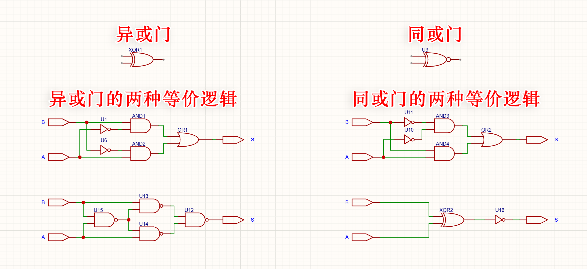
- 图上为与门和或门的符号，图下是他们相等的逻辑（异或门和同或门的逻辑式涉及布尔代数，想去了解可以看数电或者离散数学，不理解也无所谓）
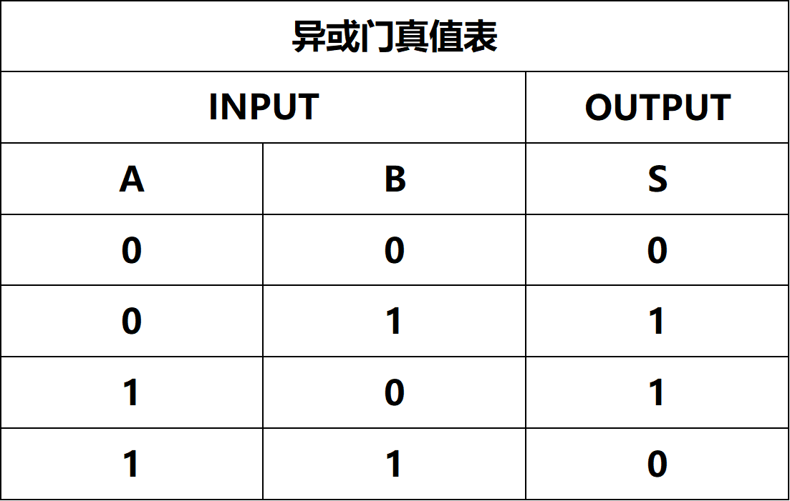

### 5.6 逻辑门的用法
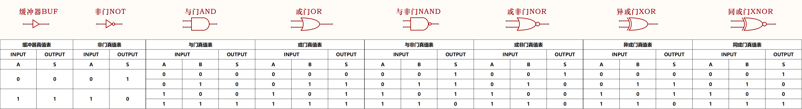
- 前面提到的八种逻辑门，可以组合出各种的逻辑电路，可分为组合逻辑和时序逻辑。
- 组合逻辑指输入和输出一一对应的电路，换言之就是没有记忆功能的电路，同样的输入一定会得到同样的输出，就像一个函数一样，输入一个 $x$ ，得到的结果一定是 $f(x)$ ，输入的时间，输入的顺序，都不会改变 $f(x)$ 这个函数本身。
- 时序逻辑指有记忆功能的逻辑电路，电路会记住之前进行过的输入，并根据之前的输入进行相应的动作，同样的输入，在不同的时间输入，结果可能不一样，比如输入第一个 $x$ ，得到了 $f(x)$ ，而第二次输入 $x$ ，得到的却是 $g(x)$ 。
### 5.7 组合逻辑
- 组合逻辑有一套完整的设计流程和方法，具体可查看数字电路的书籍，但我们并不太会用到，比起复杂的设计方法，我们只需要知道几个常见的电路即可。
#### 5.7.1 编码器
- 编码器（Encoder）有多个输入，多个输出，我们给每一个输入一个编号，如下图 In0 到 In7 ,当某一个输入为1时，译码器就会输出这个引脚对应的编码，比如给 In2 输入1，其余端口输入0，那么输出就是2对应的二进制数010，也就是Out0为0，Out1为1，Out2为0。
- 编码器可以输出对应端口的二进制编码值，下图中的是3-8线编码器，意思是可以给八个引脚分别编码一个三位的二进制数作为编码值。
- 下图是编码器的电路结构，每根输入引脚对应一个编码值，输入一个引脚就能得到对应的编码值。
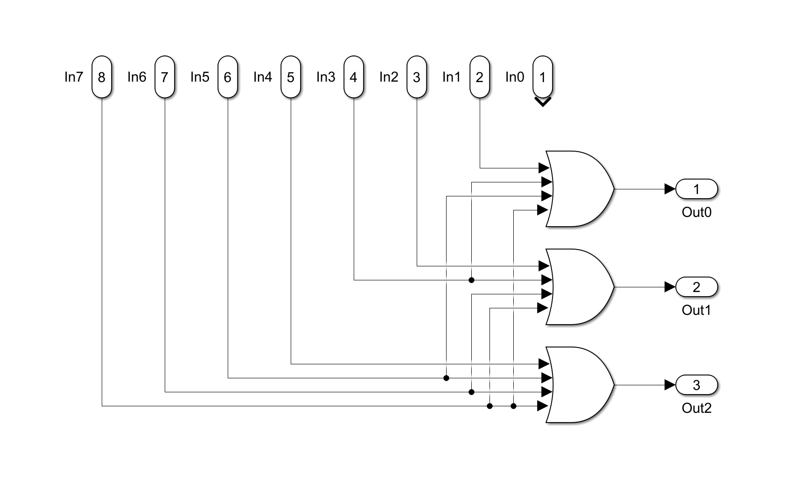
- 上图是编码器的电路结构，仅供了解。
- 这个编码器在遇到同时有多个输入时（比如同时有两个引脚输入都是1，其余是0）是无法正常工作的，解决这种问题可以使用优先编码器，优先编码器在数电书中有提及，感兴趣可翻阅。
- 下图是编码器的输入与输出的关系图
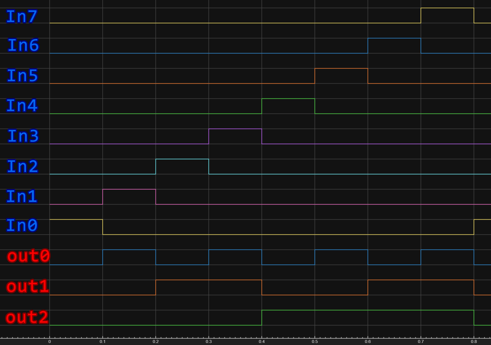
- 每个波形对应一个输入/输出，置高为1，置低为0，得到图中的波形。
- out0对应输出的二进制数编码的第一位，out1代表第二位，out2代表第三位，组成了一个二进制的三位数字。
- 输入（In1到In7）每次只允许一个置1，其余全置0，否则无法正常工作。
- 输出就是输入的引脚对应的编码值，一一对应。
- 具有 $n$ 位的二进制数，最多能表示 $2^{n}$ 个数字，所以译码器的输入的数量跟输出的数量也是同样的对应关系，图中的编码器有八个输入，三位输出，因为 $2^{3}=8$ ，三位数字最多编码八个引脚。\
如果输出是四位编码，就可以编码 $2^{4}=16$ 个引脚，编码值每增加一位，可以编码的引脚数量就翻一倍
- 编码器常用于键盘扫描、中断优先级判断等，比如单片机中多个按键接在编码器上，按下哪一个按键，编码器就输出这个按键对应的编码，CPU 通过读到的编码值就能判断出是哪一个按键被按下。
- 在设计数据的分配与运算时，我们常把这个编码值叫做地址。
#### 5.7.2 译码器
- 译码器（Decoder）有多个输入，多个输出，输入是一组二进制的编码值，输出是每一个编码值对应的引脚，与编码器刚好相反，编码器是“给一个引脚，输出它的编码”，而译码器是“给一个编码，输出它对应的引脚”。
- 译码器有 $n$ 个输入， $2^{n}$  个输出，给输入一个 $n$ 位的二进制编码，译码器就会把编号等于这个编码的那一根输出引脚置1，其余的输出引脚全部置0。
- 下图是译码器的电路结构，每根输出引脚对应一个编码值，输入一个编码就能选中对应的那一个输出引脚。
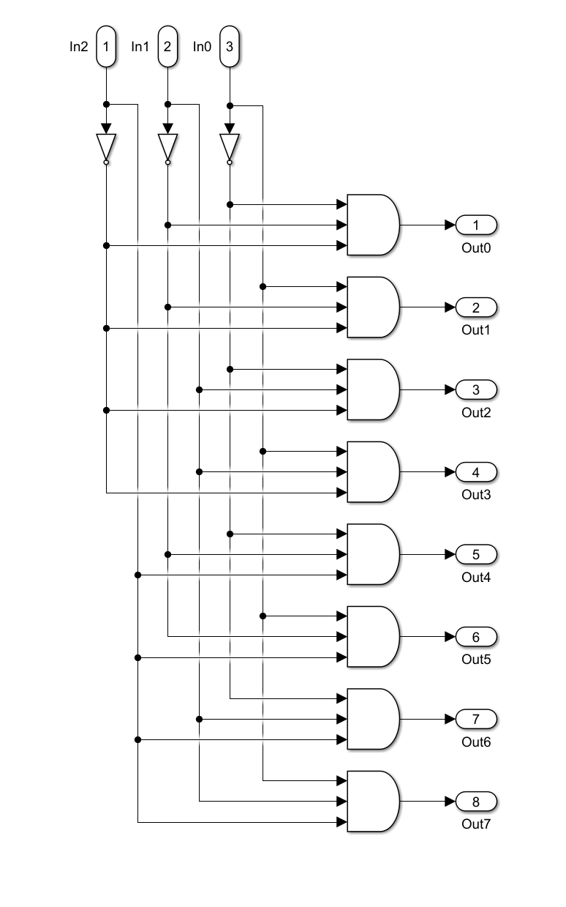
- 上图是译码器的电路结构，仅供了解。
- 比如给输入 010（也就是十进制 2），那么编号为 2 的那根输出引脚 Out2 就会输出1，其余的输出引脚全部输出0。
- 下图是译码器的输入与输出的关系图
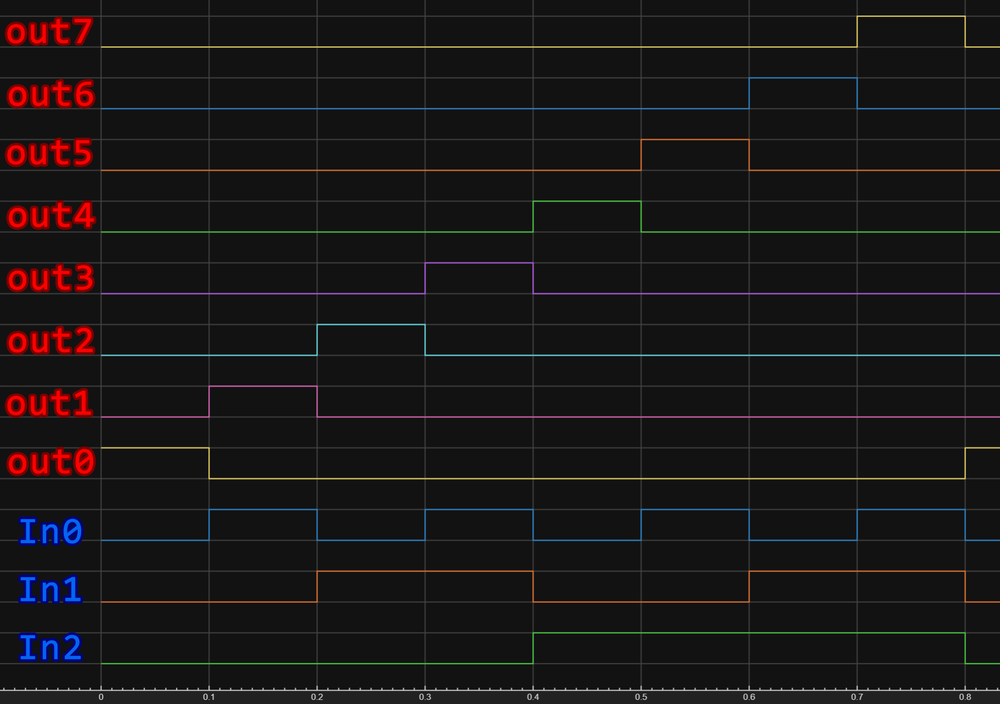
- 每个波形对应一个输入/输出，置高为1，置低为0，得到图中的波形。
- out0对应输入编码的第一位，out1代表第二位，out2代表第三位，组成了一个二进制的三位数字。
- 输入（In0到In2）组成的三位二进制编码，决定了哪一根输出引脚被置1，其余引脚全部为0。
- 译码器的输入和输出同样是  $2^{n}$  的对应关系，八个输出需要三个输入来编码，因为 $2^{3}=8$ ，同理，如果有四个输入，就可以对 $2^{4}=16$ 个输出引脚进行译码。\
译码器常用于地址译码，比如单片机给出一个地址，通过译码器选中对应的那一个存储器或外设。
- 在设计数据的分配与运算时，我们常把这个编码值叫做地址。
#### 5.7.3 加/减法器
##### 5.7.3.1 加法器
- 逻辑电路可以组成各种复杂的运算器，包括，加减法器，乘法器，除法器，等等，他们还分为串行/并行的，同步/异步的，具体内容十分庞大，不必深入了解，感兴趣可以去翻看数电&微机原理。
- 这里以异步串行加/减法器为例。
- 十进制的加法的逻辑可以总结为：计算 $A+B=S$ 时，A和B的同一位， $A_n$ 和 $B_n$ 相加，再与上一位的进位 $C_{n-1}$ 相加（如果上一位没有进位，那进位就是0），加和的结果再对10取模，得到 $S_n$ ，对10整除（舍弃小数，跟C语言的int除法一样）结果是 $C_n$ ,那么 $S_n$ 便是结果的第n位， $C_n$ 是给下一位运算的进位。从第一位开始把上面的操作逐位进行一遍，就能得到最终的结果。
- 二进制的加法也是同理，先每一位和上一位的进位相加 $$A_{n}+B_{n}+C_{n-1}$$ 得到的两位数，个位就是这一位的最终结果 $S_{n}$ ,十位就是给下一位的进位 $C_{n}$ 。

- 如果观察表格中的二进制的加法，我们会发现两个一位数加和的结果的第一位 $S_{n}$ 相当于异或的逻辑，第二位 $C_{n}$ 相当于与的逻辑。
- 若使用数字电路实现上面的二进制加法的逻辑，便能写出下面的式子：
- 不考虑进位时
```math
\begin{aligned}
S_{n} &= A_{n} \oplus B_{n} \\
C_{n} &= A_{n} \times B_{n}
\end{aligned}
```
- 加入进位时
```math
\begin{aligned}
S_{n} &= A_{n} \oplus B_{n} \oplus C_{n-1} \\
C_{n} &= A_{n} \times B_{n} + (A_{n} \oplus B_{n}) \times C_{n-1}
\end{aligned}
```
- 根据上式，我们就能设计出一个加法器的电路，不考虑进位的我们叫做半加器，考虑进位的我们叫做全加器。
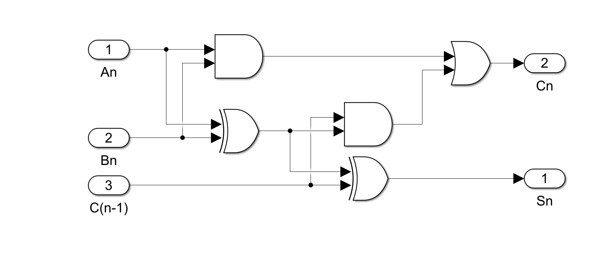
- 半加器只是推导出全加器的公式的中间形态，最终的加法器是由全加器组成的。
- 每一个全加器都能完成二进制加法中某一位的运算，所以将若干个全加器逐级连接起来，就形成了一个二进制的加法器，连接几个全加器，就是几位数的加法器，如下图就是一个八位数的加法器，可以计算两个八位二进制数相加的结果。
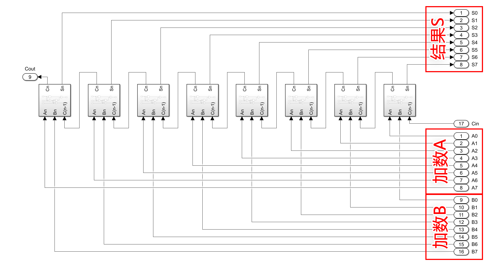
- 我们可以像下图一样级联我们的加法器，就可以得到更多位数的加法器。
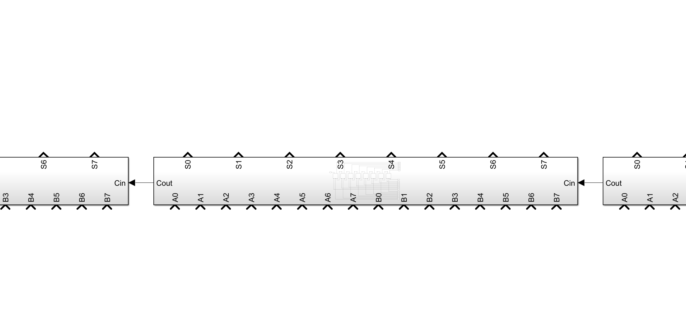
##### 5.7.3.2 减法器

- 计算减法的逻辑远比加法要复杂，为了计算减法，我们不会选择去重新设计一个减法电路，而是选择使用一种叫做补码的算法。
- 反码是指将一个二进制数的所有0变成1，1变成0，比如 $11001010$ 的反码就是 $00110101$ ，我们记一个数字 $A$ 的反码为 $!A$ ，意思就是对 $A$ 的二进制形式的每一位求非的逻辑。
- 在C语言中，求反码的运算叫做逐位非，写法如下
```c
    uint8_t A = 0b11001010;
    uint8_t B = ~A; 
    //此时B就是A的反码00110101，也就是说B=0b110101
    printf("A=%d, B=%d",A,B);
    //打印内容“A=202, B=53”,二进制换算成了十进制
```
- 反码的特点是对于任何的二进制数 $A$ ，计算 $A+(\sim A)$ 的结果一定是 $1111,1111$
- 使用补码的原理计算减法，需要以下三个原理： \
 $①$ 补码，就是在反码的基础上再加1，比如 $11001010$ 的反码是 $00110101$ ，补码就是 $00110101+1=00110110$，刚才说任何一个数字跟自身的反码求和结果一定是 $1111,1111$ ，补码在反码基础上加1，那任何一个数字跟自身的补码之和就是 $1111,1111+1$ ，结果就是 $1,0000,0000$ \
 $②$ 在刚才的八位加法器中，如果计算 $1111,1111+1$ ，按理来说得到的结果应当是九位数 $1,0000,0000$ ，但实际上我们的加法器只能输出八位，第九位被舍弃掉了 ，结果就是 $0000,0000$ ，我们管这个特点叫做溢出，八位加法器计算结果超过八位会发生溢出，丢弃掉最高位。 \
 $③$ 在正常的数学运算中，只有两个绝对值相等的相反数相加才等于0，比如 $A+(-A)=0$ ，换言之，相加为0的两个数字就是相反数。
- 综上三点，一个八位二进制数加上他的补码为 $1,0000,0000$ ，经过八位加法器的溢出，就会变成 $0000,0000$ ，也就是说在加法器电路中，一个数字加上他的补码为0，再根据刚才相反数之和为0的说法，那么在加法器中，一个数跟他的补码就互为相反数。
- 也就是说，在加法器电路中，利用加法器溢出的特性，对 $A$ 求补码，就能得到A的相反数 $(-A)$ 。
- 计算 $A-B$ ，本质上就是 $A+(-B)$ ，而 $(-B)$ 是 $B$ 的补码，所以要计算减去一个数的值，只要加上那个数的补码就行。

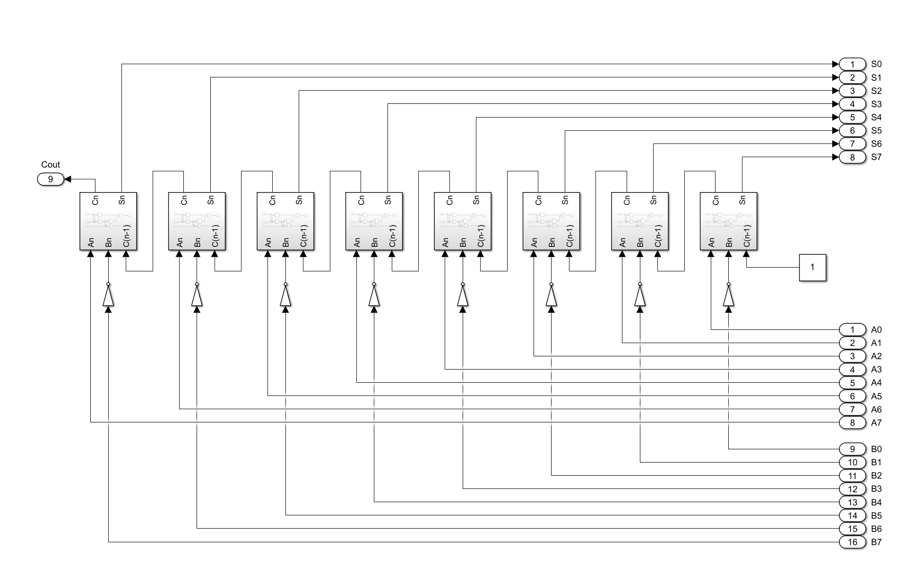
- 如图便是一个减法器电路，在加法器的基础上作出了修改（添加了用蓝色框出来的部分），添加了八个非门，并在第一个全加器的 $C_{n-1}$ 引脚输入了一个常量1，这些修改对应的就是对 $B$ 求补码的电路，八个非门是求 $B$ 的反码，第一个全加器的 $C_{n-1}$ 输入常量1就是在  $B$ 的反码的基础上再加1，得到反码。
##### 5.7.3.3 加/减法器
- 引入了补码运算让我们的加法器成功变成了减法，但是为了能够自由的切换使用加法还是减法，我们不会直接使用八个非门生成反码，而是使用由异或门组成的求补器。
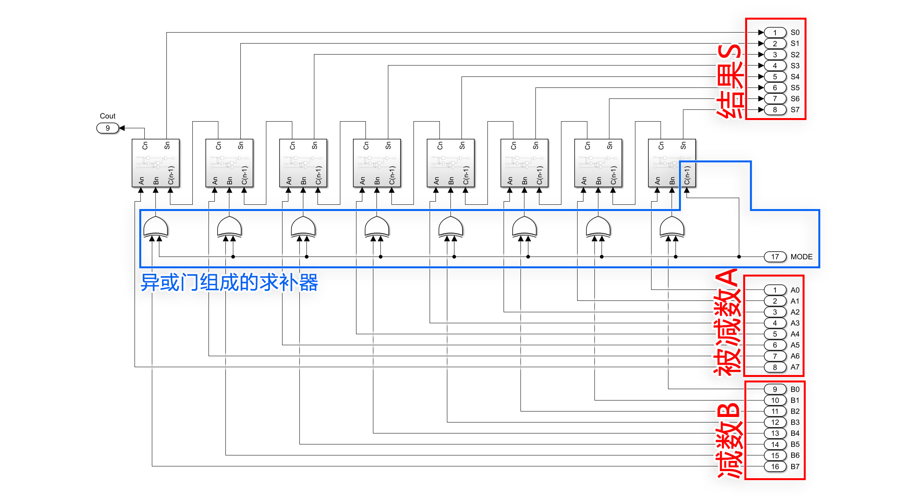
- 如图是一个可以自由切换加减法的加减法器，将八个非门改成了八个异或门。
- 当MODE引脚输入0时，八个异或门的输入跟输出相同，相当于八个跟随器，没有对B逐位求非，进位输入也为0，没有加1，B还是原先的样子，整个电路跟一个加法器无异，所以MODE为0时是加法模式。
- 当MODE引脚输入1时，八个异或门的输入跟输出相反，相当于八个非门，对B进行逐位非，进位输入为1，结果加1，B变成了他的补码，整个电路跟一个减法器无异，所以MODE为1时是减法模式。
- MODE引脚可以控制加/减法模式，如此便是一个八位的二进制加法器。
#### 5.7.4 数据选择器&数据分配器
- 数据选择器（MUX）可以从多个输入中选择一个进行输出，\
数据分配器（DEMUX）可以将一个输入在多个输出中选择一个来输出，\
其图标如下图
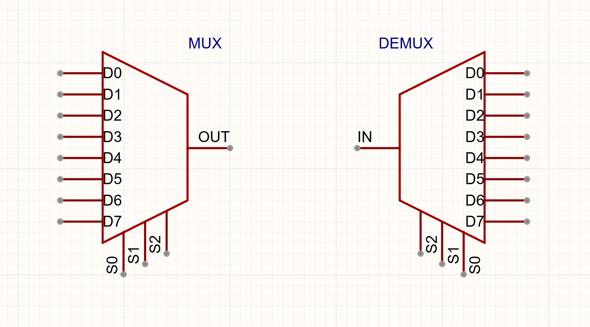
- 给数据选择器输入一个地址S，数据选择器就会选择地址S对应的引脚的输入进行输出。
- 给数据分配器输入一个地址S，数据分配器就会把输入的数据输出到地址S对应的引脚上。
- 他们本质上是个译码器，只不过增加了使用与门选通的功能和或门合并的作用。
- 与门在逻辑电路中常被用作信号的开关，提供选通信号的功能，例如下面这个与门
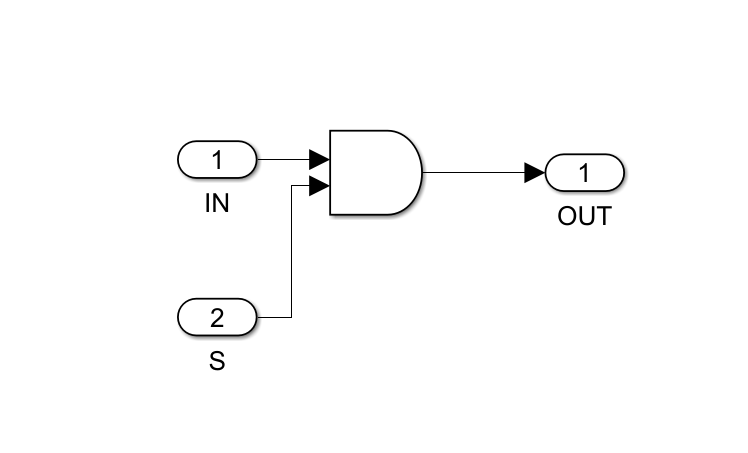
- 假设IN到OUT是一条传输数据的线路，那么S就是控制这个线路的开关。
- 当S为0时，不论IN输入什么，与门的输出都始终为0，信号被阻断。
- 当S为1时，IN输入什么，OUT就输出什么，IN和OUT始终相等，整个电路就像一个中继器一样，信号正常传输。
- 若用波形图表示，则如下图所示
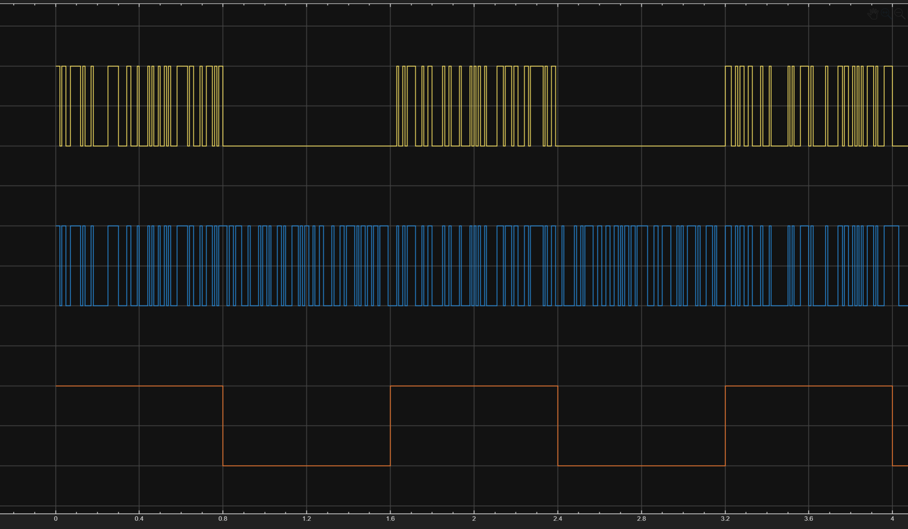
- 可见与门可作为信号的开关，用来控制信号的通断。
- 数据选择器和数据分配器便是使用了与门这样的特性。
- 数据分配器的内部结构如下图所示
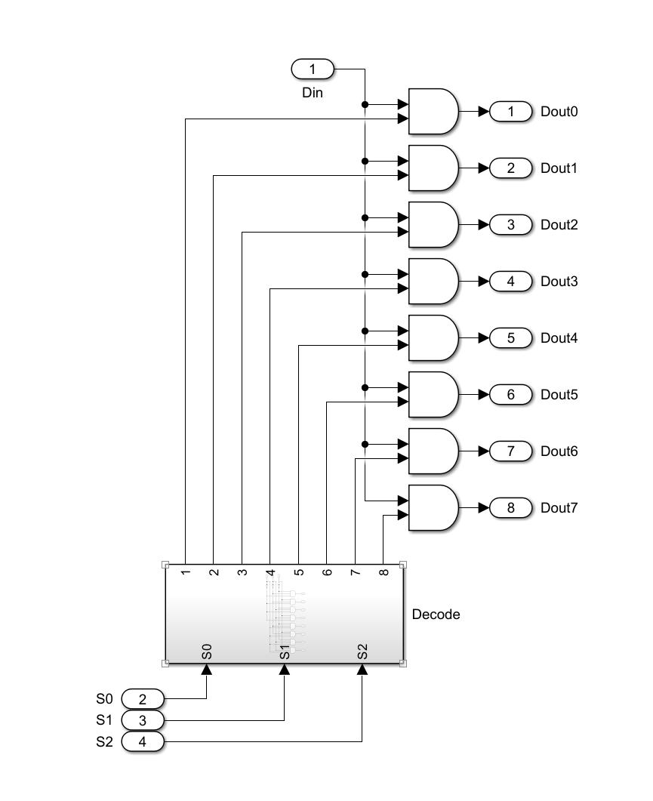
- 数据分配器的内部结构是一个译码器和若干个与门选通。
- 输入一个地址S，译码器便会给地址对应的引脚置1，其余引脚置0，置1的引脚连接的与门选通被开启，其余的被关闭，信号就只能经过被开启的与门流向对应引脚，实现将数据分配到对应引脚上。
- 数据选择器在数据分配器的基础上还添加了一个或门，利用了或门合并多路正逻辑的数据的作用。
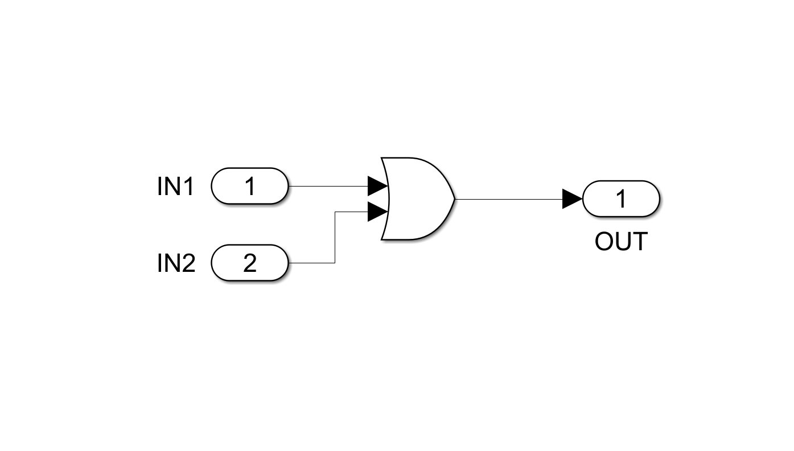
- 如果一个或门有多路信号输入 $S_0$ ， $S_1$ ，只要这两路信号不要同时进行输出，那么或门就可以将两路信号合并到一路，如下图波形图所示
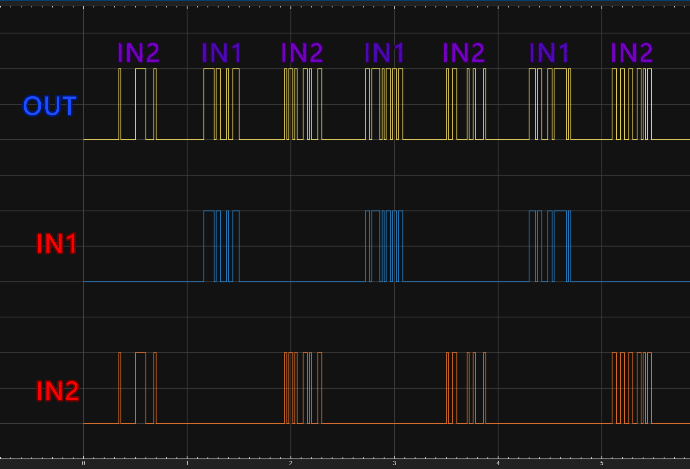
- 两路信号只要不同时输出，拿或门合并他们就可以正常工作。
- 数据选择器同时利用了与门选通的特性和或门合并的特性。
- 数据选择器的内部结构如下图所示
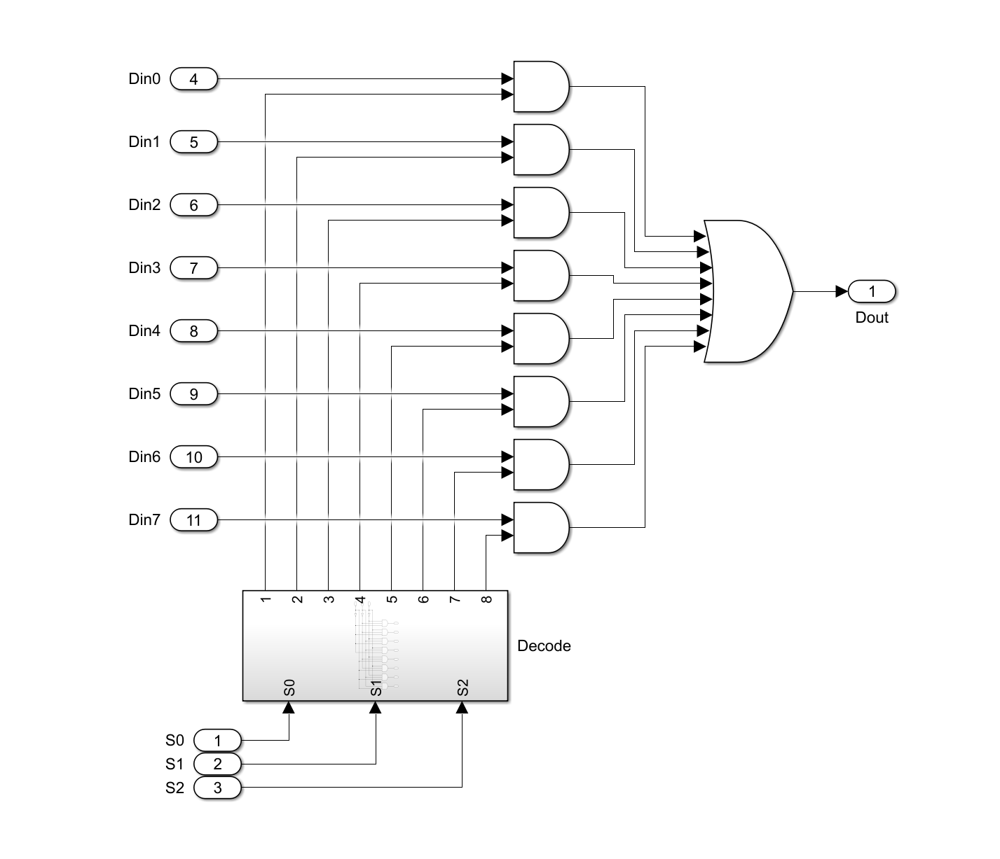
- 数据选择器内部是一个译码器，若干个与门，和一个或门。
- 译码器和与门决定了哪一路信号允许通过，其余的信号全置0禁止通过，通过的信号经过或门，原封不动的输出给输出引脚，实现数据的选择。
- 上面的数据选择器和数据分配器的电路其实十分庞大且臃肿，异步的加减法器其实也可以设计成同步的版本，上述的电路还有大量可以优化的空间，但我们这里不讨论组合逻辑的优化，仅理解各部件功能，感兴趣可以去了解数电＆微机原理。
- 除了加减法器，数据选择/分配器以外，组合逻辑还能组成相当多的其它逻辑，感兴趣可以去了解数电＆微机原理。
#### 5.7.5 线与＆线或
- 使用开漏输出的上下拉的方法，我们可以以很简单的方式制作出一个多输入的与门和或门，如下图。
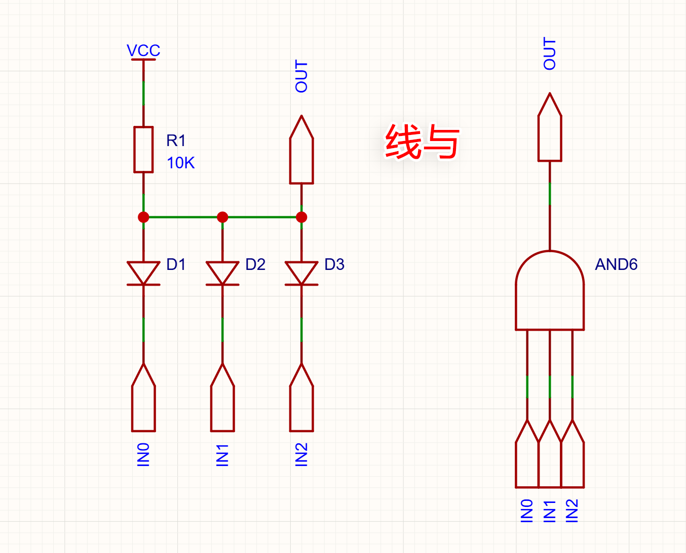
- 上图使用任意数量二极管就能制作出一个多输入的与门，优点是输入引脚可以制作很多个，而且结构简单，缺点是因为依靠上拉电阻，输出速率很缓慢。
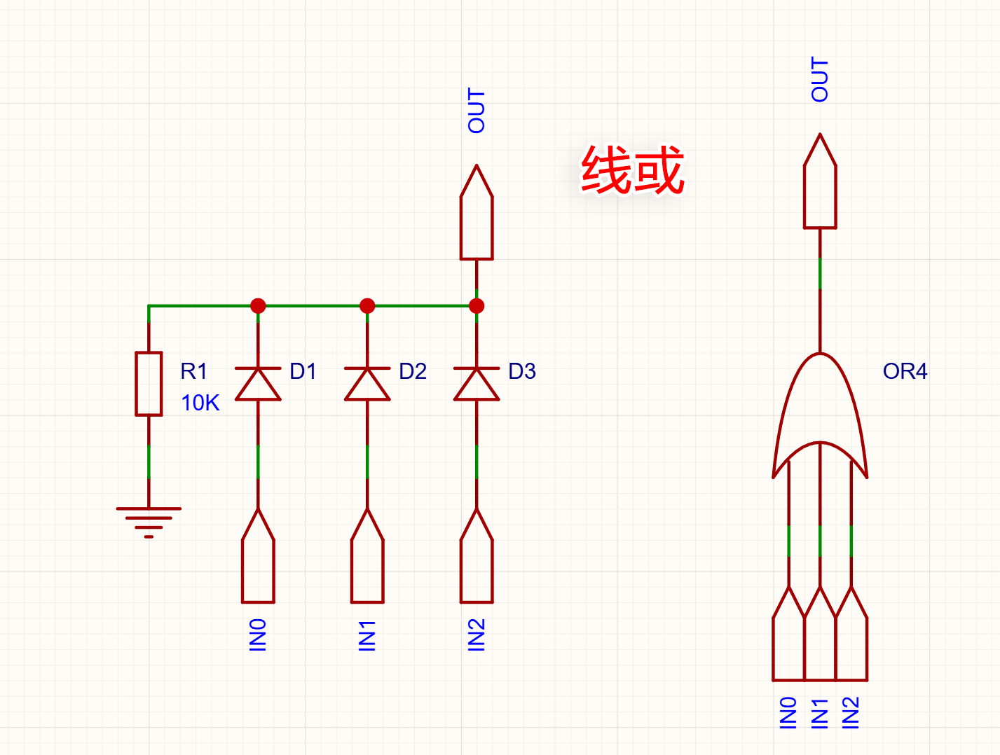
- 上图使用任意数量二极管就能制作出一个多输入的或门，优点是输入引脚可以制作很多个，而且结构简单，缺点是因为依靠下拉电阻，输出速率很缓慢。
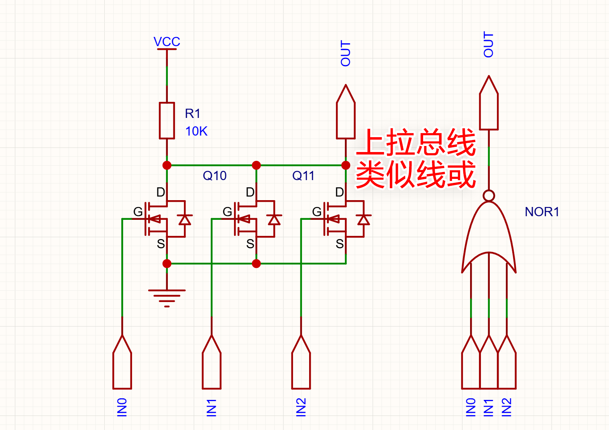
- 上图是I2C通信的上拉总线，我们将多个开漏输出的输出引脚接在一起，一起上拉一个电阻，那么任意一个输出都可以拉低总线的电平，类似或非的逻辑。
### 5.8 时序逻辑
#### 5.8.1 锁存器
- 寄存器是一种能储存，记忆信息的元件，寄存器的最核心的原理是下图两个非门的结构
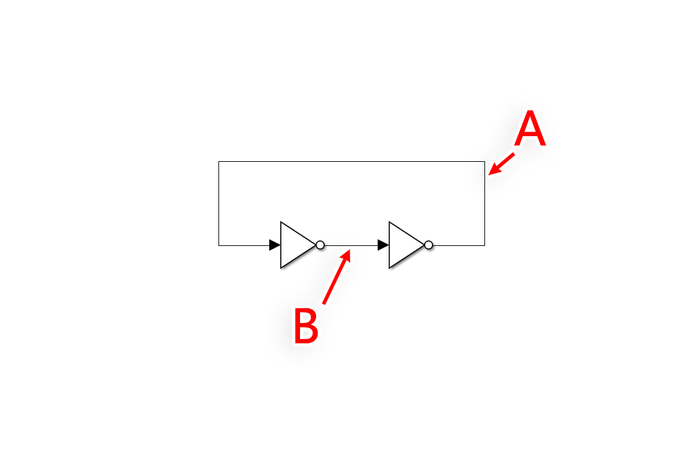
- 两个非门形成了一个回环，我们对他进行分析，先假设A点为0，那么B点是A非，B就是1，B点的1经过右侧的非门后又变成了0回到A，整个电路稳定在A恒为0，B恒为1的状态。 \
假设A点为1，那么B就是0，B点的0经过右侧的非门后又变成了1回到A，整个电路稳定在A恒为1，B恒为0的状态。
- 我们管这种电路稳定不变的状态叫做稳态，图中两个非门的电路有两个稳态，分别是
```math
S_0:~A=0,~B=1 \\
S_1:~A=1,~B=0
```
- 之前说过，组合逻辑的特点是同样的输入得到的一定是同样的输出，但是现在这个电路没有任何的输入，A的输出却有两种不同的可能，A的输出取决于我之前让这个电路处在了哪一个状态，这个电路的逻辑跟我之前进行过的输入有关，也就是说这个电路记住了我之前的操作，这个电路有记忆的能力。
- 我们如果规定A为这个电路存储的数据，那么状态 $S_0$ 就是电路储存的数据是 $A=0$ ，状态 $S_1$ 就是电路储存的数据是 $A=1$ ，改变电路的状态就能改变存储的数据。
##### RS触发器
- 现在的电路没有任何的输入引脚，我们还没法改变其状态，我们可以在其中插入两个或门，之前提到或门可以合并两路信号，我们的或门可以把我们想输入的信号和两个非门的回环中的信号合并在一起，组成如下图的电路
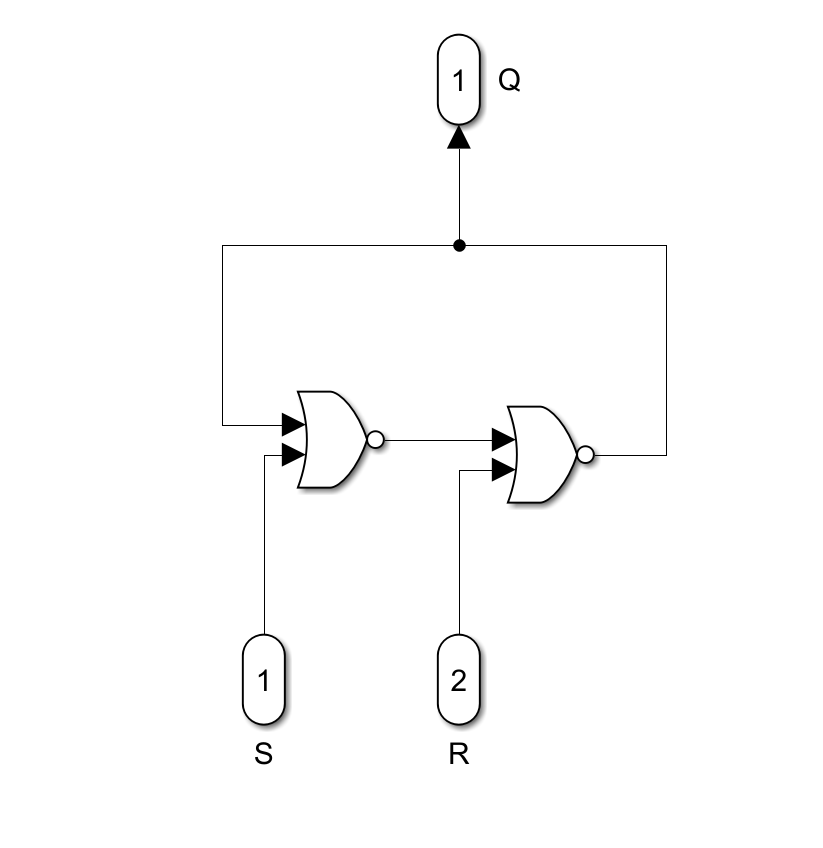
- 前面八大逻辑门的章节提到或门加一个非门就是一个或非门，这里将本来的两个非门和我们新插入的两个或门合并在了一起，变成了两个或非门。
- 我们管上图的电路叫做RS触发器，他有两个输入，重置R（reset），置位S（set），和一个输出Q。
- 置位set指将输出设置为1，重置reset指将输出设置为0。
- 脉冲指一个很短暂的高电平的信号，比如输入一直是0，突然变成了1并持续了很短一段时间，然后又回到0，这就称作一个脉冲。
- RS触发器的波形图如下
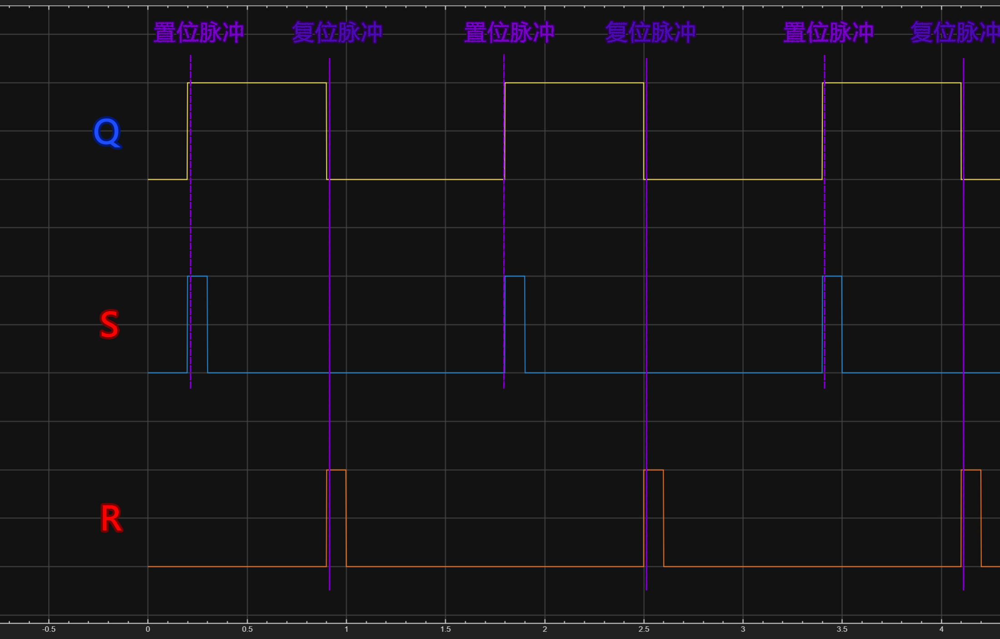
- R，S两个引脚正常情况下默认输入0，如果我们给S输入一个脉冲，Q的值会被强制设置为1，如果给R输入一个脉冲，Q的值会被强制设置为0，我们可以通过分别给R，S引脚输入脉冲来改变电路储存的数据Q。
##### RS锁存器
- RS触发器严禁同时给R,S输入脉冲，否则会造成振荡和状态的不确定，为了更安全的储存数据，我们将RS触发器作如下改动
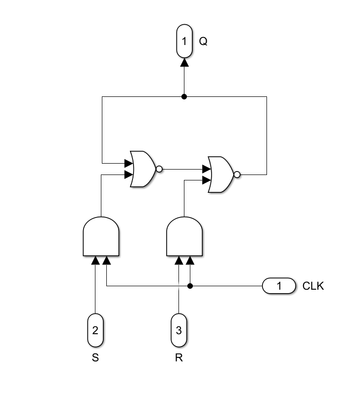
- 上图称为RS锁存器，我们分别给R,S增加了一个与门作为开关，当 $CLK=0$ 时，两个与门的输出永远为0，不论RS输入什么，Q都保持不变，当 $CLK=1$ 时，两个与门开启，RS的信号传入。
- 我们使用与门作为开关，在RS信号准备好后再开启开关传入信号，可以避免RS信号的时间有误差导致混乱，此做法称为同步，即用与门作为开关，信号准备好后再开启，如果没有同步用的与门的电路，我们称之为异步，比如之前说的异步加减法器。
##### D锁存器
- 我们发现每次开启与门时，我的输入要么是 $R=0,S=1$ ，结果 $Q=1$ ，要么是 $R=1,S=0$ ，结果 $Q=0$ ，如果输入 $R=0,S=0$ 则不会发生任何改变，没有意义，我们的目标是只要CLK有信号，就代表着我想给锁存器写入新的值了，所以我的输入必须是明确的，不能是 $R=0,S=0$ ，综上，我输入的R跟S一定是个相反的数字，为了节约引脚，简化使用方法，我们可以使用一个非门来省略掉R引脚，变成下图所示
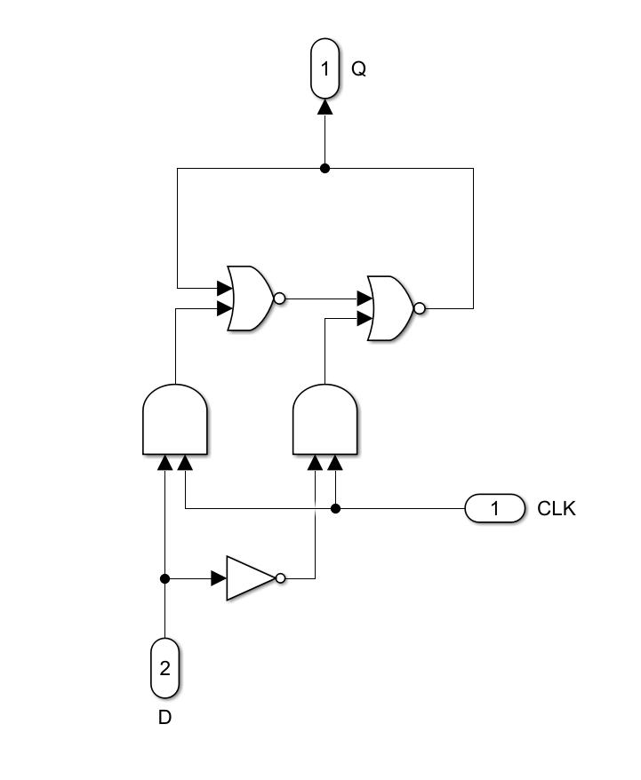
- 图中是D型锁存器，输入我想储存的数据D，然后给CLK一个脉冲，Q就会变成跟D相等的值，成功保存了我输入的值。
- D型锁存器的波形图如下图所示
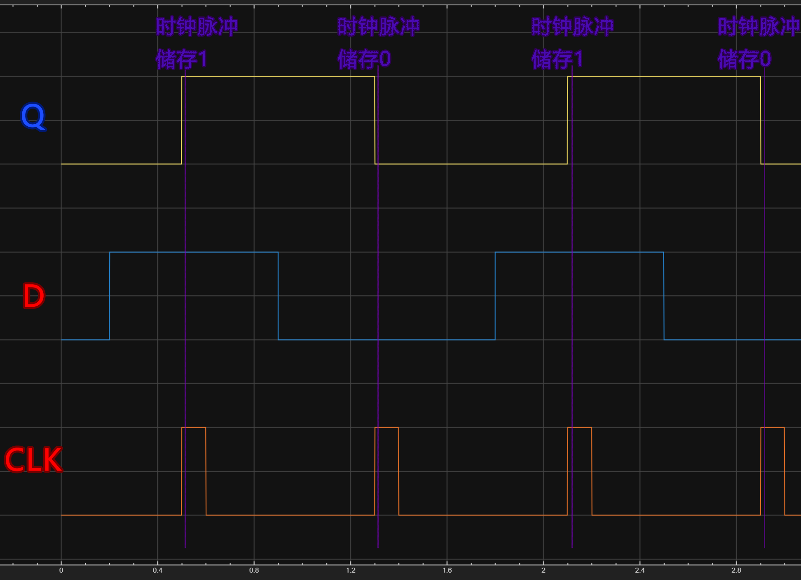
- 在CLK为0时，不论D输入什么，输出都只会保持之前的状态不变，在CLK为1时，整个电路就相当于一个中继器，D跟Q输出会完全一样。
- 当我们需要保存一个数字时，只需要将数字输入给D，然后再给CLK一个脉冲，就保存成功了。
- 但是D型锁存器有一个严重的缺陷，在输入下图的十分混乱的波形时会体现出来
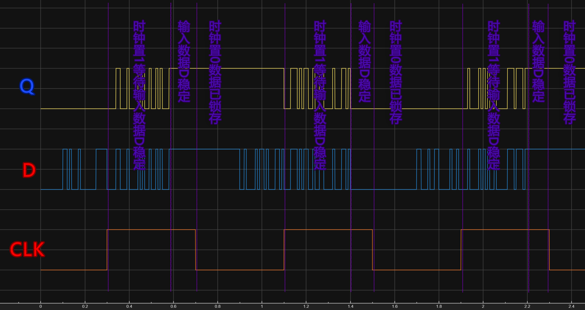
- CLK为1的那一段时间内电路如同中继器，信号可以随意的穿过锁存器，锁存器的值可以随意改变，这在大多数时序电路里，D型锁存器在这段时间里输出的跳变会造成极其严重的后果，我们希望锁存器在任何时刻都不会随意改变，也就是保存数据的动作仅发生在一瞬间，而不是CLK为1的那一段时间，为此我们会使用一种叫做边沿锁存器的电路，如下图
##### 边沿D锁存器
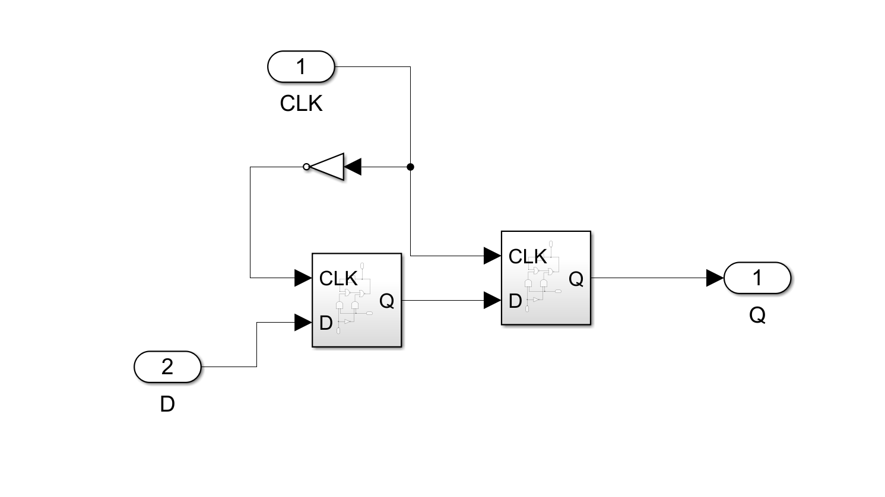
- 如图为上升边沿锁存器，这个锁存器仅在上升边沿到来的那一瞬间进行锁存，输出永远不会跟着输入乱跳变。
- 上升边沿由两个D型锁存器组成，两个D型锁存器其中一个的时钟连接了一个非门，也就是说两个时钟是相反的。
- 时钟到来前，CLK为0，第一级D锁存器的CLK为1，为开启状态，信号任意通过，第二级D锁存器的CLK为0，为关闭状态，信号不能通过，输出保持为第二级D锁存器的值。 \
时钟脉冲到来时，CLK跳变为1，第一级D锁存器的CLK跳变为0，锁存了这个瞬间的信号并保持，第二级D锁存器的CLK为1，为开启状态，第一级D锁存器的信号得以通过，输出保持为第一级D锁存器锁存到的值。 \
时钟脉冲结束后，CLK跳变为0，第二级D锁存器的CLK跳变为0，锁存了刚才第一级D锁存器的值，此时第一级D锁存器的CLK跳变为1，回到开启状态，但是输出保持为第二级D锁存器锁存到的值。 
- 观察上面一个时钟周期内，上升边沿锁存器运作的过程，我们会发现， \
第一，信号全程都无法直接经过两个锁存器，因为非门的存在，两个锁存器始终是一个开一个关，来回切换，很好的解决了D型寄存器在时钟为1时输出随输入跳变的缺陷。 \
第二，时钟脉冲结束后，上升边沿锁存器最终锁存的值，是时钟信号的上升边沿那个瞬间的值。
- 如果看上升边沿锁存器的波形图，如下图所示

- 图中锁存的值总是在时钟脉冲上升边沿的瞬间改变，在这种非常干净的信号输入中看起来与普通的D型触发器无异，但是在混乱的信号输入中，边沿锁存器的表现要远远强于D型锁存器。
- 下图是把刚才输入给D型锁存器的混乱波形输入给上升边沿锁存器的结果
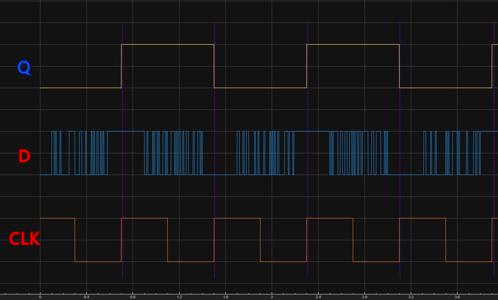
- 看到边沿触发器的输出不再乱跳，而是非常有序的仅在时钟上升边沿锁存稳定的数据，数据稳定前的胡乱跳变不会影响输出，边沿锁存器更安全实用。
- 除了上升边沿锁存器以外，还有下降边沿锁存器，如下图
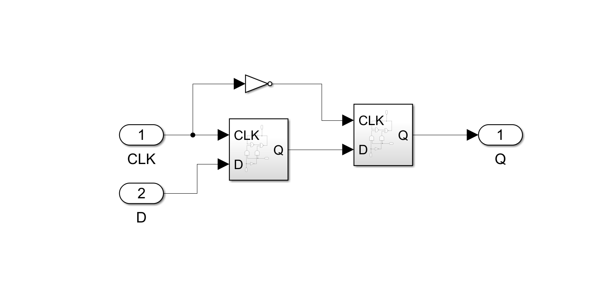
- 顾名思义，上升边沿锁存器在上升边沿锁存，那么下降边沿锁存器在下降边沿锁存，原理可以参考刚才的上升边沿锁存器原理自行分析，下降边沿锁存器的波形如下
- 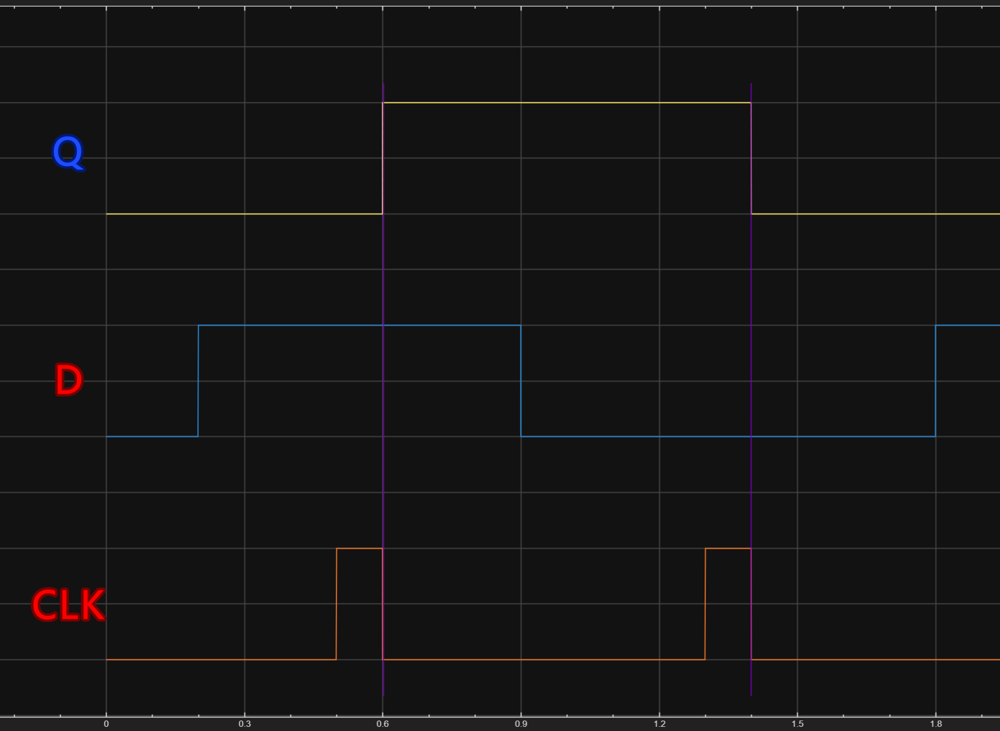
- 可以看到每次输出Q的改变都发生在时钟CLK的下降边沿，故名下降边沿锁存器。
- 上升和下降边沿锁存器也可称为边沿D型锁存器，在现代的各种芯片中，不是边沿触发的锁存器已经几乎不存在了，所以只要提到D型锁存器，默认都是边沿触发的边沿D型锁存器，即使数据手册中并没有专门写上。
- 为了实现更多功能，我们会给边沿锁存器增加置位和重置的功能
##### 带置位和重置的边沿D锁存器
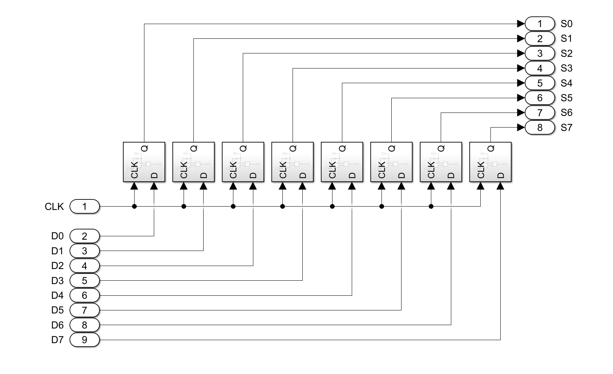
- 上图是一个带置位和重置的边沿锁存器，与之前的边沿锁存器不同的地方在于，内部的第二级D锁存器的两个或非门变成了三输入，多出来的那两个输入引了出来成为R，S引脚，通过R，S引脚我们可以不通过时钟强制给锁存器清零或者置1。
#### 5.8.2 寄存器
- 将多个锁存器器排成一排，便能存储一个多位的二进制数，我们称为寄存器，如下图是一个八位寄存器
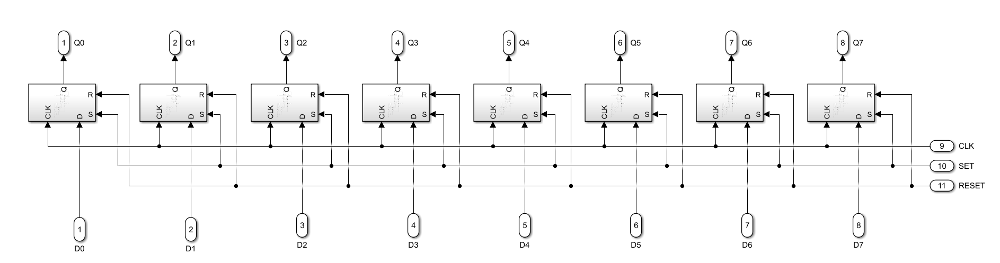
- 输入一个八位二进制数，再给CLK一个时钟脉冲，寄存器就能储存我们输入的数字。
- 给RESET一个脉冲，我们就能清空寄存器中的内容
- 给SET一个脉冲，就能让寄存器内容全部置1
#### 5.8.3 累加器
- 时序电路本质上就是组合逻辑与寄存器组合成的电路，可以实现更多有时间顺序的逻辑。
- 之前的加法器只能计算两个数字加减法，但是当我们想要计算大量数字的加减法时，我们就需要累加器。
- 累加器可以依次把多个数字相加减，其结构如下图所示。
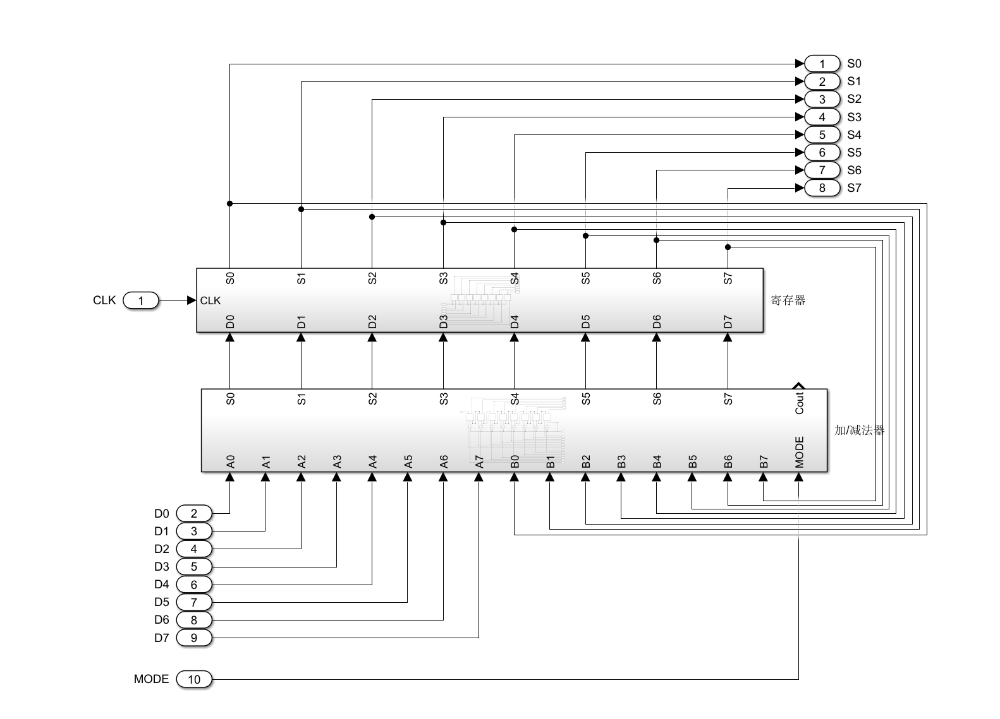
- 累加器由一个加减法器和一个寄存器组成，结构是加法器的输出连接寄存器的输入，寄存器的输出作为累加器的输出，同时寄存器的输出也转一圈输入到加减法器的输入A，要加的数据输入给加法器的输入B。
- 用数学公式写出来就是：
累加器输入数据 $D$ ， 累加器输出 $S$ \
加法器输入 $A,B$ ，加法器输出 $S$ \
寄存器输入 $D$ ， 寄存器输出 $Q$ \
则有： 
```math
\begin{aligned}
S&=A \pm B \\
D&=S \\
if(CLK):Q&=D \\
A&=Q
\end{aligned}
```
如果用C语言写出同样的逻辑，就是
```c
while(){
    if(MODE == 0){S = A + B;}   
    //如果是加法模式，计算A+B
    if(MODE == 1){S = A - B;}   
    //如果是减法模式，计算A-B
    if(CLK){A = S;}
    //如果时钟信号到来，让寄存器保存加法器的S输出，并输出给B
    CLK = 0;
    //CLK = 0是为了模拟出寄存器边沿触发的效果
}
```
- 如果我们要用上面的加法器计算5+7-9的结果，我们要做的就是 \
 $1.$ 给RESET输入一个脉冲，清空当前寄存器中的结果\
 \# 此时寄存器的输出是0，加法器的输入A是0（连接的寄存器）\
 $2.$ 将数字5（二进制是101）作为D输入给累加器，MODE输入0（加法模式）\
 \# 此时加法器的输入B是5，输入A是0，输出S是5\
 $3.$ 给CLK输入一个脉冲，当前加法器的结果保存到寄存器\
 \# 此时寄存器的输出是5，加法器的A输入也是5（连接的寄存器）\
 $4.$ 将数字7输入给累加器，MODE输入0（加法模式）\
 \# 此时加法器的输入B是7，输入A是5，输出是12\
 $5.$ 给CLK输入一个脉冲，当前加法器的结果保存到寄存器\
 \# 此时寄存器的输出是12，加法器的A输入也是12（连接的寄存器）\
 $6.$ 将数字9输入给累加器，MODE输入1（减法模式）\
 \# 此时加法器的输入B是9，输入A是12，输出是3\
 $7.$ 给CLK输入一个脉冲，当前加法器的结果保存到寄存器，此时寄存器输出的结果就是5+7-9的结果3，完成了多个数字的加法。

 - 如果总结要让多个数字累加的步骤，就是\
 先reset清空寄存器\
 输入一个数字及其MODE选择加减的操作\
 CLK脉冲保存\
 循环输入数字，MODE和CLK，直到所有数字输入完为止。\
 最后寄存器的输出就是我们要的结果。

 - 累加器实现了对加法器的分时复用，我们很难做出一个巨大的加法器加很多个数字，我们就可以使用累加器，把要输入的数字按时间顺序输入。
 - 这里每一个CLK脉冲就可以计算一个加数，我们管执行某个操作需要的CLK数量称为这个操作的指令周期。比如这个累加器计算一次加减法需要1个CLK，我们就称加减法的指令周期为1。
- CLK的速率越快，这个累加器能计算加减法的速率就越快，时钟频率决定了这个累加器的性能。
#### 5.8.4 计数器
- 定时器能够实现计数的功能，定时器是由一种叫做T触发器的电路组成的。
##### T触发器
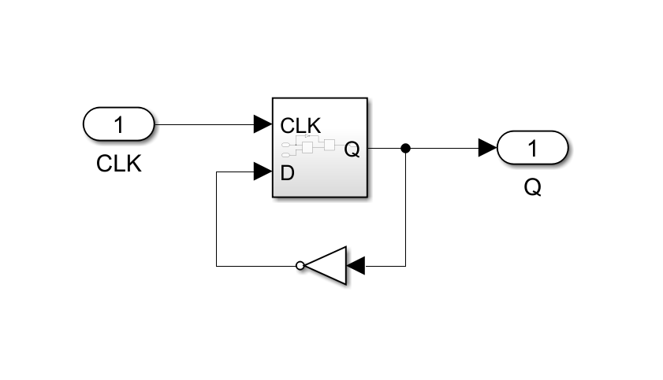
- 如上图是一个T触发器，结构是将一个边沿锁存器的输出连接到他的输入。
- 锁存器的输入与输出始终相反，每次CLK输入脉冲时，锁存器都会保存一个跟现在相反的值，也就是0变成1，1变成0。
- 如果是用上升边沿锁存器制作的T触发器，输出就会在上升边沿翻转，如果是用下降边沿锁存器制作的T触发器，输出就会在下降边沿翻转。
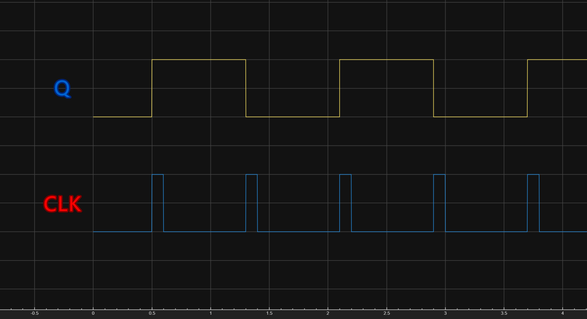
- 如图是一个上升边沿的T触发器的波形图，输出会在CLK的上升边沿发生翻转。
- 我们也可以使用带置位和重置的边沿锁存器来制作T触发器，这样T触发器就能有位和重置的功能，如下图
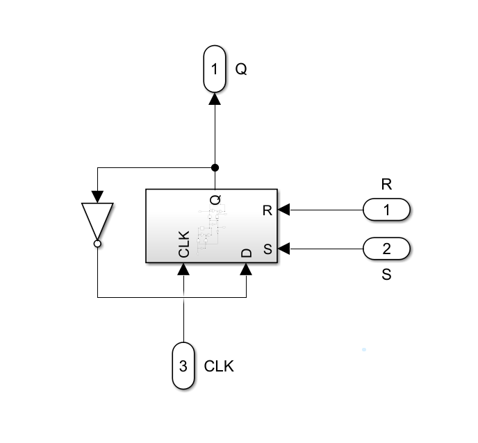
- 不论当前的状态是什么，我们都可以使用R,S引脚强制重置T触发器的状态。
- T触发器常见的功能是用来作分频器，如果我们观察上面的波形图，会发现输出脉冲的频率是CLK频率的一半， $f_{out}=\frac{f_{in}}{2}$
##### 计数器
- 计数器的功能就是计数，每当我输入一个脉冲，计数器的值就会加1。
- 如果我们把八个下降边沿触发的T触发器级联在一起，上一个T触发器的输出是下一个T触发器的CLK输入，就能得到一个计数器，如下图
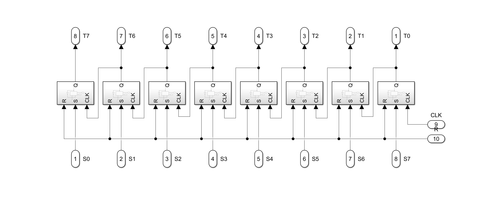
- 上图计数器CLK输入一个脉冲，计数值加1，RESET输入一个脉冲，计数值清零，清零后给置位S输入一个数字可以给计数器设置一个数字让计数器从这个数字开始计数。
- 计数器的实现原理可以从十进制计数来想。
- 当我们用十进制计数时，从零开始往上数，个位数每数十个数字，十位数就数一个数字，十位数每数十个数字，百位数就数一个数字……我们发现个位数发生变化的频率是十位数的十倍，百位数发生变化的十倍，如果计数的频率是 $f_1$ ，那么十位数计数的频率就是 $f_2=\frac{f_1}{10}$ ，百位数计数的频率就是 $f_3=\frac{f_2}{10}$ ，以此类推。
- 二进制计数也是同理，如果我们把二进制数计数的过程罗列出来观察：
```math
\begin{aligned}
0:&~0000\\
1:&~0001\\
2:&~0010\\
3:&~0011\\
4:&~0100\\
5:&~0101\\
6:&~0110\\
7:&~0111\\
8:&~1000\\
9:&~1001\\
10:&~1010\\
11:&~1011\\
12:&~1100\\
13:&~1101\\
14:&~1110\\
15:&~1111\\
\end{aligned}
```
- 竖着看，从上往下，\
第一位是0101010101010101，01来回变化，两个数字一循环。\
第二位是0011001100110011，0011来回变化，四个数字一循环。\
第三位是0000111100001111，00001111来回变化，八个数字一循环。\
……\
如果说一个CLK脉冲就是计数一次，那么第一位频率就是CLK频率的一半，第二位频率就是第一位的一半，第三位频率就是第二位的一半……
- 每一位频率是上一位的一半，刚好符合了T触发器作为分配器的特点，我们可以使用T触发器来实现这个电路。
- 我们发现每一位在0/1之间切换都是发生在上一位由1变成0的瞬间，也就是说我们需要使用下降边沿T触发器来制作。
- 多个下降边沿T触发器级联在一起，我们就得到了一个向上计数器，每输入一个CLK脉冲，计数器的值加一，输入一个RESET脉冲，计数器清零。
#### 5.8.5 时钟
- 在一个复杂的数字电路中，尤其是含有大量寄存器和计数器的时序电路中，时钟的频率决定了整个数字系统的运行速率。
- 比如刚才的累加器，一个时钟可以完成一次加/减运算，时钟频率越高，加减的速率就越快。
- 比如刚才的计数器，一个时钟数字就加一，时钟越快，计数就越快。
- 我们的单片机常会有外部晶振产生一个固定频率的时钟信号，作为整个单片机的时钟输入。
#### 5.8.6 信号的竞争与冒险
- 理想的信号的跳变总是在瞬间完成的，但是在数字信号的上下边沿提到过现实中的信号并不是在瞬间完成的跳变，中间缓慢上升的过程在实际的数字电路中会造成很多问题，我们称这种问题为信号的竞争与冒险现象。
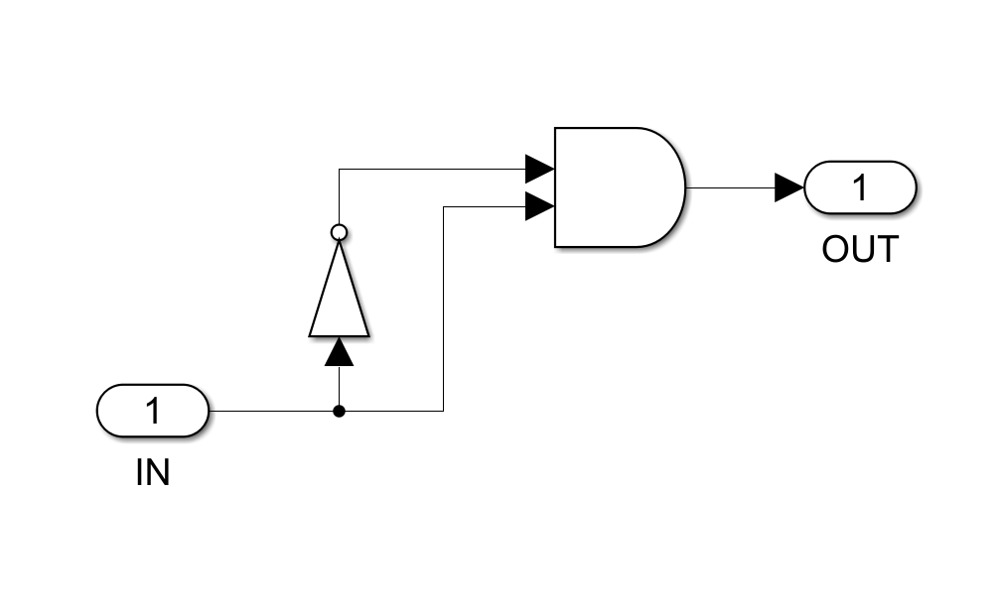
- 如图是一个非门和与门组成的简单电路，如果分析他的逻辑，我们会发现无论IN输入什么，OUT总是输出0，但在实际中却不是这样的。
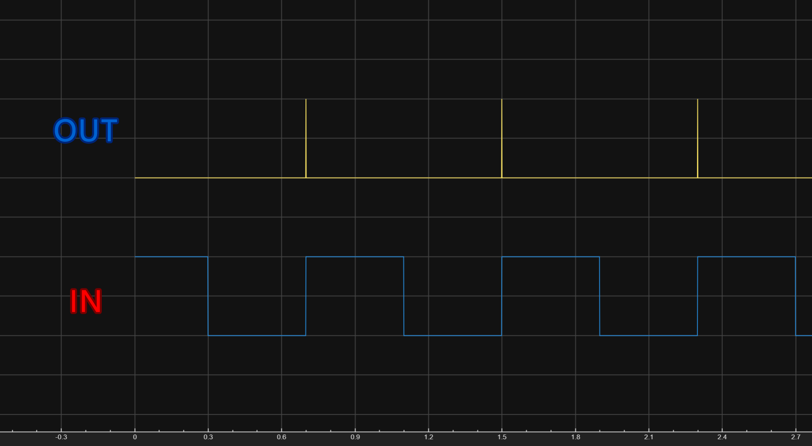
- 上图是实际中这个电路的波形，我们发现每次输入信号IN上升时，输出OUT都会产生一个极短的脉冲。
- 非门具有微小的延迟，非门输出的信号还没来得及下降至0，输入的信号已经完全变成1了，导致中间有短暂的时间与门的两个输入都变成1了，产生了一个脉冲。
- 这样的脉冲虽然短暂，但是是致命的，可能会导致下一级的电路误动作，比如计数器多加了1，寄存器莫名其妙锁存了一次等等，设计中要尽量避免这样的设计。
- 虽然我们不用亲手设计数字电路，不用担心电路中的竞争冒险现象，但是竞争冒险现象不光发生在电路中，我们写的代码因为逻辑设计不当也可能产生竞争冒险现象，比如下面这段代码。
```c
volatile int flag = 0;

void TIM2_IRQHandler(void)
{
    flag++;
}

int main(void)
{
    while (1)
    {
        if (flag == 100)     
        {
            do_something(); 
            flag = 0;
        }
    }
}
```
- 这段代码的流程是：每隔一段时间flag的值就加一，这个时间完全由TIM2控制，是个不确定的时间，而flag每加到100，就do_something()，并将flag清零。
- 如果在进行do_something()的时候flag又加一了，但是清零的操作还没有进行，此时flag就短暂的变成了101，超过了100，之后flag清零，因为清零的数字是101，所以flag相当于少数了一个，而且如果在某次flag=100被主函数循环读取之前又加了一次，flag可能会到101，跳过清零步骤，程序直接卡死。
- 上面的代码因为竞争冒险的现象，导致了flag会短暂的超过100，而且还会少计数，很有可能导致其它的bug。
- 在电路中，我们会进行逻辑约束，增加与门或者寄存器进行同步等方法解决竞争冒险现象，具体感兴趣可查阅数字电路书籍。
- 在代码中，为了解决竞争冒险现象，我们会尽量让多线程的行为变得原子化。
- 原子化，指让一个行为变得不可以被打断，执行他的中途不允许再进行其它事情。
- 如果要使用原子化的方法改造上面的代码，变成下面的内容
```c
volatile int flag = 0;

void TIM2_IRQHandler(void)
{
    flag++;
}

int main(void)
{
    while (1)
    {

        if (flag >= 100)           // 用 >= 判断，避免刚好错过
        {
            __disable_irq();
            flag -= 100;           // 只减去 100，多出来的计数保留下来
            __enable_irq();        // 退出临界区，马上恢复中断

            do_something();        // 耗时的操作放在临界区之外执行
        }
    }
}
```
- 上面的代码通过短暂的禁止中断实现了操作的原子化，但是美中不足是还有小概率会漏计数，虽然比之前的临界区小了很多，但还是有概率。
- 上面的代码还可以通过添加缓冲区，交叉缓冲区等很多方法来优化，变得更加的安全稳健，可以自行去通过网络或者ai尝试了解。
### 5.9 微机原理&了解STM32硬件结构
- 开发一个单片机，我们要做的第一步就是查询得到我们的单片机的数据手册与参考手册。
- 以STM32F103C8T6为例，我们可以去意法半导体官网搜索对应型号的单片机的数据手册与参考手册，下面是已经找好的两份手册
[STM32F103C8T6数据手册（点击阅读）](datasheet/STM32F103C8T6数据手册.pdf) \
[STM32F103C8T6参考手册（点击阅读）](datasheet/STM32F103C8T6参考手册.pdf)
- 我们打开简单阅读发现，数据手册仅有几十页，而参考手册多达上千页。
- 数据手册，是一款单片机的简单介绍，用于挑选单片机时查看，可以从中快速的知道单片机的各种配置，查阅其是否满足需求。
- 参考手册，是在挑选好单片机型号后，开发单片机时的参考文档，内部详细的介绍了单片机的每一个细节，开发方式，是个开发时要使用的工具书。
#### 单片机的硬件架构
- 单片机的内部结构可以简化成下面的框图
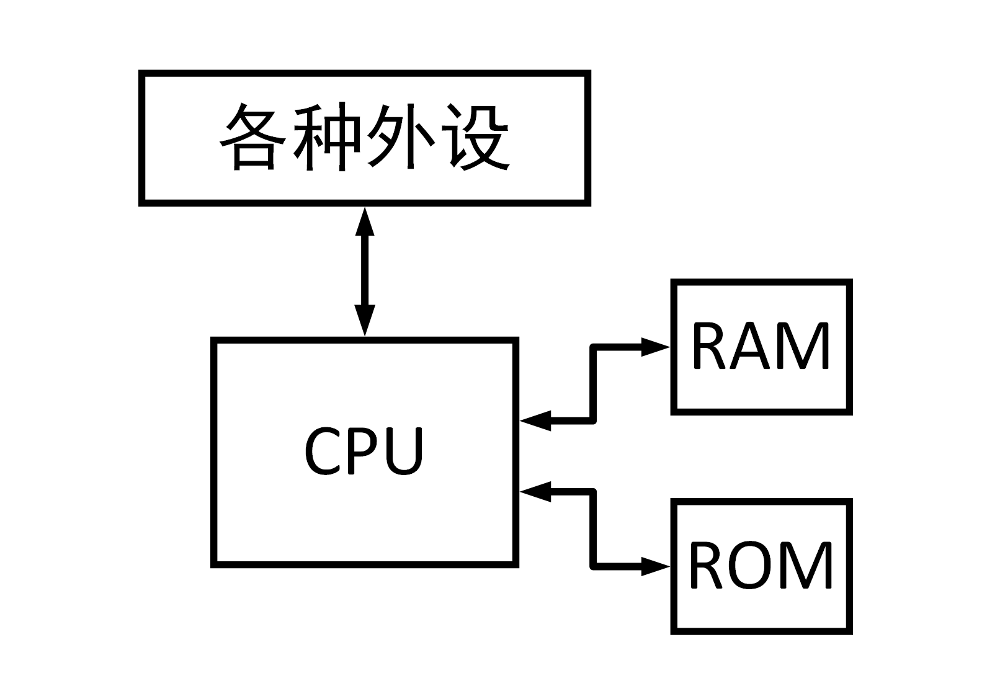
- 单片机内部的结构可以类比成我们的电脑，图中的CPU对应我们电脑的CPU。RAM指的是内存，对应我们的内存条。ROM指的是闪存，对应我们的硬盘。而外设指单片机芯片内的各种额外的硬件功能，类比成我们的显示器，键盘，鼠标这些设备，单片机通过各种外设来实现跟外界的各种互动。单片机本质上就是一个完整的“小电脑”。
- 单片机内部各种外设和RAM和ROM并不是直接跟CPU连接在一起的，而是通过一个叫做总线（BUS）的东西连接在一起，如下图
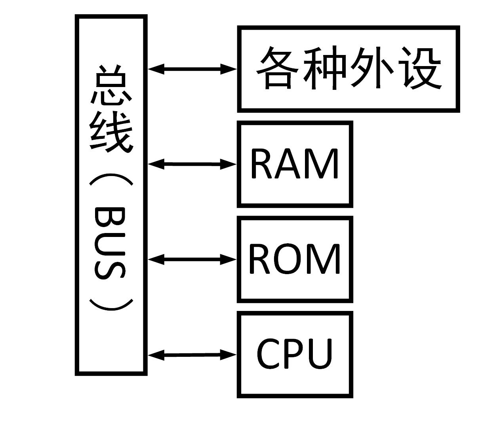
- 总线的英文名叫BUS，翻译过来是公交车，他的作用就是作为数据和信号的“公交车”，负责在各种模块之间传输数据，比如说CPU想读取RAM的数据，那就要先通过总线告诉RAM想要读取的数据，然后RAM在将数据通过总线发送给CPU，所有的数据交换都由总线完成。
- 总结下来就是：\
CPU负责进行各种复杂的运算，包括加减乘除与或非等， \
ROM和RAM负责存储数据，RAM负责储存运行过程中的数据（比如我要创建个数组 a[100]，那他就储存在RAM中）， \
ROM负责存储要运行的代码，我们烧录代码就是烧录到ROM中。 \
而外设负责实现各种跟外界互动的功能，比如GPIO引脚可以在引脚上输出高低电平，UART，SPI，I2C，USB等外设可以进行外部通信之类的。
- 打开我们的STM32F103参考手册，手册的最前面一般会有单片机总架构的介绍，在“3.1 System architecture”章节，我们能找到单片机的总线架构如下图
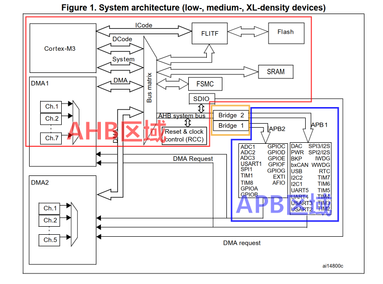
- 红色标记的AHB区域，这个区域内的所有元件都连接着AHB总线，也就是图中的AHB system bus。
- 蓝色标记的APB区域，有两个总线，APB1和APB2，这两个总线连接着所有的外设（图中蓝色APB区域里面两个方框上面写了一大堆外设的名字，ADC，UART，GPIO，TIM等等，这些都是外设）
- AHB总线和两个APB总线，之间靠黄框圈出来的Bridge连接在一起。
- 我们发现STM32F103的内部框图画了很多个总线，AHB，APB1，APB2，不同的东西连接在不同的总线上，不同的总线之间靠一个专门的电路（图中Bridge）连接，这是为了性能和功耗权衡而进行的设计，原因下面会解释。
- 凡是涉及内部的数据处理与运算的，比如我们的CPU（图中左上角的cortex-M3），RAM（图中SRAM），ROM（图中Flash），都连接在AHB总线。上对于数据的处理与运算，我们肯定希望他的速率是越快越好，所以会尽量的让其时钟频率更高，所以需要单独一个可以承受的时钟频率更高的AHB总线。
- 凡是涉及与外界交换的，比如我们的各种外设，都连接在两个APB总线上，外设的种类繁多，工作方式各不相同，有的需要更高的时钟才能运行，有的需要很慢的时钟才能运行，为了让所有的外设都能正常工作，我们将外设单独连接在了两个低速的总线上，也就是我们的APB1和APB2总线，这两个总线的时钟频率可以配置的跟AHB的频率不同，以实现各种外设需要的时钟频率。APB总线分成了两个也是这个原因，针对速度不同的外设又分成了两类，高速的在一个总线上，低速的在一个总线上。
#### 单片机的内存映射
- 计算机或者单片机的内存，我们可以看作是排成相当长一列的寄存器，每个寄存器依次都有个编号，第一个寄存器从编号0开始，一直到最后一个编号，我们管这个编号叫做地址，如下图 \
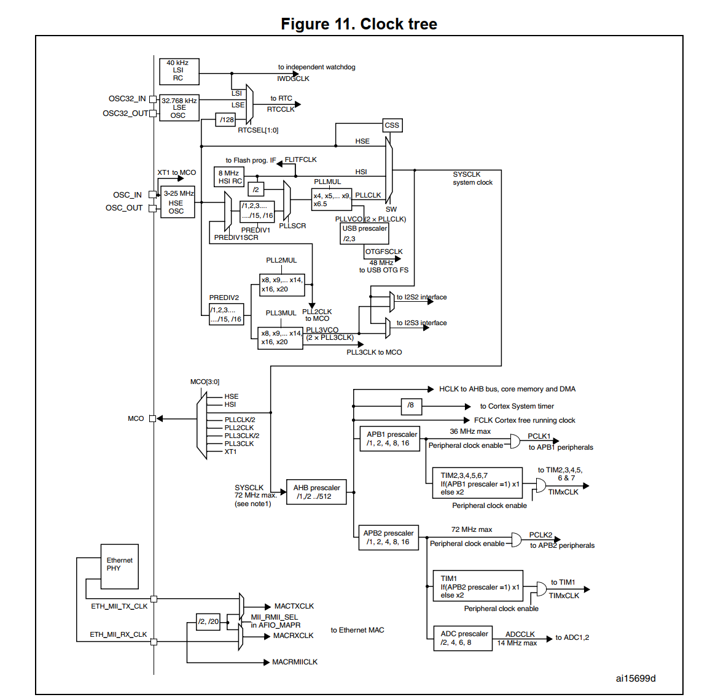 
- 在C语言中，我们使用指针访问某个地址中的变量，指针存储的地址就是对应的寄存器的编号，比如上图中指针储存的地址p，读取地址p的数据，我们就能读取到第p个格子储存的数据80。
```c
int* p = addr;/*假设addr是某个储存着80的寄存器的地址*/
int a = *p;//将p这个地址储存的值读取出来给a
printf("%d",&a);//最终输出就是80
```
- 上面就是C语言访问某个地址的数据的写法。
- 如果翻看STM32F103参考手册中所有关于地址的内容，会发现地址写的并不是简单的1234的数字，而是加了0x前缀的数字，比如0x40011000之类的。这里的0x意思就是说这个是一个十六进制数字。
- 在C语言中，我们也可以使用十六进制数，写法也是由0x开头，除此之外还有0b开头的二进制数，0h开头的八进制数，八进制现在很少使用了，所以我们不提，只看十进制，十六进制，二进制，写法如下
```c
int a = 0x5AF;//0x开头是十六进制数
int b = 0b010110101111;//0b开头是二进制数
int c = 1455;//正常写没开头是十进制数
printf("%d,%d,%d",&a,&b,&c)//打印结果"1455,1455,1455"
```
- 上面的a，b，c三个变量储存的值都是1455，但是赋值时都是使用的不同的数制。
- 我们查看STM32F103的数据手册的“2.2 系列之间的全兼容性”章节，会介绍他的SRAM有20KB，Flash有128KB，但是如果我们再看STM32F103的参考手册的“3.2 Memory organization”章节，这一章的第一句话就是
```
“Program memory, data memory, registers and I/O ports are organized within the same linear
4-Gbyte address space.”
```
- 他说我们的单片机有4GB的寻址空间，这完全与我们之前看到的20KB的SRAM是矛盾的，而且小小十块钱的单片机也不可能塞下多达4GB的RAM，实际上这里的4GB并不是指他的真实的储存容量，而是指他的内存映射的范围，至于什么是内存映射，他是我们的单片机控制各种外设的一种方式，结构如下图
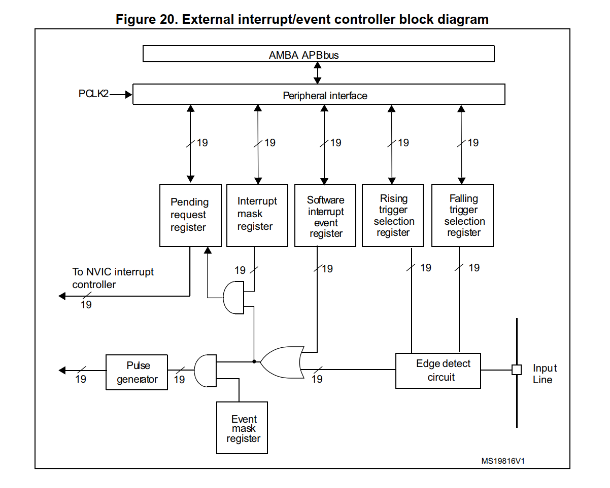
- 这个4GB的寻址空间并不是一个真实存在的东西，而是一个只存在在逻辑层面的虚拟的东西，在CPU眼中，这里有4GB的空间可以访问，而总线则根据CPU想要访问的这个逻辑上的4GB空间的地址来找到实际的对应的硬件。
- 当CPU想要控制某个外设，或者访问RAM，访问ROM时，CPU要做的就是直接去访问这个4GB的寻址空间。我们的各种硬件，他的配置和控制，都是由寄存器控制的，每个硬件有自己专门的配置寄存器和控制寄存器。比如GPIO，他就有一个控制寄存器，一个读寄存器，一个写寄存器，这三个寄存器对应到了这个4GB空间中的一个固定的地址，CPU给这个地址写入数据，就可以做到控制和使用GPIO。CPU控制和访问所有硬件的方法都是访问这个4GB的虚拟内存。
#### 使用寄存器方法开发STM32
- 根据刚才说的访问各种地址的寄存器来控制各种硬件，是单片机最底层的控制的原理，我们使用的各种库文件，比如STM32的标准库和HAL库，本质上都是在控制寄存器，只不过各种库把这些行为封装了起来，我们只需要调用各种函数即可。
- 如果不使用官方提供的各种库，直接去访问各种寄存器，我们管这个叫寄存器开发的方式。
- 寄存器开发的方式是世界上最通用的开发方式，他可能没有直接使用官方库方便，但是所有的单片机都支持寄存器开发，下至一片几十年前的8086处理器，上至各种高级的SOC，所有的处理器芯片，都是支持寄存器开发的，这种方式通用性最强，而且所有的芯片开发流程都完全一样。许多芯片有可能官方并没有提供一个好用的库，使用寄存器开发反而更好。
- 对于复杂的项目，更推荐使用官方的库，加快我们开发的速度。
- 如果使用寄存器开发的方式来点亮一个PC13引脚上连接的LED灯，我们要做的事情有以下几点：\
第一，查询参考手册中GPIO的硬件结构，了解GPIO的工作方式。 \
第二，查询参考手册中跟GPIO相关的寄存器有哪些，知道我们将要使用哪些寄存器来控制GPIO。 \
第三，查询这些要用到的寄存器的地址，和应该写入哪些值。\
以上三步骤对于其它外设也是同理，使用寄存器开发的方式，不论开发什么，都要遵循上面几步。
- 首先就是查询GPIO硬件结构，了解他的工作原理，我们要翻开参考手册的“9.1 GPIO functional description”章节，就能找到GPIO的硬件结构框图，如下图
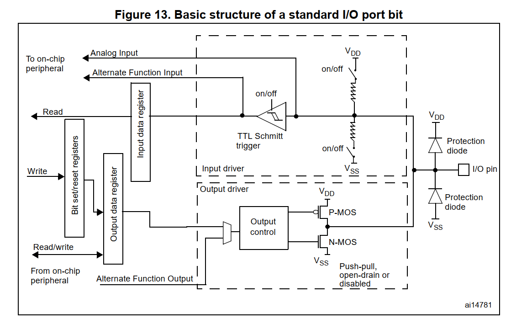
- 通过结构框图我们可以快速的了解GPIO的工作方式，框图中最右侧的方块图标是芯片外部的金属引脚，接入单片机先有一个二极管钳位电路作为保护，然后进入两个虚线框起来的部分。
- 上面虚线框起来的是输入驱动电路，两个电阻可以配置上拉或者下拉，输入进入一个施密特触发器，最终输出给我们的“Input data register”，这个寄存器就跟我们的输入信号有关，读取这个寄存器，就能知道引脚输入的电平高低，这个寄存器具体的使用方法可以在手册中查询。
- 输入驱动电路的信号还输送给了“Analog Input”和“Alternate Function Input”，指的就是其他的外设，GPIO可以把电平信号输送给其他的外设。
- 下面虚线框起来的是输出驱动电路，从最左侧开始，我们可以输入一个数据给“Bit set/reset registers”，这个寄存器可以给GPIO设置高低电平，这个寄存器控制着“Output data register”寄存器，这个寄存器储存的就是最终要输出的电平，我们可以直接读写“Output data register”寄存器，也可以读写“Bit set/reset registers”寄存器，他们最终都可以修改GPIO的输出内容。
- “Output data register”寄存器的内容和“Alternate Function Output”的信号通过一个数据选择器（那个梯形符号）输出给了我们的输出控制电路“Output
control”，这个电路控制输出的两个mos管，以实现我们配置的开漏或者推挽输出。
- 以上是我们从框图中了解到的GPIO的工作原理，我们再看前面的简介文本会介绍他的工作模式和要用到的寄存器，原文如下：
```
9.1 GPIO functional description
Each of the general-purpose I/O ports has two 32-bit configuration registers (GPIOx_CRL,
GPIOx_CRH), two 32-bit data registers (GPIOx_IDR, GPIOx_ODR), a 32-bit set/reset
register (GPIOx_BSRR), a 16-bit reset register (GPIOx_BRR) and a 32-bit locking register
(GPIOx_LCKR).
Subject to the specific hardware characteristics of each I/O port listed in the datasheet, each
port bit of the General Purpose IO (GPIO) Ports, can be individually configured by software
in several modes:
· Input floating
· Input pull-up
· Input-pull-down
· Analog
· Output open-drain
· Output push-pull
· Alternate function push-pull
· Alternate function open-drain
Each I/O port bit is freely programmable, however the I/O port registers have to be
accessed as 32-bit words (half-word or byte accesses are not allowed). The purpose of the
GPIOx_BSRR and GPIOx_BRR registers is to allow atomic read/modify accesses to any of
the GPIO registers. This way, there is no risk that an IRQ occurs between the read and the
modify access.
```
- 上面的内容总结下来就是：
- $①$ 我们可以使用GPIOx_CRL，GPIOx_CRH这两个寄存器配置GPIO的工作模式，工作模式有以下八种\
1.悬空输入（意思就是没有上下拉电阻）\
2.上拉输入\
3.下拉输入\
4.模拟输入（给ADC之类的外设使用的）\
5.开漏输出\
6.推挽输出\
7.由其它外设控制的开漏输出\
8.由其它外设控制的推挽输出\
其中GPIOx_CRL是配置1~7号GPIO引脚的，GPIOx_CRH是配置8~15号引脚的，寄存器名字后面的L指低位，H指高位，这种叫法非常常见，因为一个寄存器是32位的，配置一个引脚需要四位，一个寄存器不够用，所以分成了两个。
- $②$ 我们配置完GPIO的工作模式之后，可以使用GPIOx_IDR，GPIOx_ODR，GPIOx_BSRR，GPIOx_BRR，GPIOx_LCKR这四个寄存器控制他的输出和读取他的输入\
1.GPIOx_IDR，输入数据寄存器，IDR是“Input data register”的缩写，读取他就能知道GPIO被输入的电平高低。\
2.GPIOx_ODR，输出数据寄存器，ODR是“Output data register”的缩写，给它写入内容就能控制GPIO输出的电平。\
3.GPIOx_BSRR，位置位/清除寄存器，BSRR是“Bit set/reset registers”的缩写，他能控制刚才说的GPIOx_ODR寄存器，给对应的位置写入数据，可以控制GPIOx_ODR的内容，我们使用这个寄存器控制GPIOx_ODR而不直接使用GPIOx_ODR，是为了防止多任务的程序出现一些竞争冒险现象，我们这里的点亮PC13的代码还用不上他，我们直接读写GPIOx_ODR即可。\
4.GPIOx_BRR，位清除寄存器，BRR是“Bit reset registers”的缩写，作用跟GPIOx_BSRR类似，但是只有清零GPIOx_ODR的作用，我们这里的点亮PC13的代码同样用不上他。\
5.GPIOx_LCKR，位锁定寄存器，LCKR是“locking register”的缩写，他能锁定GPIOx_CRL，GPIOx_CRH这两个配置寄存器，防止我们代码意外修改了GPIO的工作模式，我们这里不太必要使用他。
- 看完有哪些寄存器，以及这些寄存器的功能，接下来就要去查询每个寄存器的地址和具体该写入什么内容了。
- 首先是查询地址，我们的手册并不会直接写出每一个寄存器的具体地址，而是给我们这个外设的基地址，和外设的每一个寄存器的偏移地址，寄存器实际的地址是基地址＋偏移地址。我们在“3.3 Memory map”章节可以查询到如下图
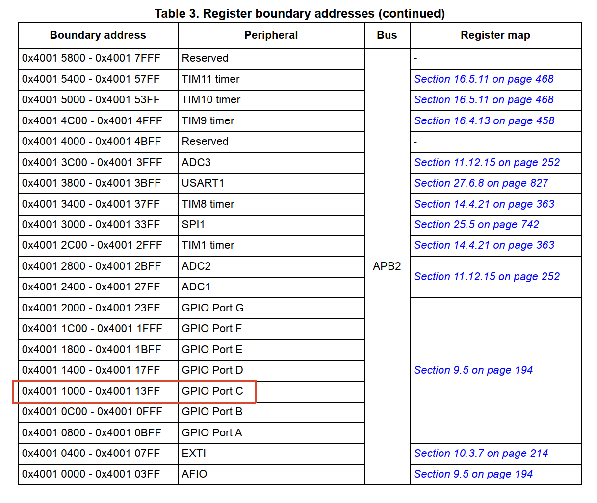
上面写我们的GPIOC的地址范围是0x4001 1000 ~ 0x4001 13FF，那么他的基地址就是0x4001 1000。
- 我们在“9.2 GPIO registers”章节可以查询每一个寄存器的偏移地址和具体内容，首先是配置寄存器GPIOx_CRL和GPIOx_CRH，我们要配置的是PC13引脚，第十三号引脚是由高位寄存器GPIOx_CRH控制的，所以不用管GPIOx_CRL了，只看GPIOx_CRH，查询到如下图
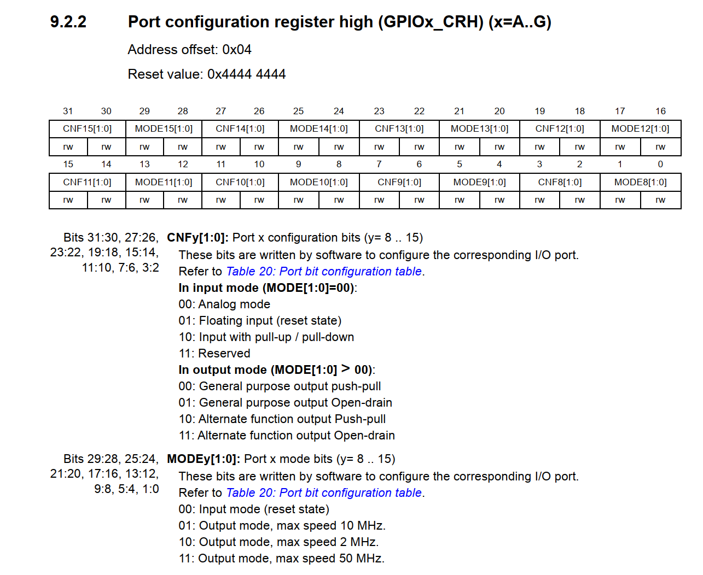
图中最上面“ $①$ ”标记处Address offset 即为偏移地址，这个寄存器的偏移地址是0x04，加上我们之前找到的GPIOC的基地址0x4001 1000，得到GPIOC的GPIOx_CRH寄存器实际地址是0x4001 1004。\
图中“ $①$ ”标记处第二行Reset value 指单片机每次重启时这个寄存器的默认值，如果我们的代码没有对这个寄存器进行任何修改，那么这个寄存器中的值就是Reset value，这里写的Reset value值是0x4444 4444。\
图中上面的表格是这个寄存器的32位每一位代表的意义，下面的文本是他们的解释。\
“ $③$ ”处说CNFy控制第y号引脚的工作模式，我们想配置13号引脚为推挽输出，下文“ $④$ ”处写“00: General purpose output push-pull”，所以要给CNF13写入00。\
图中“ $①$ ”处说MODEy控制第y号引脚的输入输出模式和输出速率，速率越高功耗越高，我们点灯不需要太高的输出速率，这里设置为“ $⑥$ ”处说的最慢的输出速率2MHz即可，所以我们要给MODE13写入10。\
我们确定了要给CNF13写入00，给MODE13写入10，我们在“ $①$ ”处可以看到CNF13和MODE13对应GPIOx_CRH的第20~23位，我们要给这四位写入0010。
- 在C语言代码中，我们可以写成下面的样子
```c
#define GPIOC_CRH     (*(volatile uint32_t *)0x40011004)

int main(){
    GPIOC_CRH &= ~(0xFu << 20);
    GPIOC_CRH |=  (0x2u << 20);
}
```
我们首先定义了GPIOC_CRH的地址为刚才算出来的实际地址0x40011004，类型写的是指针，最前面加了*符号解引用，我们就可以直接把GPIOC_CRH像一个变量一样读写他。\
我们并没有直接给GPIOC_CRH 写入一个值，而是进行了一些奇怪的运算，使用了很多没见过的符号，这些符号都是C语言中的位运算符，可以对数据的二进制的每一位依次进行逻辑运算。\
“&=”意思是按位与，把每一位数跟后面的数字的每一位依次进行与运算，比如我们写个
```c
uint8_t a = 0b00001111u, b = 0b00111100u;
uint8_t c = a & b;
```
最终c的结果就是a和b每一位依次进行与运算的结果，a的第一位是1，b的第一位是0，c的第一位就是1与0答案就是0，然后依次第二位，第三位……c最终的结果就是0b00001100，也就是十进制的12。\
“|=”意思是按位或，跟上面的按位与类似，但是改成了或运算，把每一位数跟后面的数字的每一位依次进行或运算，比如我们写个
```c
uint8_t a = 0b00001111u, b = 0b00111100u;
uint8_t c = a & b;
```
最终c的结果就是a和b每一位依次进行或运算的结果，c最终结果是0b00111111，也就是十进制的63。\
“~”意思是按位非，每一位求非，比如\
```c
uint8_t a = 0b00001111u;
uint8_t c = ~a;
```
最终c的结果就是0b11110000，也就是十进制的240。\
“<<”意思是左移位，把每一位往左挪几位，空出来的地方补0，比如\
#### 使用HAL库开发


