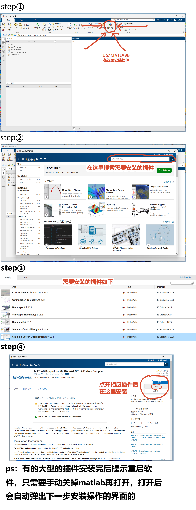

# 要下载的软件

### 学校提供的正版化软件，在里面寻找MATLAB
https://software.cup.edu.cn/

### kicad
https://www.kicad.org/

### 嘉立创EDApro
https://lceda.cn/standard

### 学校提供的VPN
https://www.cup.edu.cn/nic/ggfw/grfw/kjkjtd/kjsysm/index.blk.htm

### MATLAB中要下载的插件

# 常用的工具&文档&资料网站

### vscode官方文档
https://code.visualstudio.com/Docs

### Arm官方文档
https://developer.arm.com/search#q=arm%20v7&numberOfResults=48

### STM32官方文档
https://www.stmcu.com.cn/Search/index?csrf_token=b3c2cd792ff2248aeb50a66023cf171a&search_keywords=STM32F1&page=1&type=design_resource

### 学校提供的正版化软件（需要使用校园网）
https://software.cup.edu.cn/

### 立创商城
https://www.szlcsc.com/?c=Z

### github
https://github.com/

### arm-gnu工具链
https://gitlab.arm.com/tooling/gnu-toolchains-for-arm
